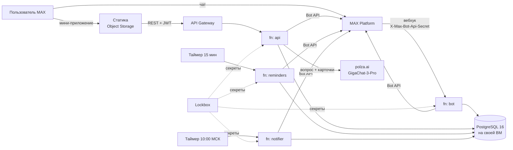

# Траектория

Навигатор по олимпиадам и поступлению: чат-бот и мини-приложение в MAX.
Трек «Образовательные решения», студенческий хакатон MAX, команда «Сигма».

- Бот: [@t356_hakaton_max_bot](https://max.ru/t356_hakaton_max_bot)
- Мини-приложение: https://traektoria.website.yandexcloud.net/ (работает только внутри MAX, открывается из бота)
- Лендинг: https://traektoriaedu.ru/ ([apps/landing](apps/landing/README.md))

## Зачем это

Олимпиада из перечня Минобрнауки может дать поступление без экзаменов (БВИ) или
100 баллов за ЕГЭ. Но какая олимпиада что даёт, решает каждый вуз сам и для
каждого направления отдельно, а сроки этапов разбросаны по сайтам организаторов.
Школьник 8–11 класса и его родители собирают это вручную и часто узнают о
регистрации, когда она уже закрыта.

«Траектория» делает эту работу за них. В чате бот задаёт несколько вопросов:
класс, регион, предметы, направления, вузы. После этого он предлагает олимпиады
под эти цели и показывает льготу именно в выбранных вузах со ссылкой на правила
приёма. Олимпиады, в которых ученик участвует, лежат в трекере, а бот
напоминает о сроках в MAX. Родитель и ученик работают в одной траектории:
родитель видит то же, что ребёнок, и может предложить олимпиаду, а решает ученик.

## Содержание

1. [Основной сценарий](#основной-сценарий)
2. [Запуск одной командой](#запуск-одной-командой)
3. [Как проверить](#как-проверить)
4. [Что должно получиться](#что-должно-получиться)
5. [Тестовые и демонстрационные данные](#тестовые-и-демонстрационные-данные)
6. [Остановка и повторный запуск](#остановка-и-повторный-запуск)
7. [Архитектура](#архитектура)
8. [Окружение и порты](#окружение-и-порты)
9. [Внешние сервисы и интеграции](#внешние-сервисы-и-интеграции)
10. [API](#api)
11. [Данные](#данные)
12. [Безопасность](#безопасность)
13. [Тесты и CI](#тесты-и-ci)
14. [Развёртывание в Yandex Cloud](#развёртывание-в-yandex-cloud)
15. [Известные ограничения](#известные-ограничения)
16. [Зависимости и лицензии](#зависимости-и-лицензии)
17. [Структура репозитория](#структура-репозитория)

## Основной сценарий

1. Ученик или родитель пишет боту `/start`, соглашается с политикой
   конфиденциальности и отвечает на вопросы анкеты. На это уходит пара минут.
2. Бот отвечает, сколько олимпиад подходит, называет стартовую (по опыту
   ученика) и ближайшую по сроку и даёт кнопку «Открыть «Траекторию»».
3. В мини-приложении: подбор → карточка олимпиады (льготы в своих вузах на свои
   направления, этапы, источник) → «Добавить в трекер».
4. За 30, 7, 3 и 1 день до этапа бот присылает напоминание. Если организатор
   поменял сроки или вуз поменял льготу, бот пишет и об этом.
5. Родитель по ссылке-приглашению входит в ту же траекторию и предлагает
   олимпиады, а ученик принимает или отклоняет их.

## Запуск одной командой

Из корня репозитория:

```bash
docker compose up --build
```

Поднимаются база, миграции с контентом, демо-семья, четыре Go-сервиса и
мини-приложение. Секреты не нужны. Примерно через полминуты после старта
откройте http://localhost:8083: мини-приложение запустится от лица ученика из
демо-семьи.

Нужны Docker с Compose v2.20 или новее (для `include` в `compose.yaml`) и около
3 ГБ на диске. На MacBook с Apple Silicon сборка без кэша заняла 97 секунд, если
базовые образы уже скачаны; первое скачивание зависит от сети. Повторный `up`
без пересборки — около 12 секунд. Со старым Compose то же самое запускается так:
`docker compose -f infra/docker-compose.yml up --build` (или `make up`).

Флаг `--wait` не подходит: `migrate` и `seed-demo` — разовые контейнеры, они
завершаются, и `--wait` считает это ошибкой. Готовность видна по
`docker compose ps`: у пяти сервисов `healthy`, у двух разовых `exited (0)`.

## Как проверить

### В MAX

Здесь всё настоящее: подписанный вход, сообщения бота, напоминания, ИИ-помощник.
Тестовых учёток нет, данные заводит сам проверяющий. Для проверки семьи нужен
второй аккаунт MAX.

1. Открыть [@t356_hakaton_max_bot](https://max.ru/t356_hakaton_max_bot) и
   нажать «Начать» (или отправить `/start`). Первым сообщением бот попросит
   согласие с [политикой конфиденциальности](https://traektoriaedu.ru/privacy.html);
   пока не нажата кнопка «Принимаю», анкета не начнётся.
2. Пройти анкету:
   - роль (ученик или родитель), имя, класс;
   - регион. Можно написать город, в том числе с опечаткой («Казань»,
     «набережные челны»), выбрать кнопкой «Москва», «Санкт-Петербург»,
     «Московская обл.», найти по первой букве, отправить геопозицию из
     мобильного MAX или нажать «Не важно»; тогда напоминания будут по
     московскому времени;
   - предметы;
   - направления, можно несколько. «Не знаю — помоги выбрать» задаёт два
     вопроса (что нравится, какая работа ближе) и предлагает 2–3 направления.
     Родитель может нажать «Пусть ребёнок ответит»;
   - опыт в олимпиадах;
   - где учиться: свой город, весь регион, Москва, Петербург, любой город
     текстом, несколько мест или «не важно»;
   - вузы. Ищутся и по разговорным названиям («вышка», «физтех»). Если в
     выбранных местах нет нужного направления, бот предложит ближайшие вузы,
     где оно есть, и похожие направления.

   На каждом шаге, кроме первого, есть «← Назад». Ответы сохраняются и отмечены
   «✓», поэтому вперёд можно пройти, ничего не выбирая заново. В конце бот
   покажет профиль: «Изменить» переспросит выбранное поле прямо в чате,
   «Готово» создаст траекторию.
3. В итоговом сообщении нажать «Открыть «Траекторию»». Мини-приложение
   откроется поверх чата, новичку сначала покажет короткое обучение.
4. В мини-приложении пройти по вкладкам:
   - «Главная» → «Подбор». В подборе только то, чего ещё нет в трекере;
   - карточка олимпиады: уровень профиля, льготы в ваших вузах на ваши
     направления, этапы, источник. Добавить в трекер;
   - «Трекер»: список и календарь, сроки и отметки по каждому этапу;
   - «Каталог»: олимпиады с переключателем «Ведут в мои вузы и на мои
     направления», вузы с фильтром по направлению. В карточке вуза можно выбрать
     свои направления;
   - «Семья» и профиль ученика.
5. Семья. «Пригласить» в мини-приложении или «👋 Пригласить в семью» в чате
   даёт одноразовую ссылку `https://max.ru/t356_hakaton_max_bot?start=inv_…`.
   Второй аккаунт MAX открывает её и попадает в ту же траекторию. Когда родитель
   предлагает олимпиаду, ученику приходит сообщение с кнопками «Добавить в
   трекер», «Открыть карточку» и «Не сейчас».
6. Команды: `/menu`; `/settings` — за сколько дней напоминать; `/help` —
   справка и ссылка на политику; `/delete` — удалить траекторию. Удалить может
   только создатель, остальным бот объяснит, как выйти. Если траектории ещё нет,
   `/delete` стирает незаконченную анкету и отзывает согласие. После `/delete`
   можно пройти всё заново с тем же аккаунтом.
7. ИИ-помощник: «Спросить помощника» на главной или кнопка «Спросить» в
   карточке. Например: «Что даёт Высшая проба в ВШЭ?», «Что такое БВИ?».

### Локально, без MAX

После `docker compose up --build`:

| Что | Как |
| --- | --- |
| Мини-приложение от лица ученика Артёма | http://localhost:8083 |
| То же от лица мамы Ольги | http://localhost:8083/?dev_user=parent |
| Пользователь, который ещё не прошёл анкету | http://localhost:8083/?dev_user=new |
| Живость сервисов | `curl localhost:8081/health`, то же на портах 8080, 8082, 8084 |
| Прогон воркера напоминаний | `curl -XPOST localhost:8082/run` |
| Прогон уведомлений об изменениях | `curl -XPOST localhost:8084/run` |
| Все ответы API против контракта | `cd apps/web && npm ci && npm run contract:check` (нужен Node.js 22; демо-данные после прогона не меняются) |

В обычном браузере нет MAX, поэтому мини-приложение собрано с заглушкой MAX
Bridge. Она отправляет неподписанную строку запуска, и локальный API принимает
такую строку только от id 900000000–900000999 (см. [Безопасность](#безопасность)).

Без токена бота и ключа LLM стенд работает полностью, кроме двух вещей: сообщения
в MAX не уходят, а помощник на любой вопрос отвечает шаблоном «данных нет».
Если скопировать `.env.example` в `.env` и вписать `POLZA_AI_API_KEY`, помощник
заработает и локально: `docker compose` из корня читает `.env` сам.

Бота можно запустить в живом MAX с локальной базой, через long polling, без
HTTPS:

```bash
cp .env.example .env    # вписать MAX_BOT_TOKEN
make bot-poll
```

Пока у бота есть подписка на вебхук, MAX в long polling ничего не отдаёт. Снять
её: `go run ./apps/bot/cmd/setup -unsubscribe <адрес вебхука>`. У прод-бота
подписка есть, поэтому для этого нужен свой бот.

## Что должно получиться

### В MAX

| Действие | Результат |
| --- | --- |
| `/start` с нового аккаунта | приветствие, короткий рассказ о том, какие данные бот сохранит, ссылка на политику и кнопка «Принимаю» |
| Регион «набережные челны» | бот находит город и регион — Республику Татарстан |
| Направление, которого нет в выбранных местах | бот предлагает ближайшие вузы с этим направлением и похожие направления |
| «Готово» на проверке профиля | итог: сколько олимпиад подходит, стартовая и ближайшая по сроку, кнопка «Открыть «Траекторию»» |
| Кнопка из уже пройденного шага анкеты | ответ «Этот вопрос уже позади», анкета не меняется |
| Ссылка-приглашение, открытая второй раз | «Приглашение уже недействительно. Попросите прислать новую ссылку.» |
| Родитель нажал «Предложить» в карточке | ученику приходит сообщение с кнопками «Добавить в трекер», «Открыть карточку», «Не сейчас» |
| Помощнику: «Что даёт Высшая проба в ВШЭ?» | ответ по карточкам олимпиады и вуза, под ним ссылки на сайт олимпиады и правила приёма ВШЭ |
| Помощнику вопрос не про олимпиады и вузы из базы | «Данных нет. В нашей базе нет ответа на этот вопрос…» и ссылка на первоисточник |
| Мини-приложение открыто по ссылке в обычном браузере | вход не выполняется: без подписанной строки запуска от MAX сессия не выдаётся |

### На локальном стенде

Ниже ответы чистого стенда без `.env`, сняты 30.09.2026.

```text
$ curl localhost:8081/health
{"status":"ok","version":"dev"}

$ curl localhost:8080/health          # то же у 8082 и 8084
ok

$ curl -XPOST localhost:8082/run
{"processed":0,"sent":0,"failed":0,"skipped":0,"expired":0,"stale":0}

$ curl -XPOST localhost:8084/run
{"changes":0,"trajectories":0,"sent":0,"failed":0,"skipped":0,"postponed":0,"dropped":0,"stale":0}

$ curl -i localhost:8083/api/v1/home  # без токена
HTTP/1.1 401 Unauthorized
{"error":{"code":"UNAUTHORIZED","message":"Сессия истекла. Откройте приложение заново."}}
```

Без токена бота воркеры ничего не отправляют и пишут об этом в лог:
`MAX_BOT_TOKEN пуст — напоминания планируются, но не отправляются` и
`MAX_BOT_TOKEN пуст — уведомления об изменениях ждут токена`. Накопленные
изменения при этом не теряются и уйдут, когда токен появится.

| Действие | Результат |
| --- | --- |
| Открыть http://localhost:8083 | главная Артёма: 9 класс, Татарстан, программная инженерия и информационная безопасность; в трекере «Высшая проба» и ВсОШ по информатике, от Ольги ждёт ответа предложение НТО |
| Вкладка «Подбор» | 6 олимпиад на 30.09.2026, среди них Innopolis Open и ВсОШ по математике. Подбор берёт только олимпиады, на которые ещё можно успеть, так что позже список станет короче |
| Карточка «Высшей пробы» по информатике | льготы в ВШЭ и КФУ на программную инженерию, этапы, ссылки на правила приёма |
| http://localhost:8083/?dev_user=parent | та же траектория глазами Ольги: отметить регистрацию она может, принять предложение — нет, это решает ученик |
| http://localhost:8083/?dev_user=new | экран «Анкета ещё не пройдена» с кнопкой «Пройти анкету в чате бота»; API на вход ответил 404 «Сначала пройдите онбординг в чате бота.» |
| `POST /api/v1/session` с неподписанной строкой от id вне 900000000–900000999 | 401 «Не удалось проверить вход. Откройте приложение из чата с ботом.» |
| Вопрос помощнику «Что даёт Высшая проба в ВШЭ?» без `POLZA_AI_API_KEY` | шаблон «Данных нет…» и ссылки на найденные источники — правила приёма ВШЭ и сайт олимпиады; в LLM ничего не уходит |

## Тестовые и демонстрационные данные

В проде демо-данных нет: единственная траектория, которую увидит проверяющий,
— та, что он создаст сам. Всё тестовое живёт только в локальном стенде и в CI.

**Демо-семья** (`packages/db/migrations-demo`, накатывает сервис `seed-demo`):

- Артём, ученик и создатель траектории, `max_user_id` 900000001. 9 класс, Казань,
  предметы — информатика и математика, направления — программная инженерия и
  информационная безопасность, вузы — Иннополис, ВШЭ, КФУ. В олимпиадах был
  на школьном этапе.
- Ольга, мама, 900000002.
- В трекере две олимпиады: «Высшая проба» по информатике (регистрацию отметила
  Ольга, поэтому в карточке видна подпись «Отметил(а) Ольга») и ВсОШ по
  информатике без регистрации — она становится «следующим шагом» на главной.
- Ольга предложила НТО по искусственному интеллекту, Артём ещё не ответил.
- Есть одна неиспользованная ссылка-приглашение.
- Гость 900000009 (`?dev_user=new`) в базе не заведён: на нём видно, что
  происходит с пользователем без анкеты.

Все id из диапазона 900000000–900000999: у настоящих аккаунтов MAX таких нет.

**Вымышленные олимпиады вне перечня** (`packages/db/migrations-local`): «Турнир
юных программистов Казани», «Импульс» и «Бизнес-старт». Они нужны, чтобы на
стенде был виден блок «Вне перечня». Организатор у них — «Вымышленный пример
для демонстрации», источника нет, в прод они не попадают.

**Демонстрационные поля в настоящем контенте** описаны в разделе
[Данные](#данные): часть сроков этапов и часть льгот. В интерфейсе они
помечены — «Демо-даты» и «данные уточняются».

Как работать с тестовыми данными:

- Начать с чистого листа: `docker compose down -v`, затем снова `docker compose up`.
  База пересоздастся, миграции и демо-семья накатятся заново.
- Изменения, сделанные в браузере (трекер, предложения, чаты с помощником),
  переживают `docker compose down` и `up`: база лежит в томе `postgres-data`.
- Своего пользователя можно завести только анкетой в боте. Локально для этого
  нужен свой бот в MAX и `make bot-poll`; без анкеты мини-приложение отвечает
  «Анкета ещё не пройдена».
- Посмотреть данные напрямую:
  `docker compose exec postgres psql -U traektoria -d traektoria`.

## Остановка и повторный запуск

| Что нужно | Команда | Что происходит |
| --- | --- | --- |
| Остановить, ничего не удаляя | `docker compose stop` | контейнеры стоят, `docker compose start` поднимает их обратно |
| Убрать контейнеры, сохранить данные | `docker compose down` | база остаётся в томе; следующий `docker compose up -d` готов примерно за 12 секунд, миграции не накатываются повторно (`goose: no migrations to run`) |
| Стереть данные | `docker compose down -v` | удаляется том с базой; следующий `up` заново создаёт схему, контент и демо-семью |
| Убрать всё, включая образы | `docker compose down -v --rmi local` | следующий запуск — с `--build` |
| Перезапустить один сервис | `docker compose restart api` | остальные продолжают работать |
| Пересобрать сервис после правки кода | `docker compose up -d --build api` | пересобирается и перезапускается только он |

Если запускали через `-f infra/docker-compose.yml` или `make up`, в каждую
команду нужно добавить тот же `-f` (`make down`, `make down ARGS=-v`).

В облаке останавливать нечего: функции запускаются на запрос и по таймеру.

## Архитектура



Четыре Cloud Functions на Go из одного модуля и одна база. Бот и мини-приложение
не ходят друг в друга по HTTP: оба вызывают одни и те же сценарии из
`packages/core` и `packages/db/store` напрямую.

| Компонент | Код | Что делает |
| --- | --- | --- |
| bot | `apps/bot` | анкета (состояние в `bot_dialogs`), команды, кнопки напоминаний и предложений, вход по приглашению |
| api | `apps/api` | 35 операций контракта: сессия, главная, подбор, каталог, трекер, календарь, семья, профиль, помощник |
| reminders | `apps/reminders` | раз в 15 минут досчитывает план, рассылает наступившие напоминания, чистит устаревшее |
| notifier | `apps/notifier` | раз в сутки одним сообщением на траекторию сообщает об изменившихся сроках и льготах |
| web | `apps/web` | React + MAX UI, контракт в `packages/api-contract` |

На локальном стенде те же сервисы запускаются обычными `http.Server`
(`apps/*/cmd/local`), таймеры заменены ручкой `POST /run`, статику отдаёт nginx
и проксирует `/api/v1/` в api.

Нагрузка MVP — единицы запросов в секунду, поэтому нет ни очереди, ни кэша, ни
отдельного сервиса на каждую сущность. Дубли отсекает база: уникальные ключи
на доставку напоминания и на обработанное обновление MAX, одноразовость
приглашения — одним условным `UPDATE`. Функции не хранят состояние: диалог
лежит в `bot_dialogs`, пул соединений переживает вызовы тёплого инстанса и
открывает соединение только на первом запросе.

Слои Go-кода:

- `packages/core/*` — логика без HTTP и MAX: права (`access`), скоринг (`match`),
  подбор (`pick`), план напоминаний (`schedule`), голос ученика и родителя
  (`voice`), регионы (`refdata`), проверка initData и JWT (`auth`),
  ИИ-помощник (`assistant`), тексты уведомлений (`notify`);
- `packages/db/store` — запросы на pgx, написанные руками, одна транзакция на сценарий;
- `packages/shared` — клиент MAX Bot API (`maxapi`), клиент LLM, конфиг, словарь
  текстов, общий с фронтом;
- `apps/*/cmd/function` — точки входа Cloud Functions, `apps/*/cmd/local` — те же
  сервисы для стенда.

## Окружение и порты

**Для стенда** нужен только Docker (Compose v2.20+) и свободные порты из таблицы
ниже. **Для разработки** дополнительно: Go 1.23 (именно 1.23: рантайм Cloud
Functions — `golang123`), Node.js 22.12+ и npm 11+, Python 3.11+ для парсера
датасетов.

| Сервис | Порт | Переменная | Что это |
| --- | --- | --- | --- |
| `postgres` | 5432 | `POSTGRES_PORT` | PostgreSQL 16 |
| `migrate` | — | | разовый: схема и контент (goose, `packages/db/migrations`) |
| `seed-demo` | — | | разовый: демо-семья (`migrations-demo`) и вымышленные олимпиады (`migrations-local`), у каждого каталога своя таблица версий |
| `bot` | 8080 | `BOT_PORT` | вебхук MAX (`POST /`), `/health` |
| `api` | 8081 | `API_PORT` | REST мини-приложения `/api/v1/*`, `/health` |
| `reminders` | 8082 | `REMINDERS_PORT` | воркер напоминаний, `POST /run` вместо таймера |
| `web` | 8083 | `WEB_PORT` | мини-приложение (nginx, `/api/v1/` проксируется в `api`) |
| `notifier` | 8084 | `NOTIFIER_PORT` | уведомления об изменениях, `POST /run` |

Если порт занят: `API_PORT=18081 WEB_PORT=18083 docker compose up`.

Переменные приложения с пояснениями — в [.env.example](.env.example). Секретов
в нём нет. У каждой переменной в compose есть значение по умолчанию, поэтому
`.env` нужен только для живого MAX и LLM. Если он есть в корне,
`docker compose up` подхватит его сам.

| Переменная | Кто читает | Смысл | По умолчанию на стенде |
| --- | --- | --- | --- |
| `MAX_BOT_TOKEN` | все | токен Bot API, им же проверяется подпись initData | пусто: сообщения не уходят |
| `WEBHOOK_SECRET` | bot | секрет вебхука; облачная функция без него не стартует | пусто: вебхук без проверки, удобно слать `curl` |
| `MAX_BOT_NAME`, `MAX_BOT_ID` | все | ник для ссылок-приглашений, id для кнопок `open_app` | прод-бот |
| `DATABASE_URL`, `DB_MAX_CONNS` | все | PostgreSQL; в облаке `sslmode=require` | база из compose |
| `POSTGRES_USER`, `POSTGRES_PASSWORD`, `POSTGRES_DB` | postgres | учётка локальной базы | `traektoria` / `traektoria` / `traektoria` |
| `JWT_SECRET`, `JWT_TTL` | api | подпись сессий мини-приложения (HS256); в production не короче 32 байт | `local-dev-not-a-secret`, `1h` |
| `APP_ENV` | api | `production` запрещает обход подписи initData | `development` |
| `DEV_UNSIGNED_INITDATA` | api | обход подписи для браузера без MAX, только вне production | `true` |
| `POLZA_AI_API_KEY`, `LLM_BASE_URL`, `LLM_MODEL` | api | ИИ-помощник | ключа нет: шаблон «данных нет» |
| `CORS_ALLOWED_ORIGINS` | api | источник мини-приложения в проде | пусто: запросы идут через прокси nginx |
| `REMINDER_HOUR` | bot, api, reminders | час напоминаний по местному времени ученика | `10` |
| `BOT_MODE` | bot (локально) | `webhook` или `poll` | `webhook` |
| `TZ` | все | часовой пояс контейнеров; сроки олимпиад — по Москве | `Europe/Moscow` |
| `VITE_API_BASE`, `VITE_DEV_FAKE_WEBAPP` | web, при сборке | адрес API; заглушка моста для браузера | `/api/v1`, `true` |
| `VITE_MAX_BOT_NAME` | web, при сборке | ник бота для кнопки «Пройти анкету в чате бота» | как `MAX_BOT_NAME` |

## Внешние сервисы и интеграции

Три внешние зависимости в Docker не поднять. Стенд обходится без них.

| Сервис | Зачем | Чем заменён на стенде |
| --- | --- | --- |
| MAX Platform: Bot API и MAX Bridge | сообщения бота, вебхук, запуск мини-приложения с подписанной строкой | заглушка MAX Bridge в браузере и дев-обход подписи; бот поднимается и принимает вебхук, но без токена не отправляет сообщения |
| polza.ai → GigaChat-3-Pro | ответы ИИ-помощника | без ключа — шаблон «данных нет» |
| Yandex Cloud: Cloud Functions, API Gateway, таймеры, Object Storage, Lockbox | прод | `http.Server` вместо функций, `POST /run` вместо таймеров, nginx вместо бакета, переменные окружения вместо Lockbox |

### MAX Bot API

Клиент свой, в `packages/shared/maxapi`. База — `https://platform-api2.max.ru`,
заголовок `Authorization: <токен>`.

| Метод | Зачем |
| --- | --- |
| `GET /me` | проверка токена в `cmd/setup` |
| `PATCH /me/commands` | подсказки `/menu`, `/settings`, `/help`, `/delete` |
| `POST /subscriptions`, `GET /subscriptions`, `DELETE /subscriptions` | подписка вебхука (`cmd/setup`) |
| `GET /updates` | long polling для локальной отладки |
| `POST /messages?user_id=` | сообщения; клавиатуры `callback`, `link`, `open_app` |
| `POST /answers?callback_id=` | ответ на нажатие: всплывающее уведомление или замена сообщения с кнопками — так шаг анкеты меняется на месте |

Вебхук сравнивает секрет из `X-Max-Bot-Api-Secret` за постоянное время; при
неверном секрете отвечает 403. На всё остальное, включая битое тело и
собственные сбои, отвечает 200, а пользователю пишет извинение в чат. Иначе MAX
повторяет доставку и через 8 часов отписывает бота. Повторную доставку того же
обновления отсекает таблица `bot_updates_seen`. Обработка укладывается в 25
секунд из 30. На 429 клиент ждёт и повторяет, отправка ограничена 25 сообщениями
в секунду. Сертификат Russian Trusted Root CA встроен в клиент: без него
запросы к `platform-api2.max.ru` не проходят проверку TLS там, где этого корня
нет в системе.

Кнопки `open_app` открывают мини-приложение с `start_param`: `tracker`,
`family`, `match` — вкладки, `profile` и `faq` — экраны, `o_<профиль>` —
карточка олимпиады.

### Мини-приложение и initData

`POST /session` проверяет строку запуска по
[dev.max.ru/docs/webapps/validation](https://dev.max.ru/docs/webapps/validation):
снять `hash`, URL-декодировать, отсортировать пары, склеить `key=value` через
`\n`, `secret = HMAC-SHA256("WebAppData", BOT_TOKEN)`, сравнить
`hex(HMAC-SHA256(secret, строка))` за постоянное время. Сверх документации
проверяется свежесть: `auth_date` не старше часа. Дальше выдаётся JWT на час.
Истёкший или отозванный токен даёт 401, и клиент один раз повторяет вход.

### ИИ-помощник: polza.ai → GigaChat-3-Pro

OpenAI-совместимый `POST https://polza.ai/api/v1/chat/completions`, модель
`GigaChat/GigaChat-3-Pro`, ответ в режиме JSON. Помощник отвечает только по
нашей базе, векторного поиска нет. В вопросе ищутся олимпиады, вузы, предметы и
термины (БВИ, 100 баллов, уровни перечня), из базы собираются их карточки.
Модель получает инструкции и карточки в системном сообщении, вопрос — отдельным
сообщением пользователя. Ответ принимается, только если модель сослалась на
карточки из контекста; иначе пользователь видит шаблон «данных нет» со ссылкой
на первоисточник. Вопрос — до 500 символов; подряд можно задать 5 вопросов,
дальше не чаще одного в 12 секунд на участника (иначе 429).

### Yandex Cloud

Cloud Functions (`golang123`), API Gateway перед api, таймеры, Object Storage
для статики, PostgreSQL 16 на своей ВМ, Lockbox для секретов. Инфраструктура
описана в Terraform ([infra/terraform](infra/terraform/README.md)), настройка
СУБД — в Ansible ([infra/ansible](infra/ansible/README.md)).

## API

Контракт — [packages/api-contract/openapi.yaml](packages/api-contract/openapi.yaml):
35 операций, базовый путь `/api/v1`. Этот API — бэкенд мини-приложения, а не
открытый API данных. Типы фронта генерируются из контракта (`npm run contract`),
а `npm run contract:check` вызывает каждую операцию на живом API и сверяет ответ
со схемой; то же делает отдельная задача CI.

Вход: `POST /session {init_data}` → `{token}`, дальше
`Authorization: Bearer <token>`. Права (кто может отмечать регистрацию,
приглашать, удалять участников) считаются на каждый запрос по матрице ТЗ §3.1 и
приходят в ответе в `permissions`. Ошибки — `{error: {code, message}}` с кодами
из контракта.

В проде API стоит за API Gateway:
`https://d5d8b10t57l9qlsqnsk7.y0g3kng5.apigw.yandexcloud.net/api/v1`. Без
подписанной строки запуска MAX он отвечает 401, поэтому вызвать его в обход
мини-приложения нельзя. Все ответы можно посмотреть на локальном стенде.

## Данные

Источники — открытые документы: перечень олимпиад школьников на 2025/26 год
(приказ Минобрнауки № 669 от 30.08.2025, rsr-olymp.ru), правила приёма 2026 года
десяти вузов и сайты олимпиад. Сбор и проверка описаны в
[datasets/](datasets/README.md): у каждого из 66 документов записаны URL, sha256
и дата проверки. Парсер на Python (`datasets/parser`, зависимости —
[requirements.txt](datasets/parser/requirements.txt)) собирает из них JSON-датасеты
и SQL-сид: `make seed` пересобирает миграции
`0003_seed_content.sql` и `0021_university_directions_content.sql`. В рантайме
Python не нужен: контент приходит в базу миграциями.

После всех миграций в базе:

| Что | Сколько |
| --- | --- |
| Олимпиады | 72: 63 из перечня и 9 предметов ВсОШ |
| Профили олимпиад (олимпиада + предмет) | 192 |
| Этапы | 571 |
| Вузы | 10 |
| Направления | 67, из них 16 предлагаются в анкете бота |
| Направления у вузов | 164 |
| Льготы вузов | 1420 |
| Льготы по направлениям | 11 519 |
| Источники со ссылкой и датой проверки | 303 |

Описания вузов и олимпиад в карточках написаны нами по официальным сайтам
(миграции `0010` и дальше). В них только то, что можно проверить: город, год
основания, профиль, формат. Льготы и сроки в описания не попадают — для них есть
свои таблицы с источником и датой проверки.

Персональных данных в репозитории нет. Пользователи появляются только из MAX:
id, имя из профиля MAX и то, что указано в анкете, — класс, регион, предметы,
направления, вузы. В LLM уходят только текст вопроса и карточки олимпиад и
вузов, без имён, id MAX и состава семьи.

Что в данных демонстрационное и как это видно пользователю:

| Данные | Пометка |
| --- | --- |
| 203 этапа у 85 профилей. Организаторы публикуют сроки 2026/27 постепенно; где их ещё нет целиком (у части — только финал), даты сгенерированы детерминированно на октябрь 2026 — январь 2027 или взяты из прошлого сезона. У ВсОШ даты настоящие: школьный этап — окно по графику «Сириуса», остальные этапы — крайние сроки Порядка | `stages.is_demo`, в API `stages_are_demo: true`, в карточке метка «Демо-даты» вместо «Факт» |
| 80 из 1420 льгот: у них хотя бы одна исходная запись помечена в датасете `is_demo` | без источника (`source: null`), в карточке «данные уточняются» вместо метки «Факт» |
| Город финала — выведен из организатора-вуза, у межвузовских олимпиад не указан | приближение: у многих вузовских олимпиад есть и региональные площадки |
| Демо-семья и вымышленные олимпиады вне перечня | только локальный стенд и CI, см. [Тестовые и демонстрационные данные](#тестовые-и-демонстрационные-данные) |

## Безопасность

- Секреты хранятся только в `.env` (он в `.gitignore`) и в Lockbox. В настройки
  версии функции они не записываются: Cloud Functions подставляет их из Lockbox
  при запуске от имени сервисного аккаунта с ролью `lockbox.payloadViewer`.
  Архив функций собирается без `.env`, образы — без `.env` и `infra/`
  (`.dockerignore`).
- Вебхук: в облаке секрет обязателен, сравнение за постоянное время.
- Сессии: проверяется подпись initData и её свежесть. JWT HS256 с жёстко заданным
  алгоритмом (тест проверяет, что `alg: none` не проходит), `iss`, `aud`, `exp`.
  Ключ в production не короче 32 байт, иначе api не стартует.
- Участник, которого удалили из семьи, теряет доступ сразу: каждый запрос
  проверяет, что участие активно, и не ждёт истечения JWT.
- Обход подписи для браузера без MAX требует трёх условий одновременно:
  `DEV_UNSIGNED_INITDATA=true`, `APP_ENV` не `production` и id из диапазона
  900000000–900000999. Главная защита — первые два: с `APP_ENV=production` и
  включённым обходом api не стартует. Диапазон не даёт даже локальному стенду
  выдать себя за произвольного пользователя. В облаке у функций
  `APP_ENV=production`; переменная Terraform `enable_browser_demo`, которая
  открывала мини-приложение в браузере на время разработки, к сдаче выключена.
- Функция api не публичная, до неё можно дойти только через API Gateway.
  Публичный вызов есть только у вебхука.
- Права проверяются на сервере на каждое действие, в том числе в боте: кнопка
  из старого сообщения ничего не меняет, если шаг уже другой.
- LLM: вопрос не смешивается с инструкциями, длина и частота ограничены, ответ
  без ссылок на карточки из контекста отбрасывается. polza.ai в своём
  справочнике моделей помечает `GigaChat/GigaChat-3-Pro` как
  `is_fz152_compliant: false`. Это метаданные прокси, а не самого GigaChat, но
  персональные данные в запрос к модели всё равно не попадают.
- Удаление: `/delete` создателя сразу закрывает доступ всем участникам, а строки
  физически стирает воркер напоминаний первым запуском спустя час.
- 152-ФЗ: [политика конфиденциальности](https://traektoriaedu.ru/privacy.html)
  лежит на лендинге ([apps/landing/privacy.html](apps/landing/privacy.html)),
  ссылка на неё есть в `/help`, в профиле мини-приложения и в подвале лендинга.
  Согласие бот спрашивает до первого вопроса анкеты и до входа по приглашению;
  «Принимаю» записывает время в `users.privacy_accepted_at`. Отозвать согласие
  можно тремя способами: `/delete` создателем, выходом из траектории (в боте или
  во вкладке «Семья») и `/delete` с брошенной анкетой. Отметка снимается,
  черновик анкеты в `bot_dialogs` стирается, и вернувшегося пользователя бот
  спросит снова. У тех, кто прошёл анкету до появления согласия, отметки нет, и
  повторно их не спрашивают.

## Тесты и CI

- Go: 502 тестовые функции. Логика проверяется юнит-тестами, а `store`, бот, воркеры и API
  — интеграционными против настоящего Postgres: харнесс `packages/db/dbtest`
  собирает шаблонную базу из миграций и даёт каждому пакету свою копию. Бот
  тестируется целыми сценариями через поддельный отправитель MAX.
- Мини-приложение: 1244 теста на Vitest. Словарь текстов проверяют и фронт, и Go.
- Парсер датасетов и генератор сида: 255 тестов на `unittest`.
- Лендинг: 56 проверок в `node --test apps/landing/landing.test.mjs` — ассеты,
  якоря, ссылки на бота, контраст цветов.
- Контракт: `contract:check` против живого API.

CI ([.github/workflows/ci.yml](.github/workflows/ci.yml)) на каждый PR:

- Go: gofmt, go vet, сборка всех бинарей, тесты с Postgres, тесты парсера;
- мини-приложение: typecheck и тесты;
- лендинг: тесты;
- контракт API: миграции, демо-данные, запуск api и `contract:check`;
- Terraform: `tofu fmt -check` и `tofu validate`.

Локально:

```bash
make check && make test-db
cd apps/web && npm ci && npm run typecheck && npm test
```

## Развёртывание в Yandex Cloud

Инфраструктуру применяет человек, код выкладывает пайплайн. Подробно —
[.github/workflows/README.md](.github/workflows/README.md) и
[infra/terraform/README.md](infra/terraform/README.md).

| Что | Как |
| --- | --- |
| База, функции, шлюз, Lockbox, таймеры | Actions → Infra apply (подтверждает второй человек) или `tofu apply` вручную |
| Миграции и код четырёх функций | автоматически при слиянии в `master` (Deploy functions): сначала `goose up`, потом новая версия каждой функции с настройками из Terraform, проверка живости и откат `$latest`, если она не прошла |
| Мини-приложение | автоматически при слиянии в `master` (Deploy web), сборка под адрес API Gateway |
| Лендинг | автоматически при слиянии в `master` (Deploy landing): тесты и заливка `apps/landing` в бакет `traektoriaedu.ru` |
| Вебхук MAX | один раз вручную, когда бот с новым кодом выложен |

```bash
# вебхук и подсказки команд — один раз; нужны MAX_BOT_TOKEN и WEBHOOK_SECRET из .env
set -a; . ./.env; set +a
go run ./apps/bot/cmd/setup -webhook "$(cd infra/terraform && tofu output -raw webhook_url)"
```

## Известные ограничения

- Предметы и направления — только ИТ, физика, биология и медицина, экономика.
  Гуманитарных направлений в датасетах нет (см. `docs/onboarding-v2/DECISIONS.md`).
- Вузов 10, все в Москве, Московской области, Петербурге, Новосибирской области
  и Татарстане. Для других мест бот прямо говорит, что направления там нет, и
  предлагает ближайшие вузы. У вуза один город: филиалы и кампусы в других
  городах (ВШЭ в Нижнем Новгороде, Перми и Петербурге, МГУ в Грозном и
  Севастополе, институты-филиалы КФУ) — отдельные вузы, и в каталоге их нет,
  только головные (`datasets/README.md`).
- Сроки у 85 профилей демонстрационные (см. [Данные](#данные)): олимпиады
  публикуют даты сезона 2026/27 постепенно.
- «Написать своими словами» в подсказке направлений — заглушка.
- Город внутри региона добавляется только в боте; в профиле мини-приложения
  места выбираются регионами.
- Лимит частоты вопросов помощнику считается в памяти инстанса функции: при
  нескольких тёплых инстансах он мягче заявленного.
- Уведомления об изменениях доставляются не меньше одного раза и без дублей:
  состояние хранится в `content_change_deliveries` по паре «изменение,
  получатель». Недоставленное остаётся в очереди и уходит следующим запуском;
  через неделю попыток воркер сдаётся и пишет это в `dropped`. Дубль возможен
  только в узком окне, когда сообщение ушло, а записать результат не удалось.
  За один запуск уходит не больше ~1400 сообщений: 25 в секунду × 60 секунд
  таймаута.
- База живёт на одной ВМ без автоматического переключения — это единственная
  точка отказа. Управляемый кластер мы заменили своей ВМ ради стоимости: он
  тарифицируется круглосуточно, а нагрузка MVP этого не оправдывает. Бэкап —
  ежедневный `pg_dump` в Object Storage, восстановление ручное. Порт 5432 открыт
  в интернет, потому что Cloud Functions работают вне VPC и без постоянных
  исходящих адресов. Защищают его не сетевые правила, а обязательный TLS и
  `scram-sha-256`.
- Пулера соединений нет: пул в `packages/db` ограничен двумя соединениями на
  инстанс функции.
- Напоминания приходят с точностью до 15 минут — это шаг таймера.
- Из бота нельзя сослаться на карточку вуза: `start_param` ведёт только на
  вкладки, профиль, «Вопросы и ответы» и карточку олимпиады.
- Вне MAX прод-версия мини-приложения не открывается. Так задумано.
- В политике конфиденциальности оператор — команда «Сигма»: юрлица или ИП у
  проекта нет, права субъекта данных исполняются в самом продукте (профиль,
  `/settings`, `/delete`). Перед публичным запуском в политику нужно вписать
  реквизиты оператора и адрес для обращений. Id и имя из профиля MAX остаются в
  `users` и после удаления: бот заводит их заново с каждым сообщением.

## Зависимости и лицензии

Версии зафиксированы: Go — `go.mod` и `go.sum`, мини-приложение — `apps/web/package-lock.json`,
парсер датасетов — [datasets/parser/requirements.txt](datasets/parser/requirements.txt)
(прямые и транзитивные пакеты с точными версиями), образы — тегами в Dockerfile
и compose.

| Зависимость | Версия | Лицензия |
| --- | --- | --- |
| [pgx](https://github.com/jackc/pgx) | v5.7.6 | MIT |
| [golang-jwt](https://github.com/golang-jwt/jwt) | v5.3.1 | MIT |
| golang.org/x/crypto, x/sync, x/text (косвенные) | см. go.mod | BSD-3-Clause |
| [goose](https://github.com/pressly/goose) — миграции, только в образе `migrate` | v3.22.1 | MIT |
| React, React DOM | 19.2.8 | MIT |
| [@maxhub/max-ui](https://www.npmjs.com/package/@maxhub/max-ui) | 0.5.0 | MIT |
| @tanstack/react-query | 5.103.2 | MIT |
| react-router-dom | 7.18.4 | MIT |
| Vite, Vitest, Testing Library, jsdom, openapi-typescript (разработка) | см. package.json | MIT |
| TypeScript (разработка) | 5.9.3 | Apache-2.0 |
| pdfplumber, pdfminer.six (парсер) | 0.11.10, 20260107 | MIT |
| PyYAML, charset-normalizer, urllib3, cffi (парсер) | см. requirements.txt | MIT |
| requests (парсер) | 2.34.2 | Apache-2.0 |
| pypdfium2, cryptography (парсер) | см. requirements.txt | Apache-2.0 или BSD-3-Clause |
| idna, pycparser (парсер) | см. requirements.txt | BSD-3-Clause |
| pillow (парсер) | 12.3.0 | MIT-CMU |
| certifi (парсер) | 2026.7.22 | MPL-2.0 |
| Образы postgres:16-alpine, nginx:1.27-alpine, golang:1.23-alpine, node:22-alpine, alpine:3.20 | | PostgreSQL License, BSD-2-Clause, BSD-3-Clause, MIT, MIT |
| Шрифты Onest, Unbounded (лендинг, файлы в `apps/landing/fonts`) | | SIL OFL 1.1 |

Проверка initData и формат запросов Bot API сверены с официальным
[Go SDK MAX](https://github.com/max-messenger/max-bot-api-client-go) (Apache License 2.0)
и документацией [dev.max.ru](https://dev.max.ru); код SDK в репозиторий не
копировался. Словарь городов для поиска места (`packages/core/refdata/places.json`)
собран скриптом `datasets/parser/build_places.py` из
[hflabs/city](https://github.com/hflabs/city) (© HFLabs, CC BY-SA 4.0), и
производный файл распространяется на тех же условиях. Сертификат Russian Trusted
Root CA (`packages/shared/maxapi`) — публичный корневой сертификат НУЦ Минцифры.

## Структура репозитория

| Папка | Что внутри |
| --- | --- |
| `apps/bot` | вебхук MAX: анкета, команды, кнопки; `cmd/setup` — подписка и подсказки команд |
| `apps/api` | REST мини-приложения |
| `apps/reminders` | воркер напоминаний |
| `apps/notifier` | воркер уведомлений об изменениях контента |
| `apps/web` | мини-приложение: React + Vite + MAX UI ([README](apps/web/README.md)) |
| `apps/landing` | лендинг traektoriaedu.ru, статика без сборки ([README](apps/landing/README.md)) |
| `packages/core` | бизнес-логика без HTTP и MAX |
| `packages/db` | пул, `store`, миграции, демо-миграции, тестовый харнесс |
| `packages/shared` | клиент MAX, клиент LLM, конфиг, словарь текстов kid/parent |
| `packages/api-contract` | OpenAPI-контракт и сгенерированные TS-типы |
| `datasets` | датасеты олимпиад и вузов, парсер, генератор сида |
| `infra` | compose стенда, Terraform для Yandex Cloud, Ansible для базы |
| `docs` | [ТЗ](docs/TZ.md), прототип, экраны, материалы хакатона |
| `compose.yaml` | точка входа `docker compose up`, подключает `infra/docker-compose.yml` |
