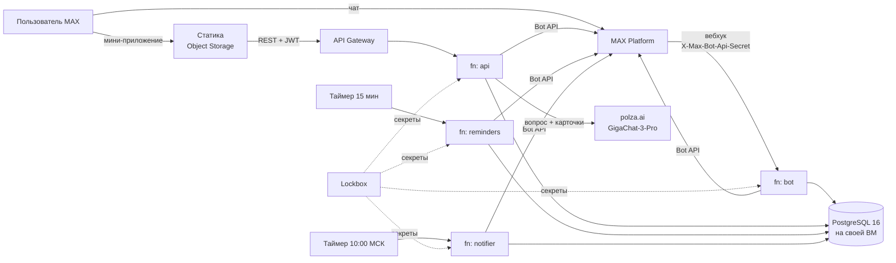

# Траектория


Чат-бот и мини-приложение в MAX: подбирают школьнику олимпиады для поступления и
напоминают о сроках. Студенческий хакатон MAX, трек «Образовательные решения»,
команда «Сигма».

- Бот: [@t356_hakaton_max_bot](https://max.ru/t356_hakaton_max_bot)
- Мини-приложение: https://traektoria.website.yandexcloud.net/ (открывается только из MAX, кнопкой в боте)
- Лендинг: https://traektoriaedu.ru/

## О проекте

Олимпиада из перечня может дать БВИ или 100 баллов за ЕГЭ, но льготу назначает
каждый вуз сам, часто отдельно для каждого направления. Сроки этапов разбросаны
по сайтам организаторов. Школьники и родители сводят это вручную и нередко
узнают о регистрации, когда она уже закрыта.

Бот за пару минут спрашивает класс, регион, предметы, направления и вузы и
предлагает олимпиады, которые ведут туда. В карточке видно, какую льготу даёт
каждый выбранный вуз, со ссылкой на правила приёма. Выбранные олимпиады лежат в
трекере, о сроках бот напоминает в MAX. Родитель подключается к той же
траектории и может предложить олимпиаду, решает ученик.

Чат и мини-приложение поделили по удобству. В чате короткое: анкета на кнопках,
которые меняют сообщение на месте, напоминания с кнопками «✓ Отметить
регистрацию», «Напомнить завтра» и «Открыть регистрацию», предложения родителя,
новости об изменившихся сроках и льготах. В мини-приложении то, что удобнее
смотреть списком: подбор, каталог, карточки, трекер, календарь. Кнопки из чата
открывают мини-приложение сразу на карточке, в трекере или в семье. Логин не
нужен, MAX передаёт подписанные данные пользователя. Приглашением в семью можно
поделиться штатным окном MAX, регион можно отправить геопозицией.

## Содержание

- [Основной сценарий](#основной-сценарий)
- [Запуск в Docker](#запуск-в-docker)
- [Как проверить](#как-проверить)
- [Что должно получиться](#что-должно-получиться)
- [Тестовые данные](#тестовые-данные)
- [Остановка и повторный запуск](#остановка-и-повторный-запуск)
- [Архитектура](#архитектура)
- [Порты и переменные окружения](#порты-и-переменные-окружения)
- [Внешние сервисы](#внешние-сервисы)
- [API](#api)
- [Данные](#данные)
- [Безопасность](#безопасность)
- [Тесты](#тесты)
- [Известные ограничения](#известные-ограничения)
- [Зависимости и лицензии](#зависимости-и-лицензии)
- [Что где лежит](#что-где-лежит)

## Основной сценарий

1. Пользователь пишет боту `/start`, соглашается с политикой конфиденциальности
   и проходит анкету.
2. Бот говорит, сколько олимпиад подошло, с какой начать и какая ближайшая по
   сроку, и присылает кнопку «Открыть «Траекторию»».
3. В мини-приложении ученик открывает карточку олимпиады (льготы в его вузах,
   этапы, источник) и добавляет её в трекер.
4. За 30, 7, 3 и 1 день до этапа приходит напоминание. Если сроки или льготы
   изменились, бот тоже напишет.
5. Родитель входит в траекторию по приглашению и предлагает олимпиады, ученик
   принимает или отклоняет.

Сценарий целиком работает в проде.

## Запуск в Docker

Из корня репозитория:

```bash
docker compose up --build
```

Поднимутся Postgres, миграции с контентом, демо-семья, четыре Go-сервиса и
мини-приложение. Секреты не нужны. Через полминуты откройте
http://localhost:8083, мини-приложение запустится от лица ученика из демо-семьи.

Нужны Docker с Compose v2.20+ (`compose.yaml` использует `include`), около 3 ГБ
места и свободные порты 5432 и 8080–8084. Сборка без кэша на MacBook с Apple
Silicon — 97 секунд без скачивания базовых образов, повторный `up` — около 12.
Со старым Compose: `docker compose -f infra/docker-compose.yml up --build` или
`make up`.

`--wait` не добавляйте: `migrate` и `seed-demo` завершаются, и `--wait` считает
это ошибкой. Готовность видна в `docker compose ps`: пять сервисов `healthy`, два
разовых `exited (0)`.

## Как проверить

### В MAX

В MAX всё настоящее: вход по подписи, сообщения, напоминания, помощник. Тестовых
учёток нет, траекторию проверяющий создаёт сам, для семьи нужен второй аккаунт
MAX. Версия прода видна внизу профиля в мини-приложении и в `GET /api/v1/health`
(короткий хеш коммита).

1. Откройте [@t356_hakaton_max_bot](https://max.ru/t356_hakaton_max_bot), нажмите
   «Начать» и примите [политику конфиденциальности](https://traektoriaedu.ru/privacy.html).
2. Пройдите анкету. Что стоит попробовать:
   - регион текстом, даже с опечаткой («набережные челны»), кнопкой, по первой
     букве или геопозицией из мобильного MAX;
   - «Не знаю — помоги выбрать» в направлениях: два вопроса, и бот предложит
     2–3 направления;
   - вузы по разговорным названиям: «вышка», «физтех»;
   - «← Назад» на любом шаге, кроме первого, ответы не теряются.

   В конце «Изменить» переспросит одно поле, «Готово» создаст траекторию.
3. Нажмите «Открыть «Траекторию»», при первом входе будет короткое обучение.
4. Пройдите по вкладкам: главная, подбор, карточка олимпиады, трекер с
   календарём, каталог с переключателем «Ведут в мои вузы и на мои направления»,
   семья, профиль.
5. «Пригласить» в мини-приложении или «👋 Пригласить в семью» в чате дают
   одноразовую ссылку `https://max.ru/t356_hakaton_max_bot?start=inv_…`.
   Откройте её со второго аккаунта и предложите олимпиаду от родителя.
6. Команды: `/menu`, `/settings` (за сколько дней напоминать), `/help`,
   `/delete`. Удалить траекторию может только создатель, после этого анкету
   можно пройти заново.
7. Помощник: «Спросить помощника» на главной или «Спросить» в карточке. Например,
   «Что даёт Высшая проба в ВШЭ?» или «Что такое БВИ?».

### Локально

После `docker compose up --build`:

- http://localhost:8083 — ученик Артём;
- http://localhost:8083/?dev_user=parent — его мама Ольга;
- http://localhost:8083/?dev_user=new — пользователь без анкеты.

```bash
curl localhost:8081/health         # api; /health есть и у 8080, 8082, 8084
curl -XPOST localhost:8082/run     # прогнать напоминания вместо таймера
curl -XPOST localhost:8084/run     # прогнать уведомления об изменениях

# сверить API с контрактом (Node.js 22, демо-данные не меняются)
cd apps/web && npm ci && npm run contract:check
```

В браузере нет MAX, поэтому локальная сборка идёт с заглушкой MAX Bridge, а
локальный API принимает неподписанный вход только от id 900000000–900000999.
Без токена бота сообщения в MAX не уходят, без ключа LLM помощник отвечает
шаблоном «данных нет». Ключ можно вписать в `.env` (копия `.env.example`),
`docker compose` подхватит его сам.

Бот на стенде — тот же код, что в проде, но сообщений из MAX не получит: MAX
шлёт их только на публичный HTTPS-вебхук, а он настроен на прод. Переписку с
ботом проверяйте в [@t356_hakaton_max_bot](https://max.ru/t356_hakaton_max_bot),
на стенде — мини-приложение, API, воркеры и базу.

## Что должно получиться

### В MAX

- `/start` с нового аккаунта: приветствие, какие данные бот сохранит, ссылка на
  политику и «Принимаю». Если траектория уже есть: «С возвращением…» и меню.
- «набережные челны» → Республика Татарстан.
- Направления нет в выбранных местах → бот предложит ближайшие вузы и похожие
  направления.
- «Готово» → сколько олимпиад подходит, с какой начать, ближайшая по сроку и
  кнопка «Открыть «Траекторию»».
- Неверный ввод → бот переспрашивает: «Имя — от 1 до 40 символов», «Не нашёл вуз
  «…». Попробуй иначе или выбери из списка». Непонятное сообщение → подсказка с
  командами.
- Кнопка из пройденного шага → «Этот вопрос уже позади», ничего не меняется.
- Сбой на нашей стороне → «Что-то пошло не так. Попробуй ещё раз чуть позже»,
  анкета продолжается с того же места.
- Повторно открытое приглашение → «Приглашение уже недействительно».
- Предложение родителя → у ученика кнопки «Добавить в трекер», «Открыть
  карточку», «Не сейчас». Повторный ответ → «На это предложение уже ответили».
- «✓ Отметить регистрацию» в напоминании → в трекере появляется «отмечено: имя».
- «Что даёт Высшая проба в ВШЭ?» → ответ по карточкам и ссылки на сайт олимпиады
  и правила приёма ВШЭ. Нет ответа в базе → «Данных нет…» и ссылка на
  первоисточник.
- Нет сети → в мини-приложении «Не загрузилось» и «Повторить загрузку»,
  неудачное сохранение — всплывающее сообщение. Перезапуск не нужен, истёкшую
  сессию приложение обновляет само.
- Мини-приложение в обычном браузере не открывается: без подписи MAX сессии нет.

### На локальном стенде

Чистый стенд без `.env`, 30.09.2026:

```text
$ curl localhost:8081/health
{"status":"ok","version":"dev"}

$ curl localhost:8080/health
ok

$ curl -XPOST localhost:8082/run
{"processed":0,"sent":0,"failed":0,"skipped":0,"expired":0,"stale":0}

$ curl -XPOST localhost:8084/run
{"changes":0,"trajectories":0,"sent":0,"failed":0,"skipped":0,"postponed":0,"dropped":0,"stale":0}

$ curl -i localhost:8083/api/v1/home
HTTP/1.1 401 Unauthorized
{"error":{"code":"UNAUTHORIZED","message":"Сессия истекла. Откройте приложение заново."}}
```

Без токена воркеры пишут в лог `MAX_BOT_TOKEN пуст` и ничего не отправляют,
накопленное уйдёт, когда токен появится.

В браузере:

- главная Артёма: 9 класс, Татарстан, программная инженерия и информационная
  безопасность; в трекере «Высшая проба» и ВсОШ по информатике, от Ольги ждёт
  ответа предложение НТО;
- «Подбор» 30.09.2026: 6 олимпиад, среди них Innopolis Open и ВсОШ по математике.
  Показываются только те, куда ещё можно успеть, поэтому позже список короче;
- карточка «Высшей пробы» по информатике: льготы ВШЭ и КФУ на программную
  инженерию, этапы, ссылки на правила приёма;
- `?dev_user=parent`: Ольга может отметить регистрацию, но не принять
  предложение, это решает ученик;
- `?dev_user=new`: экран «Анкета ещё не пройдена» (API отвечает 404);
- неподписанный вход от id вне 900000000–900000999: 401;
- без `POLZA_AI_API_KEY` помощник отвечает «Данных нет…» со ссылками на
  источники, в LLM ничего не уходит.

## Тестовые данные

В проде демо-данных нет, проверяющий видит только свою траекторию. Всё тестовое —
в локальном стенде и в CI.

Демо-семья (`packages/db/migrations-demo`, накатывает `seed-demo`):

- Артём (id MAX 900000001), ученик и создатель траектории: 9 класс, Казань,
  информатика и математика, программная инженерия и информационная безопасность,
  вузы Иннополис, ВШЭ, КФУ;
- Ольга (900000002), мама;
- в трекере «Высшая проба» по информатике (регистрацию отметила Ольга) и ВсОШ
  по информатике без регистрации;
- предложение НТО от Ольги без ответа и одна неиспользованная ссылка-приглашение;
- Гость (900000009, `?dev_user=new`) в базе не заведён.

Id из диапазона 900000000–900000999, у настоящих аккаунтов MAX таких нет.

Ещё три вымышленные олимпиады вне перечня (`packages/db/migrations-local`):
«Турнир юных программистов Казани», «Импульс», «Бизнес-старт». Они нужны для
блока «Вне перечня», организатор у них «Вымышленный пример для демонстрации», в
прод они не попадают. Демонстрационные сроки и льготы в настоящем контенте
описаны в разделе [Данные](#данные).

```bash
docker compose down -v && docker compose up                     # начать с нуля
docker compose exec postgres psql -U traektoria -d traektoria   # заглянуть в базу
```

Изменения из браузера переживают `down` и `up`, база лежит в томе
`postgres-data`. Нового пользователя можно завести только анкетой в боте, поэтому
на стенде работаем с демо-семьёй.

## Остановка и повторный запуск

```bash
docker compose stop                  # остановить, контейнеры и данные остаются
docker compose start                 # запустить обратно

docker compose down                  # удалить контейнеры, база остаётся в томе
docker compose up -d                 # поднять снова, ~12 с, миграции не повторяются

docker compose down -v               # удалить и базу, следующий up создаст всё с нуля
docker compose down -v --rmi local   # плюс собранные образы

docker compose restart api           # перезапустить один сервис
docker compose up -d --build api     # пересобрать один сервис
```

`goose: no migrations to run` в логе `migrate` после повторного `up` — это норма.
Если запускали с `-f infra/docker-compose.yml`, добавляйте его к каждой команде
(или `make down`, `make down ARGS=-v`).

## Архитектура



Четыре Cloud Functions на Go из одного модуля и одна база:

- `bot` — анкета, команды, кнопки напоминаний и предложений, приглашения;
- `api` — REST для мини-приложения, 35 операций;
- `reminders` — раз в 15 минут рассылает наступившие напоминания, неотправленное
  остаётся в плане до следующего запуска;
- `notifier` — раз в день пишет траектории одним сообщением, что изменилось в
  сроках и льготах. Изменения записывают триггеры базы.

Мини-приложение (`apps/web`, React и MAX UI) — статика в Object Storage.

Бот и api не вызывают друг друга по HTTP, а используют общие сценарии из
`packages/core` (логика без HTTP и MAX: права, подбор, план напоминаний,
помощник) и `packages/db/store` (SQL на pgx). Поэтому сделанное в чате сразу
видно в мини-приложении, а права и шаги анкеты проверяются в одном месте.

Очереди и кэша нет: нагрузка MVP — единицы запросов в секунду. Дубли отсекает
база уникальными ключами на доставку напоминания, обновление MAX и олимпиаду в
трекере, приглашение гасится одним условным `UPDATE`. Функции не хранят
состояние, анкета лежит в `bot_dialogs`.

Подбор считается без LLM, по таблицам весов: одни ответы — один результат, и его
можно объяснить. Модель работает только в помощнике и только по нашим
карточкам. Облачные функции выбрали, потому что нагрузка маленькая и
неравномерная, а платить за простой не хотелось.

Каждый сервис собирается из одного кода и облачной функцией (`cmd/function`), и
обычным сервером для Docker (`cmd/local`). Локально таймеры заменяет `POST /run`,
статику отдаёт nginx. TS-типы фронта генерируются из контракта API.

## Порты и переменные окружения

| Сервис | Порт | Переопределить | Что это |
| --- | --- | --- | --- |
| postgres | 5432 | `POSTGRES_PORT` | PostgreSQL 16 |
| migrate | — | | разово накатывает схему и контент (goose) |
| seed-demo | — | | разово накатывает демо-семью и вымышленные олимпиады |
| bot | 8080 | `BOT_PORT` | вебхук MAX (`POST /`) |
| api | 8081 | `API_PORT` | REST `/api/v1/*` |
| reminders | 8082 | `REMINDERS_PORT` | напоминания, `POST /run` |
| web | 8083 | `WEB_PORT` | мини-приложение, nginx проксирует `/api/v1/` в api |
| notifier | 8084 | `NOTIFIER_PORT` | уведомления об изменениях, `POST /run` |

Если порт занят: `API_PORT=18081 WEB_PORT=18083 docker compose up`.

Переменные с комментариями — в [.env.example](.env.example), секретов там нет. У
всех есть значения по умолчанию, `.env` нужен только для настоящего MAX и LLM.

| Переменная | Для чего | На стенде |
| --- | --- | --- |
| `MAX_BOT_TOKEN` | токен Bot API, им же проверяется подпись мини-приложения | пусто, сообщения не уходят |
| `WEBHOOK_SECRET` | секрет вебхука, в облаке обязателен | пусто, вебхук принимает всё |
| `MAX_BOT_NAME`, `MAX_BOT_ID` | ник для приглашений, id для кнопок `open_app` | наш бот |
| `DATABASE_URL`, `DB_MAX_CONNS` | база и размер пула | Postgres из compose, 2 |
| `POSTGRES_USER`, `POSTGRES_PASSWORD`, `POSTGRES_DB` | учётка локальной базы | `traektoria` |
| `JWT_SECRET`, `JWT_TTL` | подпись сессий, в production от 32 байт | небоевой ключ, `1h` |
| `APP_ENV` | `production` запрещает вход без подписи | `development` |
| `DEV_UNSIGNED_INITDATA` | вход без подписи для браузера, только вне production | `true` |
| `POLZA_AI_API_KEY`, `LLM_BASE_URL`, `LLM_MODEL` | ИИ-помощник | ключа нет, «данных нет» |
| `CORS_ALLOWED_ORIGINS` | адрес мини-приложения в проде | пусто, всё идёт через nginx |
| `REMINDER_HOUR` | час напоминаний по местному времени | `10` |
| `BOT_MODE` | `webhook` или `poll` (отладка) | `webhook` |
| `TZ` | часовой пояс контейнеров | `Europe/Moscow` |
| `VITE_API_BASE`, `VITE_DEV_FAKE_WEBAPP` | адрес API и заглушка MAX Bridge при сборке веба | `/api/v1`, `true` |
| `VITE_MAX_BOT_NAME` | ник бота для кнопки «Пройти анкету в чате бота» | `t356_hakaton_max_bot` |

Для разработки без Docker: Go 1.23 (рантайм Cloud Functions), Node.js 22.12+ с
npm 11+, Python 3.11+ для парсера датасетов.

## Внешние сервисы

Три сервиса в Docker не поднять, стенд работает без них:

- MAX (Bot API и MAX Bridge) — сообщения бота и вход в мини-приложение. На стенде
  вместо него заглушка MAX Bridge и вход без подписи для тестовых id, бот без
  токена не отвечает. Чат проверяется в прод-боте.
- polza.ai с GigaChat-3-Pro — ответы помощника. Без ключа — «данных нет».
- Yandex Cloud (Cloud Functions, API Gateway, таймеры, Object Storage, Lockbox) —
  прод. Локально вместо них `http.Server`, `POST /run`, nginx и переменные
  окружения.

### MAX Bot API

Клиент свой (`packages/shared/maxapi`): официальный Go SDK требует Go 1.24, а в
Cloud Functions есть только 1.23. Используем `/messages`, `/answers`,
`/subscriptions`, `/updates`, `/me`, `/me/commands`. Вебхук с неверным секретом
получает 403, всё остальное — 200, даже при нашей ошибке (пользователю уходит
извинение). Иначе MAX повторял бы доставку и через 8 часов отписал бота.
Обработка обновления ограничена 25 секундами (MAX ждёт 30), повторы отсекает
`bot_updates_seen`. На 429 клиент ждёт и повторяет, сами шлём не больше 25
сообщений в секунду. Сертификат Russian Trusted Root CA вшит в клиент: без него
на части систем TLS до `platform-api2.max.ru` не проходит.

### Вход в мини-приложение

`POST /session` проверяет строку запуска по
[алгоритму MAX](https://dev.max.ru/docs/webapps/validation) (HMAC-SHA256 от
токена бота) и что `auth_date` не старше часа, затем выдаёт JWT на час. Истёкший
токен клиент один раз обновляет сам.

### ИИ-помощник

`POST https://polza.ai/api/v1/chat/completions`, модель `GigaChat/GigaChat-3-Pro`,
ответ в JSON. Отвечает только по нашей базе, без векторного поиска: в вопросе
ищем олимпиады, вузы, предметы и термины (БВИ, 100 баллов, уровни перечня) и
отдаём модели их карточки. Ответ без ссылок на карточки или дольше 25 секунд
заменяется на «данных нет» со ссылкой на первоисточник. Вопрос до 500 символов,
5 подряд, дальше не чаще раза в 12 секунд.

### Yandex Cloud

Инфраструктура — в Terraform ([infra/terraform](infra/terraform/README.md)),
настройка базы — в Ansible ([infra/ansible](infra/ansible/README.md)).

## API

API нужен только мини-приложению, открытым API данных он не задумывался.
Контракт — [openapi.yaml](packages/api-contract/openapi.yaml), 35 операций под
`/api/v1`, TS-типы фронта генерируются из него.

`npm run contract:check` делает 94 запроса к живому API по всем 35 операциям,
включая ошибки 400, 401 и 404. Проверяет, что код описан в контракте, тело
проходит схему с обязательными полями, лишнего тела нет, а календарь приходит с
`Content-Type: text/calendar`. Этот прогон есть в CI на каждый PR.

Вход: строка запуска в `POST /session` → токен → `Authorization: Bearer <token>`.
Права считаются на каждый запрос и приходят в `permissions`. Ошибки —
`{error: {code, message}}`, противоречивые отметки в трекере получают 409.

Прод: `https://d5d8b10t57l9qlsqnsk7.y0g3kng5.apigw.yandexcloud.net/api/v1`. Без
подписи MAX он отвечает 401, поэтому ответы вне MAX можно посмотреть только на
стенде.

## Данные

Источники — открытые документы: перечень олимпиад на 2025/26 год (приказ
Минобрнауки № 669 от 30.08.2025), правила приёма 2026 года десяти вузов и сайты
олимпиад. У каждого из 66 документов записаны URL, sha256 и дата проверки
([datasets/](datasets/README.md)). Парсер на Python (зависимости в
[requirements.txt](datasets/parser/requirements.txt)) собирает датасеты, `make
seed` превращает их в миграции `0003` и `0021`. В рантайме Python не нужен.

В базе 72 олимпиады (63 из перечня и 9 предметов ВсОШ), 192 профиля, 571 этап,
10 вузов, 67 направлений (16 в анкете), 164 направления у вузов, 1420 льгот
вузов, 11 519 льгот по направлениям, 303 источника.

Описания вузов и олимпиад мы писали сами по официальным сайтам, только
проверяемое: город, год основания, профиль, формат. Льготы и сроки хранятся
отдельно, с источником.

Персональных данных в репозитории нет. Пользователь появляется из MAX: id, имя и
ответы анкеты. В LLM уходят только вопрос и карточки, без имён и id.

Что пока демонстрационное:

- 203 этапа у 85 профилей: сроки 2026/27 публикуются постепенно, где их нет,
  даты сгенерированы на октябрь 2026 — январь 2027 или взяты из прошлого сезона.
  В карточке метка «Демо-даты», в API `stages_are_demo: true`. У ВсОШ даты
  настоящие.
- 80 из 1420 льгот без подтверждённого источника: в карточке «данные уточняются».
- Город финала выводим из вуза-организатора, у межвузовских олимпиад не
  указываем. Это приближение: у многих олимпиад есть региональные площадки.
- Демо-семья и вымышленные олимпиады — только стенд и CI.

## Безопасность

- Рабочих токенов, паролей и ключей в репозитории нет. Секреты — в `.env` (в
  `.gitignore`) и Lockbox, функции берут их из Lockbox при запуске. В архив
  функций и Docker-образы `.env` не попадает.
- Бот в облаке без секрета вебхука не стартует, секрет сравнивается за
  постоянное время.
- Сессии: подпись и свежесть initData, JWT HS256 с фиксированным алгоритмом
  (`alg: none` отбивается тестом). В production ключ короче 32 байт не даст api
  запуститься.
- Вход без подписи требует сразу `DEV_UNSIGNED_INITDATA=true`, `APP_ENV` не
  `production` и id из 900000000–900000999; с `APP_ENV=production` api не
  стартует. В облаке `APP_ENV=production`, демо-режим разработки
  (`enable_browser_demo` в Terraform) к сдаче выключен.
- Функция api доступна только через API Gateway, публично вызывается только
  вебхук.
- Права проверяются на сервере на каждое действие: сессия, активное участие,
  роль. Участник видит только свою траекторию, чаты с помощником — только автор.
  Удалённый из семьи теряет доступ сразу.
- Помощник: вопрос отделён от инструкций, длина и частота ограничены, ответ без
  ссылок на карточки отбрасывается. polza.ai помечает GigaChat-3-Pro как
  `is_fz152_compliant: false`, поэтому персональные данные модели не уходят.
- `/delete` сразу закрывает доступ всем участникам, данные стираются через час.
- 152-ФЗ: [политика](https://traektoriaedu.ru/privacy.html) на лендинге, ссылки в
  `/help` и в профиле. Согласие бот спрашивает до анкеты и до входа по
  приглашению (`users.privacy_accepted_at`). Отзыв — `/delete` или выход из
  траектории.

## Тесты

- Go: 502 тестовые функции. `store`, бот, воркеры и API тестируются на настоящем
  Postgres, бот — целыми сценариями с поддельным MAX.
- Мини-приложение: 1244 теста на Vitest.
- Парсер и генератор сида: 255 тестов.
- Лендинг: 56 проверок.
- Контракт: `contract:check` против живого API.

CI ([ci.yml](.github/workflows/ci.yml)) на каждый PR: gofmt, go vet, сборка, все
тесты, проверка контракта и `tofu validate`.

```bash
make check && make test-db
cd apps/web && npm ci && npm run typecheck && npm test
```

## Известные ограничения

- Только ИТ, физика, биология с медициной и экономика, гуманитарных направлений
  нет.
- 10 вузов: Москва, Московская область, Петербург, Новосибирская область и
  Татарстан. Для других мест бот предлагает ближайшие вузы. Филиалов нет.
- Сроки у 85 профилей пока демонстрационные.
- «Написать своими словами» в подсказке направлений — заглушка.
- Город внутри региона выбирается только в боте, в мини-приложении — регионы.
- Лимит вопросов помощнику считается в памяти инстанса: при нескольких
  инстансах он мягче.
- Уведомление об изменениях в редком случае может прийти дважды (ушло, но не
  записалось). За запуск уходит не больше ~1400 сообщений, остальное — следующим
  запуском; через неделю попыток воркер сдаётся.
- База на одной ВМ без резерва: управляемый кластер дорог для MVP. Бэкап —
  ежедневный `pg_dump` в Object Storage, восстановление ручное. Порт 5432 открыт,
  потому что у Cloud Functions нет постоянных адресов, защита — TLS и
  `scram-sha-256`.
- Пулера соединений нет, у инстанса функции не больше двух соединений.
- Напоминания приходят с точностью до 15 минут.
- Из бота нельзя открыть карточку вуза, только вкладки, профиль, FAQ и карточку
  олимпиады.
- Вне MAX прод-версия мини-приложения не открывается, это специально.
- Оператор данных в политике — команда «Сигма», юрлица нет, перед настоящим
  запуском нужны реквизиты оператора. Id и имя из MAX остаются в `users` после
  удаления траектории: бот записывает их при каждом сообщении.

## Зависимости и лицензии

Версии зафиксированы в `go.mod`/`go.sum`, `apps/web/package-lock.json` и
[requirements.txt](datasets/parser/requirements.txt) (с транзитивными), образы — с
тегами.

| Зависимость | Версия | Лицензия |
| --- | --- | --- |
| [pgx](https://github.com/jackc/pgx) | v5.7.6 | MIT |
| [golang-jwt](https://github.com/golang-jwt/jwt) | v5.3.1 | MIT |
| golang.org/x/crypto, x/sync, x/text (косвенные) | см. go.mod | BSD-3-Clause |
| [goose](https://github.com/pressly/goose), только в образе `migrate` | v3.22.1 | MIT |
| React, React DOM | 19.2.8 | MIT |
| [@maxhub/max-ui](https://www.npmjs.com/package/@maxhub/max-ui) | 0.5.0 | MIT |
| @tanstack/react-query | 5.103.2 | MIT |
| react-router-dom | 7.18.4 | MIT |
| Vite, Vitest, Testing Library, jsdom, openapi-typescript (разработка) | см. package.json | MIT |
| TypeScript (разработка) | 5.9.3 | Apache-2.0 |
| pdfplumber, pdfminer.six (парсер) | 0.11.10, 20260107 | MIT |
| PyYAML, charset-normalizer, urllib3, cffi (парсер) | см. requirements.txt | MIT |
| requests (парсер) | 2.34.2 | Apache-2.0 |
| pypdfium2, cryptography (парсер) | см. requirements.txt | Apache-2.0 или BSD-3-Clause |
| idna, pycparser (парсер) | см. requirements.txt | BSD-3-Clause |
| pillow (парсер) | 12.3.0 | MIT-CMU |
| certifi (парсер) | 2026.7.22 | MPL-2.0 |
| Образы postgres:16-alpine, nginx:1.27-alpine, golang:1.23-alpine, node:22-alpine, alpine:3.20 | | PostgreSQL License, BSD-2-Clause, BSD-3-Clause, MIT, MIT |
| Шрифты Onest и Unbounded на лендинге | | SIL OFL 1.1 |

Работу с initData и Bot API сверяли с [Go SDK MAX](https://github.com/max-messenger/max-bot-api-client-go)
(Apache 2.0) и [dev.max.ru](https://dev.max.ru), код SDK не копировали. Словарь
городов собран из [hflabs/city](https://github.com/hflabs/city) (© HFLabs,
CC BY-SA 4.0) и распространяется на тех же условиях. Russian Trusted Root CA —
публичный корневой сертификат НУЦ Минцифры.

## Что где лежит

```text
compose.yaml            точка входа docker compose, подключает infra/docker-compose.yml
apps/
  bot/                  вебхук MAX: анкета, команды, кнопки
  api/                  REST для мини-приложения
  reminders/            напоминания
  notifier/             уведомления об изменениях сроков и льгот
  web/                  мини-приложение: React + Vite + MAX UI
  landing/              лендинг traektoriaedu.ru
packages/
  core/                 логика без HTTP и MAX
  db/                   миграции, демо-миграции, store, тестовая база
  shared/               клиенты MAX и LLM, конфиг, словарь текстов
  api-contract/         OpenAPI-контракт и TS-типы
datasets/               датасеты олимпиад и вузов, парсер, генератор сида
infra/                  compose стенда, Terraform, Ansible
docs/                   ТЗ, прототип, экраны, материалы хакатона
```
