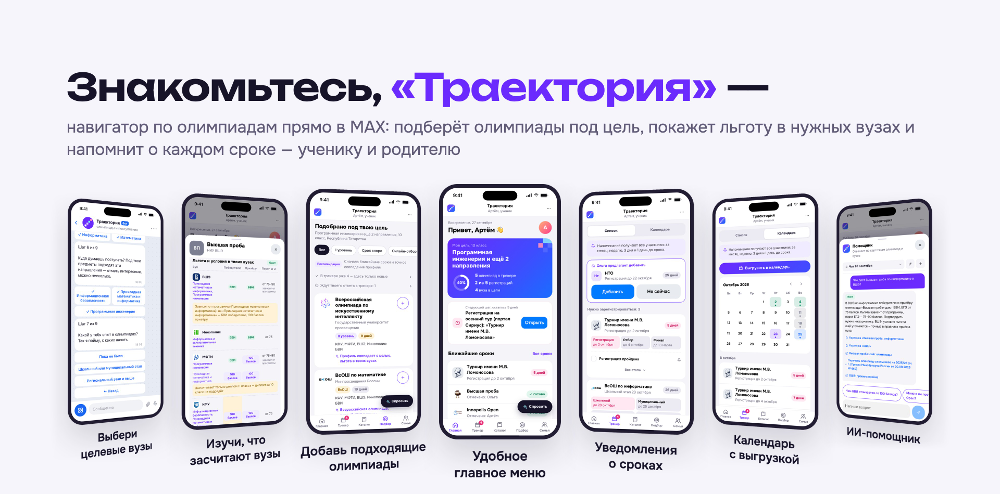
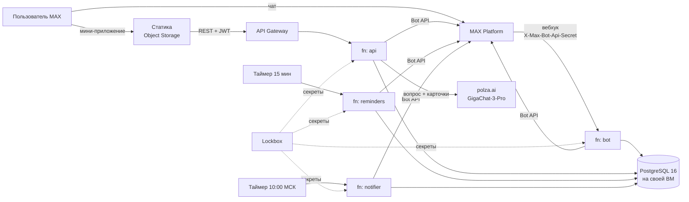

# Траектория



Чат-бот и мини-приложение в MAX, которые помогают школьнику подобрать олимпиады
для поступления и не пропустить сроки. Делали на студенческий хакатон MAX,
трек «Образовательные решения», команда «Сигма».

- Бот: [@t356_hakaton_max_bot](https://max.ru/t356_hakaton_max_bot)
- Мини-приложение: https://traektoria.website.yandexcloud.net/. Открывается только из MAX, кнопкой в боте
- Лендинг: https://traektoriaedu.ru/

## О проекте

Олимпиада из перечня Минобрнауки может дать поступление без экзаменов (БВИ) или
100 баллов за ЕГЭ. Проблема в том, что льготу назначает каждый вуз сам, и часто
отдельно для каждого направления. Сроки этапов при этом разбросаны по сайтам
организаторов. Школьники и родители собирают всё это по таблицам вручную и
нередко узнают о регистрации, когда она уже закрыта.

Мы хотели, чтобы это занимало пару минут. Бот в чате спрашивает класс, регион,
любимые предметы, направления и вузы. Потом предлагает олимпиады, которые ведут
именно туда, и в карточке показывает, какую льготу даёт каждый выбранный вуз, со
ссылкой на правила приёма. Олимпиады, в которых ученик участвует, лежат в
трекере, а о сроках бот напоминает сообщениями в MAX. Родитель подключается к
той же траектории: видит то же, что ребёнок, и может предложить олимпиаду. Решает
в итоге ученик.

Чат и мини-приложение мы поделили по тому, что где удобнее. В чате остаётся
короткое: анкета на кнопках, которые меняют сообщение на месте, напоминания с
кнопками «✓ Отметить регистрацию», «Напомнить завтра» и «Открыть регистрацию»,
предложения родителя и новости об изменившихся сроках и льготах. В
мини-приложении — то, что нужно сравнивать и смотреть списком: подбор, каталог,
карточки, трекер, календарь. Кнопки из чата открывают мини-приложение сразу в
нужном месте: на карточке олимпиады, в трекере или в семье. Логиниться не надо,
MAX сам передаёт подписанные данные пользователя. Приглашение в семью — это ссылка
на бота, и ею можно поделиться штатным окном MAX прямо из мини-приложения. Регион
в анкете можно отправить геопозицией.

## Содержание

- [Основной сценарий](#основной-сценарий)
- [Запуск в Docker](#запуск-в-docker)
- [Как проверить](#как-проверить)
- [Что должно получиться](#что-должно-получиться)
- [Тестовые данные](#тестовые-данные)
- [Остановка и повторный запуск](#остановка-и-повторный-запуск)
- [Архитектура](#архитектура)
- [Порты и переменные окружения](#порты-и-переменные-окружения)
- [Внешние сервисы](#внешние-сервисы)
- [API](#api)
- [Данные](#данные)
- [Безопасность](#безопасность)
- [Тесты](#тесты)
- [Известные ограничения](#известные-ограничения)
- [Зависимости и лицензии](#зависимости-и-лицензии)
- [Что где лежит](#что-где-лежит)

## Основной сценарий

1. Ученик или родитель пишет боту `/start`, соглашается с политикой
   конфиденциальности и отвечает на вопросы анкеты.
2. Бот говорит, сколько олимпиад подошло, называет одну для старта и ближайшую по
   сроку и присылает кнопку «Открыть «Траекторию»».
3. В мини-приложении ученик смотрит подбор, открывает карточку олимпиады (льготы
   в его вузах, этапы, источник) и добавляет её в трекер.
4. За 30, 7, 3 и 1 день до этапа приходит напоминание. Если организатор сдвинул
   сроки или вуз поменял льготу, бот тоже напишет.
5. Родитель заходит в траекторию по ссылке-приглашению и предлагает олимпиады, а
   ученик принимает их или отклоняет.

Весь сценарий работает в проде от начала до конца. Как пройти его по шагам и что
должно получиться, описано ниже.

## Запуск в Docker

Из корня репозитория:

```bash
docker compose up --build
```

Этой командой поднимаются Postgres, миграции с контентом, демо-семья, четыре
Go-сервиса и мини-приложение. Секреты не нужны. Секунд через тридцать можно
открывать http://localhost:8083: мини-приложение запустится от лица ученика из
демо-семьи.

Что нужно на машине: Docker с Compose v2.20 или новее (корневой `compose.yaml`
использует `include`), около 3 ГБ места и свободные порты 5432 и 8080–8084. На
MacBook с Apple Silicon сборка без кэша у нас заняла 97 секунд, не считая
скачивания базовых образов. Повторный `up` без пересборки — около 12 секунд.

Если Compose старше 2.20, запускайте так:
`docker compose -f infra/docker-compose.yml up --build` (или `make up`).

`--wait` лучше не добавлять: `migrate` и `seed-demo` отрабатывают и завершаются,
а `--wait` считает это ошибкой. Готовность проще смотреть в `docker compose ps`:
у пяти сервисов `healthy`, у двух разовых `exited (0)`.

## Как проверить

### В MAX

В MAX всё работает по-настоящему: вход по подписи, сообщения бота, напоминания,
ИИ-помощник. Тестовых учёток нет, траекторию проверяющий создаёт сам. Для
проверки семьи понадобится второй аккаунт MAX.

Какая версия сейчас в проде, видно внизу профиля в мини-приложении («Версия:
приложение … · сервер …») и в `GET /api/v1/health`: там короткий хеш коммита из
этого репозитория.

1. Откройте [@t356_hakaton_max_bot](https://max.ru/t356_hakaton_max_bot) и
   нажмите «Начать». Сначала бот попросит согласие с
   [политикой конфиденциальности](https://traektoriaedu.ru/privacy.html), без
   «Принимаю» анкета не начнётся.
2. Ответьте на вопросы. Несколько мест, которые стоит попробовать:
   - регион можно написать как угодно, даже с опечаткой: «Казань», «набережные
     челны». Есть кнопки для Москвы, Петербурга и области, поиск по первой
     букве, геопозиция из мобильного MAX и «Не важно» (тогда напоминания
     приходят по Москве);
   - в направлениях есть «Не знаю — помоги выбрать»: два вопроса, и бот
     предложит 2–3 направления. Родитель может нажать «Пусть ребёнок ответит»;
   - вузы ищутся и по разговорным названиям: «вышка», «физтех». Если в
     выбранных местах нужного направления нет, бот предложит ближайшие вузы, где
     оно есть, и похожие направления;
   - на любом шаге, кроме первого, есть «← Назад», и ответы не теряются.

   В конце бот покажет профиль целиком. «Изменить» переспросит одно поле прямо в
   чате, «Готово» создаст траекторию.
3. В итоговом сообщении нажмите «Открыть «Траекторию»». При первом входе
   мини-приложение покажет короткое обучение.
4. Пройдитесь по вкладкам: «Главная» и «Подбор» (там только то, чего ещё нет в
   трекере), карточка олимпиады, «Трекер» со списком и календарём, «Каталог» с
   переключателем «Ведут в мои вузы и на мои направления», «Семья», профиль.
5. Семья: «Пригласить» в мини-приложении или «👋 Пригласить в семью» в чате даёт
   одноразовую ссылку `https://max.ru/t356_hakaton_max_bot?start=inv_…`. Откройте
   её со второго аккаунта, и он попадёт в ту же траекторию. Предложите олимпиаду
   от родителя: ученику придёт сообщение с кнопками.
6. Команды бота: `/menu`, `/settings` (за сколько дней напоминать), `/help`,
   `/delete`. Удалить траекторию может только её создатель. После `/delete` можно
   пройти всё заново с того же аккаунта.
7. ИИ-помощник открывается кнопкой «Спросить помощника» на главной или
   «Спросить» в карточке. Для начала можно спросить «Что даёт Высшая проба в
   ВШЭ?» или «Что такое БВИ?».

### Локально

После `docker compose up --build`:

- http://localhost:8083 — мини-приложение от лица ученика Артёма;
- http://localhost:8083/?dev_user=parent — то же от лица его мамы Ольги;
- http://localhost:8083/?dev_user=new — пользователь, который ещё не прошёл анкету.

```bash
curl localhost:8081/health         # api; у 8080, 8082 и 8084 тоже есть /health
curl -XPOST localhost:8082/run     # прогнать воркер напоминаний вместо таймера
curl -XPOST localhost:8084/run     # прогнать уведомления об изменениях

# сверить ответы API с контрактом (нужен Node.js 22, демо-данные не меняются)
cd apps/web && npm ci && npm run contract:check
```

MAX в обычном браузере нет, поэтому локальная сборка мини-приложения идёт с
заглушкой MAX Bridge. Заглушка присылает неподписанную строку запуска, и
локальный API её принимает, но только от id 900000000–900000999 (подробнее в
разделе [Безопасность](#безопасность)).

Без токена бота и ключа LLM работает всё, кроме двух вещей: сообщения в MAX не
уходят, а помощник отвечает шаблоном «данных нет». Чтобы помощник заработал,
скопируйте `.env.example` в `.env` и впишите `POLZA_AI_API_KEY`. `docker compose`
из корня подхватит `.env` сам.

Бот на стенде — тот же код, что в проде, но сообщений из MAX он не получит: MAX
доставляет их только на публичный HTTPS-вебхук, а вебхук нашего бота смотрит в
прод. Поэтому переписку с ботом проверяйте в
[@t356_hakaton_max_bot](https://max.ru/t356_hakaton_max_bot), а на стенде —
мини-приложение, API, воркеры и базу.

## Что должно получиться

### В MAX

- На `/start` с нового аккаунта бот здоровается, коротко объясняет, какие данные
  сохранит, и даёт ссылку на политику и кнопку «Принимаю». Если траектория уже
  есть, анкета заново не начинается: бот отвечает «С возвращением…» и предлагает,
  что открыть.
- На «набережные челны» бот находит город и определяет регион: Республика
  Татарстан.
- Если выбрать направление, которого нет в выбранных местах, бот предложит
  ближайшие вузы с ним и похожие направления.
- После «Готово» приходит итог: сколько олимпиад подходит, с какой начать,
  какая ближайшая по сроку, и кнопка «Открыть «Траекторию»».
- На неверный ответ бот переспрашивает. Слишком длинное имя: «Имя — от 1 до 40
  символов. Напиши ещё раз.» Неизвестный вуз: «Не нашёл вуз «…». Попробуй иначе
  или выбери из списка.» На непонятное сообщение вне анкеты: «Не понял
  сообщение. Команды: /menu, /settings, /help.»
- Кнопка из уже пройденного шага анкеты ничего не меняет, бот отвечает «Этот
  вопрос уже позади».
- Если на нашей стороне что-то сломалось, бот пишет «Что-то пошло не так.
  Попробуй ещё раз чуть позже.» Ответы анкеты уже сохранены в базе, и
  продолжить можно с того же места.
- Ссылка-приглашение работает один раз. Повторно бот ответит: «Приглашение уже
  недействительно. Попросите прислать новую ссылку.»
- Когда родитель предлагает олимпиаду, ученику приходит сообщение с кнопками
  «Добавить в трекер», «Открыть карточку» и «Не сейчас». На «Не сейчас» бот
  ответит, что родитель увидит ответ в мини-приложении. Второй раз ответить на то
  же предложение нельзя: «На это предложение уже ответили.»
- «✓ Отметить регистрацию» в напоминании сразу отмечает регистрацию, и в трекере
  мини-приложения рядом с этапом появляется «отмечено: имя».
- На «Что даёт Высшая проба в ВШЭ?» помощник отвечает по карточкам олимпиады и
  вуза, а под ответом даёт ссылки на сайт олимпиады и правила приёма ВШЭ. Если
  ответа в нашей базе нет, так и пишет («Данных нет…») и отправляет к
  первоисточнику.
- Если пропала сеть, мини-приложение показывает «Не загрузилось» с кнопкой
  «Повторить загрузку», а неудачное сохранение — всплывающим сообщением.
  Закрывать и открывать приложение заново не нужно, истёкшую сессию оно
  обновляет само.
- Ссылка на мини-приложение, открытая в обычном браузере, не пускает внутрь: без
  подписи MAX сессия не выдаётся.

### На локальном стенде

Ответы чистого стенда без `.env`, сняли 30.09.2026:

```text
$ curl localhost:8081/health
{"status":"ok","version":"dev"}

$ curl localhost:8080/health
ok

$ curl -XPOST localhost:8082/run
{"processed":0,"sent":0,"failed":0,"skipped":0,"expired":0,"stale":0}

$ curl -XPOST localhost:8084/run
{"changes":0,"trajectories":0,"sent":0,"failed":0,"skipped":0,"postponed":0,"dropped":0,"stale":0}

$ curl -i localhost:8083/api/v1/home
HTTP/1.1 401 Unauthorized
{"error":{"code":"UNAUTHORIZED","message":"Сессия истекла. Откройте приложение заново."}}
```

Без токена воркеры ничего не отправляют и пишут в лог `MAX_BOT_TOKEN пуст —
напоминания планируются, но не отправляются` и `MAX_BOT_TOKEN пуст — уведомления
об изменениях ждут токена`. Накопленные изменения не пропадают и уйдут, когда
токен появится.

В браузере:

- на главной Артём: 9 класс, Татарстан, программная инженерия и информационная
  безопасность. В трекере «Высшая проба» и ВсОШ по информатике, от Ольги висит
  предложение НТО;
- в «Подборе» на 30.09.2026 было 6 олимпиад, среди них Innopolis Open и ВсОШ по
  математике. Подбор показывает только олимпиады, на которые ещё можно успеть,
  так что позже список будет короче;
- в карточке «Высшей пробы» по информатике видны льготы ВШЭ и КФУ на
  программную инженерию, этапы и ссылки на правила приёма;
- с `?dev_user=parent` та же траектория глазами Ольги. Регистрацию она отметить
  может, а принять предложение нет: это решает ученик;
- с `?dev_user=new` открывается экран «Анкета ещё не пройдена» с кнопкой
  «Пройти анкету в чате бота» (API на вход отвечает 404);
- неподписанная строка от id вне 900000000–900000999 получает 401 «Не удалось
  проверить вход. Откройте приложение из чата с ботом.»;
- без `POLZA_AI_API_KEY` помощник отвечает шаблоном «Данных нет…» со ссылками на
  найденные источники, в LLM ничего не уходит.

## Тестовые данные

В проде демо-данных нет. Проверяющий увидит только ту траекторию, которую
создаст сам. Всё тестовое живёт в локальном стенде и в CI.

Демо-семью (`packages/db/migrations-demo`) накатывает сервис `seed-demo`:

- Артём (id MAX 900000001), ученик и создатель траектории. 9 класс, Казань,
  информатика и математика, программная инженерия и информационная
  безопасность, вузы Иннополис, ВШЭ и КФУ. В олимпиадах доходил до школьного
  этапа.
- Ольга (900000002), его мама.
- В трекере «Высшая проба» по информатике и ВсОШ по информатике. На «Высшей
  пробе» регистрацию отметила Ольга, поэтому в карточке видно «Отметил(а) Ольга».
  ВсОШ без регистрации, она становится «следующим шагом» на главной.
- Ольга предложила НТО по искусственному интеллекту, Артём ещё не ответил.
- Есть одна неиспользованная ссылка-приглашение.
- Гость (900000009, `?dev_user=new`) в базе не заведён. На нём видно, что
  происходит с пользователем без анкеты.

Все id взяты из диапазона 900000000–900000999, у настоящих аккаунтов MAX таких нет.

Ещё есть три вымышленные олимпиады вне перечня (`packages/db/migrations-local`):
«Турнир юных программистов Казани», «Импульс» и «Бизнес-старт». Без них на стенде
не видно блока «Вне перечня». Организатор у них «Вымышленный пример для
демонстрации», источника нет, в прод они не попадают.

Кроме этого, в настоящем контенте часть сроков и льгот пока демонстрационные.
Они помечены в интерфейсе, подробности в разделе [Данные](#данные).

Как с этим работать:

```bash
# начать с нуля: база, миграции и демо-семья создадутся заново
docker compose down -v && docker compose up

# заглянуть в базу
docker compose exec postgres psql -U traektoria -d traektoria
```

Всё, что вы сделаете в браузере (трекер, предложения, чаты с помощником),
переживает `docker compose down` и `up`: база лежит в томе `postgres-data`.
Своего пользователя можно завести только анкетой в боте, поэтому на стенде
работаем с демо-семьёй.

## Остановка и повторный запуск

```bash
docker compose stop                  # остановить; контейнеры и данные остаются
docker compose start                 # запустить обратно

docker compose down                  # удалить контейнеры, база остаётся в томе
docker compose up -d                 # поднять снова, ~12 с; миграции второй раз не катятся

docker compose down -v               # удалить и базу; следующий up создаст всё с нуля
docker compose down -v --rmi local   # то же плюс собранные образы

docker compose restart api           # перезапустить один сервис
docker compose up -d --build api     # пересобрать один сервис после правки кода
```

После `down` и `up` в логе `migrate` будет `goose: no migrations to run`, так и
должно быть. Если запускали через `-f infra/docker-compose.yml`, добавляйте этот
же `-f` к каждой команде (или `make down`, `make down ARGS=-v`).

## Архитектура



В проде это четыре Cloud Functions на Go из одного модуля и одна база:

- `bot`: анкета, команды, кнопки напоминаний и предложений, вход по приглашению;
- `api`: REST для мини-приложения, 35 операций;
- `reminders`: раз в 15 минут досчитывает план напоминаний и рассылает те, что
  наступили. Что не удалось отправить, остаётся в плане до следующего запуска;
- `notifier`: раз в день пишет каждой траектории одним сообщением, что
  изменилось в сроках и льготах. Сами изменения записывают в журнал триггеры
  базы, когда меняются этапы или льготы.

Мини-приложение (`apps/web`, React и MAX UI) лежит статикой в Object Storage.

Бот и api друг друга по HTTP не вызывают: оба используют одни и те же сценарии из
`packages/core` и `packages/db/store`. В `packages/core` лежит логика без HTTP и
MAX (права, скоринг и подбор, план напоминаний, голос ученика и родителя, проверка
initData, помощник), в `packages/db/store` — SQL на pgx, в `packages/shared` —
клиенты MAX и LLM, конфиг и словарь текстов, общий с фронтом. Поэтому сделанное в
чате сразу видно в мини-приложении и наоборот, а права и шаги анкеты проверяются
в одном месте.

Очереди и кэша нет, нагрузка MVP — единицы запросов в секунду. От дублей
защищает сама база: уникальные ключи на доставку напоминания, на обработанное
обновление MAX и на олимпиаду в трекере, одноразовое приглашение гасится одним
условным `UPDATE`. Функции ничего не хранят в памяти между вызовами, состояние
анкеты лежит в `bot_dialogs`.

Подбор и скоринг считаются без LLM, по таблицам весов: на одни и те же ответы
всегда один и тот же результат, и его можно объяснить. Модель работает только в
помощнике и только поверх наших карточек. Облачные функции выбрали, потому что
нагрузка маленькая и неравномерная, а платить за простой не хотелось.

Каждый сервис собирается из одного кода двумя способами: облачной функцией
(`apps/*/cmd/function`) и обычным `http.Server` для Docker (`apps/*/cmd/local`).
Локально таймеры заменяет ручка `POST /run`, статику отдаёт nginx и проксирует
`/api/v1/` в api. TS-типы фронта генерируются из контракта API, так что фронт и
бэкенд не разъезжаются.

## Порты и переменные окружения

| Сервис | Порт | Переопределить | Что это |
| --- | --- | --- | --- |
| postgres | 5432 | `POSTGRES_PORT` | PostgreSQL 16 |
| migrate | — | | разово накатывает схему и контент (goose) |
| seed-demo | — | | разово накатывает демо-семью и вымышленные олимпиады |
| bot | 8080 | `BOT_PORT` | вебхук MAX (`POST /`) |
| api | 8081 | `API_PORT` | REST `/api/v1/*` |
| reminders | 8082 | `REMINDERS_PORT` | напоминания, `POST /run` |
| web | 8083 | `WEB_PORT` | мини-приложение, nginx проксирует `/api/v1/` в api |
| notifier | 8084 | `NOTIFIER_PORT` | уведомления об изменениях, `POST /run` |

Если порт занят: `API_PORT=18081 WEB_PORT=18083 docker compose up`.

Все переменные приложения с комментариями есть в [.env.example](.env.example),
секретов там нет. У каждой переменной в compose есть значение по умолчанию,
поэтому `.env` нужен только для настоящего MAX и LLM.

| Переменная | Для чего | На стенде по умолчанию |
| --- | --- | --- |
| `MAX_BOT_TOKEN` | токен Bot API, им же проверяется подпись мини-приложения | пусто, сообщения не уходят |
| `WEBHOOK_SECRET` | секрет вебхука; в облаке без него бот не стартует | пусто, вебхук принимает всё |
| `MAX_BOT_NAME`, `MAX_BOT_ID` | ник для ссылок-приглашений и id для кнопок `open_app` | наш бот |
| `DATABASE_URL`, `DB_MAX_CONNS` | база и размер пула | Postgres из compose, 2 |
| `POSTGRES_USER`, `POSTGRES_PASSWORD`, `POSTGRES_DB` | учётка локальной базы | `traektoria` |
| `JWT_SECRET`, `JWT_TTL` | подпись сессий мини-приложения; в production от 32 байт | небоевой ключ, `1h` |
| `APP_ENV` | `production` запрещает вход без подписи | `development` |
| `DEV_UNSIGNED_INITDATA` | вход без подписи для браузера (только вне production) | `true` |
| `POLZA_AI_API_KEY`, `LLM_BASE_URL`, `LLM_MODEL` | ИИ-помощник | ключа нет, шаблон «данных нет» |
| `CORS_ALLOWED_ORIGINS` | адрес мини-приложения в проде | пусто, запросы идут через nginx |
| `REMINDER_HOUR` | во сколько по местному времени слать напоминания | `10` |
| `BOT_MODE` | `webhook` или `poll` (long polling для отладки) | `webhook` |
| `TZ` | часовой пояс контейнеров | `Europe/Moscow` |
| `VITE_API_BASE`, `VITE_DEV_FAKE_WEBAPP` | адрес API и заглушка MAX Bridge, при сборке веба | `/api/v1`, `true` |
| `VITE_MAX_BOT_NAME` | ник бота для кнопки «Пройти анкету в чате бота» | `t356_hakaton_max_bot` |

Для разработки без Docker понадобятся Go 1.23 (именно 1.23, такой рантайм у Cloud
Functions), Node.js 22.12+ с npm 11+ и Python 3.11+ для парсера датасетов.

## Внешние сервисы

Три вещи в Docker не поднять, но стенд работает и без них:

- MAX (Bot API и MAX Bridge). Нужен для сообщений бота и для входа в
  мини-приложение по подписанной строке запуска. На стенде вместо него заглушка
  MAX Bridge и вход без подписи для тестовых id. Бот поднимается и принимает
  вебхук, но без токена не отвечает. Для полной проверки есть прод-бот.
- polza.ai с моделью GigaChat-3-Pro. Отвечает на вопросы ИИ-помощнику. Без ключа
  помощник выдаёт шаблон «данных нет».
- Yandex Cloud: Cloud Functions, API Gateway, таймеры, Object Storage,
  Lockbox. На нём работает прод. Локально функции заменены `http.Server`, таймеры —
  `POST /run`, бакет — nginx, Lockbox — переменными окружения.

### MAX Bot API

Клиент написали сами (`packages/shared/maxapi`): официальный Go SDK
требует Go 1.24, а в Cloud Functions есть только 1.23. Используем `/messages`,
`/answers`, `/subscriptions`, `/updates`, `/me` и `/me/commands`. Вебхук проверяет
секрет из `X-Max-Bot-Api-Secret` и при неверном отвечает 403. На всё остальное,
даже на собственную ошибку, отвечает 200 и извиняется перед пользователем в чате:
иначе MAX будет повторять доставку, а через 8 часов отпишет бота. На обработку
обновления бот отводит себе 25 секунд, MAX ждёт 30. Повторы одного и того же
обновления отсекает таблица `bot_updates_seen`. На 429 клиент ждёт и
повторяет, больше 25 сообщений в секунду не отправляет. Сертификат Russian
Trusted Root CA вшит в клиент, иначе на системах без него TLS до
`platform-api2.max.ru` не проходит.

### Вход в мини-приложение

`POST /session` проверяет строку запуска по
[алгоритму из документации MAX](https://dev.max.ru/docs/webapps/validation)
(HMAC-SHA256 от токена бота) и дополнительно следит, чтобы `auth_date` была не
старше часа. После этого выдаёт JWT на час. Если токен истёк, клиент один раз
заходит заново.

### ИИ-помощник

OpenAI-совместимый `POST https://polza.ai/api/v1/chat/completions`,
модель `GigaChat/GigaChat-3-Pro`, ответ в JSON. Отвечает только по нашей базе,
без векторного поиска: в вопросе ищем олимпиады, вузы, предметы и термины (БВИ,
100 баллов, уровни перечня) и отдаём модели их карточки. Ответ показываем, только
если модель сослалась на эти карточки. Если не сослалась или не ответила за 25
секунд, пользователь видит «данных нет» и ссылку на первоисточник. Вопрос до 500 символов. Подряд можно задать 5 вопросов, дальше
не чаще раза в 12 секунд.

### Yandex Cloud

Инфраструктура описана в Terraform
([infra/terraform](infra/terraform/README.md)), настройка базы — в Ansible
([infra/ansible](infra/ansible/README.md)).

## API

Наш API нужен только мини-приложению, открытым API данных он не задумывался.
Контракт лежит в
[packages/api-contract/openapi.yaml](packages/api-contract/openapi.yaml): 35
операций под `/api/v1`. Типы фронта генерируются из него (`npm run contract`).

`npm run contract:check` делает 94 запроса к живому API и проходит все 35
операций, в том числе с ошибочными ответами (400, 401, 404). Для каждого ответа
проверяется, что код описан в контракте, тело проходит схему вместе с
обязательными полями, лишнего тела нет, а календарь приходит с `Content-Type:
text/calendar`. Этот же прогон — отдельная задача CI на каждый PR.

Сначала мини-приложение отправляет строку запуска в `POST /session` и получает
токен, дальше ходит с `Authorization: Bearer <token>`. Права считаются на каждый запрос по матрице из
ТЗ и приходят в `permissions`. Ошибки выглядят как `{error: {code, message}}`.
Противоречивые отметки в трекере API отклоняет с кодом 409.

Прод-адрес: `https://d5d8b10t57l9qlsqnsk7.y0g3kng5.apigw.yandexcloud.net/api/v1`.
Без подписанной строки запуска MAX он отвечает 401, поэтому посмотреть ответы
вне MAX можно только на локальном стенде.

## Данные

Всё собрано из открытых документов: перечень олимпиад школьников на 2025/26 год
(приказ Минобрнауки № 669 от 30.08.2025), правила приёма 2026 года десяти вузов и
сайты олимпиад. Для каждого из 66 документов записаны URL, sha256 и дата проверки,
подробности в [datasets/](datasets/README.md). Парсер на Python
(`datasets/parser`, зависимости в
[requirements.txt](datasets/parser/requirements.txt)) собирает из документов
JSON-датасеты, а `make seed` делает из них SQL-миграции `0003` и `0021`. В
рантайме Python не нужен, контент попадает в базу миграциями.

После всех миграций в базе 72 олимпиады (63 из перечня и 9 предметов ВсОШ), 192
профиля олимпиад, 571 этап, 10 вузов, 67 направлений (16 из них предлагаются в
анкете), 164 направления у вузов, 1420 льгот вузов, 11 519 льгот по направлениям и
303 источника со ссылкой и датой проверки.

Описания вузов и олимпиад в карточках мы писали сами по официальным сайтам
(миграции с `0010`). В них только то, что можно проверить: город, год основания,
профиль, формат. Льготы и сроки в описания не пишем, у них свои таблицы с
источником.

Персональных данных в репозитории нет. Пользователи появляются только из MAX: id,
имя из профиля и ответы анкеты. В LLM уходят только текст вопроса и карточки
олимпиад и вузов, без имён, id и состава семьи.

Что пока демонстрационное:

- 203 этапа у 85 профилей. Организаторы публикуют сроки сезона 2026/27
  постепенно. Где их ещё нет полностью, даты либо сгенерированы на октябрь
  2026 — январь 2027, либо взяты из прошлого сезона. В карточке у таких этапов
  метка «Демо-даты» вместо «Факт», в API `stages_are_demo: true`. У ВсОШ даты
  настоящие: школьный этап — окно по графику «Сириуса», остальные — крайние сроки
  из Порядка проведения.
- 80 льгот из 1420. Хотя бы одна исходная запись у них помечена в датасете
  `is_demo`. Источника у них нет, в карточке написано «данные уточняются».
- Город финала мы выводим из вуза-организатора, у межвузовских олимпиад
  не указываем. Это приближение, у многих олимпиад есть региональные площадки.
- Демо-семья и вымышленные олимпиады есть только локально и в CI, см.
  [Тестовые данные](#тестовые-данные).

## Безопасность

- Рабочих токенов, паролей и ключей в репозитории нет. Секреты лежат только в
  `.env` (он в `.gitignore`) и в Lockbox. В настройки
  версий функций они не попадают: Cloud Functions достаёт их из Lockbox при
  запуске. В архив функций и в Docker-образы `.env` не попадает.
- Бот в облаке без секрета вебхука не стартует, секрет сравнивается за
  постоянное время.
- Сессии мини-приложения: проверка подписи и свежести initData, JWT HS256 с
  жёстко заданным алгоритмом (`alg: none` отбивается, на это есть тест). В
  production ключ короче 32 байт не пройдёт, api просто не запустится.
- Кого удалили из семьи, тот теряет доступ сразу, не дожидаясь, пока истечёт JWT.
- Вход без подписи для локальной разработки срабатывает только при трёх условиях
  сразу: `DEV_UNSIGNED_INITDATA=true`, `APP_ENV` не `production` и id из
  900000000–900000999. Если включить его вместе с `APP_ENV=production`, api не
  стартует. В облаке у функций `APP_ENV=production`, а временный демо-режим
  (`enable_browser_demo` в Terraform), которым мы пользовались во время
  разработки, к сдаче выключен.
- Функция api не публичная, к ней можно попасть только через API Gateway.
  Публично вызывается только вебхук.
- Права проверяются на сервере на каждое действие, в том числе в боте. Каждый
  запрос проверяет сессию, активное участие в траектории и права роли:
  участник видит только свою траекторию, а чаты с помощником — только их автор.
  Кнопка из старого сообщения ничего не сломает.
- Помощник: вопрос не смешивается с инструкциями, длина и частота ограничены,
  ответ без ссылок на карточки выбрасывается. polza.ai в своём каталоге помечает
  GigaChat-3-Pro как `is_fz152_compliant: false`. Это пометка прокси, а не самого
  GigaChat, но персональные данные к модели у нас всё равно не уходят.
- `/delete` сразу закрывает доступ всем участникам траектории, а сами строки
  стирает воркер напоминаний через час.
- 152-ФЗ. [Политика конфиденциальности](https://traektoriaedu.ru/privacy.html)
  лежит на лендинге, ссылки на неё есть в `/help`, в профиле мини-приложения и в
  подвале лендинга. Согласие бот спрашивает до первого вопроса анкеты и до входа
  по приглашению, время согласия пишется в `users.privacy_accepted_at`. Отозвать
  согласие можно через `/delete` или выход из траектории: отметка снимается,
  черновик анкеты стирается, и при возвращении бот спросит снова.

## Тесты

- Go: 502 тестовые функции. Логика покрыта юнит-тестами, а `store`, бот,
  воркеры и API тестируются против настоящего Postgres: `packages/db/dbtest`
  собирает шаблонную базу из миграций и выдаёт каждому пакету свою копию. Бота
  гоняем целыми сценариями с поддельным отправителем MAX.
- Мини-приложение: 1244 теста на Vitest.
- Парсер и генератор сида: 255 тестов на `unittest`.
- Лендинг: 56 проверок (ассеты, якоря, ссылки на бота, контраст).
- Контракт: `contract:check` против живого API.

CI ([.github/workflows/ci.yml](.github/workflows/ci.yml)) на каждый PR прогоняет
gofmt, go vet, сборку, все тесты выше, проверку контракта на поднятом api и
`tofu validate` для Terraform.

Запустить у себя:

```bash
make check && make test-db
cd apps/web && npm ci && npm run typecheck && npm test
```

## Известные ограничения

- Только ИТ, физика, биология с медициной и экономика. Гуманитарных направлений в
  датасетах нет.
- Вузов 10, все в Москве, Московской области, Петербурге, Новосибирской области и
  Татарстане. Для других мест бот честно говорит, что направления рядом нет, и
  предлагает ближайшие вузы. Филиалов в каталоге нет, только головные вузы.
- Сроки у 85 профилей пока демонстрационные: олимпиады публикуют даты сезона
  2026/27 постепенно.
- Кнопка «Написать своими словами» в подсказке направлений пока заглушка.
- Город внутри региона выбирается только в боте. В профиле мини-приложения места
  выбираются регионами.
- Лимит на вопросы помощнику считается в памяти инстанса функции. Если тёплых
  инстансов несколько, лимит получается мягче.
- Уведомление об изменениях может в редком случае прийти дважды: если сообщение
  ушло, а записать это в базу не удалось. Недоставленное уходит следующим
  запуском, через неделю попыток воркер сдаётся. За один запуск уходит не больше
  ~1400 сообщений (25 в секунду за 60 секунд).
- База на одной ВМ, без автоматического переключения. Управляемый кластер
  оказался слишком дорогим для MVP, поэтому раз в сутки делаем `pg_dump` в Object
  Storage, а восстанавливать придётся руками. Порт 5432 открыт в интернет, потому
  что у Cloud Functions нет постоянных исходящих адресов. Защищают его
  обязательный TLS и `scram-sha-256`.
- Пулера соединений нет, у каждого инстанса функции максимум два соединения.
- Напоминания приходят с точностью до 15 минут, таков шаг таймера.
- Ссылкой из бота нельзя открыть карточку вуза, только вкладки, профиль,
  «Вопросы и ответы» и карточку олимпиады.
- Вне MAX прод-версия мини-приложения не открывается, и это специально.
- Оператор данных в политике — команда «Сигма», юрлица у проекта нет. Перед
  настоящим запуском в политику нужно вписать реквизиты оператора. Id и имя из
  профиля MAX остаются в `users` и после удаления траектории: бот записывает их
  заново при каждом сообщении.

## Зависимости и лицензии

Версии зафиксированы в `go.mod` и `go.sum`, `apps/web/package-lock.json` и
[datasets/parser/requirements.txt](datasets/parser/requirements.txt) (там и
транзитивные пакеты). Образы в Dockerfile и compose указаны с тегами.

| Зависимость | Версия | Лицензия |
| --- | --- | --- |
| [pgx](https://github.com/jackc/pgx) | v5.7.6 | MIT |
| [golang-jwt](https://github.com/golang-jwt/jwt) | v5.3.1 | MIT |
| golang.org/x/crypto, x/sync, x/text (косвенные) | см. go.mod | BSD-3-Clause |
| [goose](https://github.com/pressly/goose), только в образе `migrate` | v3.22.1 | MIT |
| React, React DOM | 19.2.8 | MIT |
| [@maxhub/max-ui](https://www.npmjs.com/package/@maxhub/max-ui) | 0.5.0 | MIT |
| @tanstack/react-query | 5.103.2 | MIT |
| react-router-dom | 7.18.4 | MIT |
| Vite, Vitest, Testing Library, jsdom, openapi-typescript (разработка) | см. package.json | MIT |
| TypeScript (разработка) | 5.9.3 | Apache-2.0 |
| pdfplumber, pdfminer.six (парсер) | 0.11.10, 20260107 | MIT |
| PyYAML, charset-normalizer, urllib3, cffi (парсер) | см. requirements.txt | MIT |
| requests (парсер) | 2.34.2 | Apache-2.0 |
| pypdfium2, cryptography (парсер) | см. requirements.txt | Apache-2.0 или BSD-3-Clause |
| idna, pycparser (парсер) | см. requirements.txt | BSD-3-Clause |
| pillow (парсер) | 12.3.0 | MIT-CMU |
| certifi (парсер) | 2026.7.22 | MPL-2.0 |
| Образы postgres:16-alpine, nginx:1.27-alpine, golang:1.23-alpine, node:22-alpine, alpine:3.20 | | PostgreSQL License, BSD-2-Clause, BSD-3-Clause, MIT, MIT |
| Шрифты Onest и Unbounded на лендинге | | SIL OFL 1.1 |

Проверку initData и запросы к Bot API мы сверяли с официальным
[Go SDK MAX](https://github.com/max-messenger/max-bot-api-client-go) (Apache 2.0) и
документацией [dev.max.ru](https://dev.max.ru), код SDK не копировали. Словарь
городов (`packages/core/refdata/places.json`) собран из
[hflabs/city](https://github.com/hflabs/city) (© HFLabs, CC BY-SA 4.0) и
распространяется на тех же условиях. Сертификат Russian Trusted Root CA — публичный
корневой сертификат НУЦ Минцифры.

## Что где лежит

```text
compose.yaml            точка входа docker compose, подключает infra/docker-compose.yml
apps/
  bot/                  вебхук MAX: анкета, команды, кнопки
  api/                  REST для мини-приложения
  reminders/            напоминания
  notifier/             уведомления об изменениях сроков и льгот
  web/                  мини-приложение: React + Vite + MAX UI
  landing/              лендинг traektoriaedu.ru
packages/
  core/                 логика без HTTP и MAX
  db/                   миграции, демо-миграции, store, тестовая база
  shared/               клиенты MAX и LLM, конфиг, словарь текстов
  api-contract/         OpenAPI-контракт и TS-типы
datasets/               датасеты олимпиад и вузов, парсер, генератор сида
infra/                  compose стенда, Terraform, Ansible
docs/                   ТЗ, прототип, экраны, материалы хакатона
```
