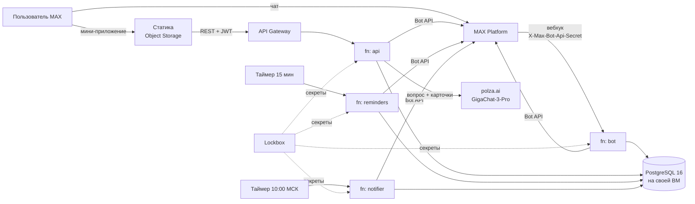

# Траектория

Навигатор по олимпиадам и поступлению: чат-бот и мини-приложение в MAX.
Трек «Образовательные решения», студенческий хакатон MAX, команда «Сигма».

- Бот: [@t356_hakaton_max_bot](https://max.ru/t356_hakaton_max_bot)
- Мини-приложение: https://traektoria.website.yandexcloud.net/ (открывается из бота)
- Лендинг: https://traektoriaedu.ru/ ([apps/landing](apps/landing/README.md))

Школьник или родитель проходит короткий онбординг в чате, получает 3–5 олимпиад
под свою цель, видит льготы именно в своих вузах со ссылкой на первоисточник,
ведёт трекер сроков и получает напоминания в MAX. Родитель и ученик работают в
одной траектории: родитель предлагает олимпиаду, ученик решает.

## Содержание

1. [Как проверить](#как-проверить)
2. [Локальный запуск](#локальный-запуск)
3. [Архитектура](#архитектура)
4. [Окружение](#окружение)
5. [Интеграции](#интеграции)
6. [API](#api)
7. [Данные и их маркировка](#данные-и-их-маркировка)
8. [Безопасность](#безопасность)
9. [Тесты и CI](#тесты-и-ci)
10. [Развёртывание](#развёртывание)
11. [Отступления от ТЗ](#отступления-от-тз)
12. [Известные ограничения](#известные-ограничения)
13. [Зависимости и лицензии](#зависимости-и-лицензии)
14. [Структура репозитория](#структура-репозитория)

## Как проверить

### В MAX

1. Открыть [@t356_hakaton_max_bot](https://max.ru/t356_hakaton_max_bot), нажать «Начать» или отправить `/start`.
2. Пройти онбординг: роль (ученик или родитель) → имя → класс → регион
   (геолокацией или из списка) → предметы → цель (направление или «пока не знаю» —
   тогда три вопроса об интересах) → вузы. Бот покажет итог и подборку с
   ближайшим сроком.
3. «🔔 Напоминать о сроках» — включает напоминания за 30, 7, 3 и 1 день; если
   трекер пуст, в него попадает подборка. «Открыть мини-приложение» открывает его поверх чата.
4. В мини-приложении: «Главная» → «Подбор» → карточка олимпиады (уровень профиля,
   льготы в ваших вузах, этапы, источник) → добавить в трекер → «Трекер» (список
   и календарь, отметка регистрации) → «Каталог» (олимпиады и вузы) → «Семья» →
   профиль ученика.
5. Семья: «Пригласить» в мини-приложении или «👋 Пригласить в семью» в чате даёт
   одноразовую ссылку `https://max.ru/t356_hakaton_max_bot?start=inv_…`. Второй
   аккаунт MAX открывает её и входит в ту же траекторию. Родитель предлагает
   олимпиаду — ученику приходит сообщение с кнопками «Добавить в трекер»,
   «Открыть карточку», «Не сейчас».
6. Команды: `/menu`, `/settings` (пороги напоминаний), `/help`, `/delete`
   (удалить траекторию — только создатель; остальным бот объясняет, как выйти).
7. ИИ-помощник — «Спросить помощника» на главной или кнопка «Спросить»:
   «Что даёт Высшая проба в ВШЭ?», «Что такое БВИ?». Вопрос не по базе —
   прямой ответ «данных нет» со ссылкой на первоисточник.

Тестовые учётки не нужны: вход в мини-приложение — только из MAX, по подписанным
данным запуска. Все данные в системе заводит сам проверяющий через онбординг.

### Локально, без MAX

```bash
docker compose -f infra/docker-compose.yml up --build    # или make up
```

| Что | Как |
| --- | --- |
| Мини-приложение от лица ученика Артёма | http://localhost:8083 |
| То же от лица мамы Ольги | http://localhost:8083/?dev_user=parent |
| API вживую | `curl localhost:8081/health` |
| Прогон воркера напоминаний | `curl -XPOST localhost:8082/run`; без токена бота воркер только ведёт план, с токеном второй вызов подряд даёт `"sent":0` |
| Прогон уведомлений об изменениях | `curl -XPOST localhost:8084/run` |
| Ответы API против контракта | `cd apps/web && npm ci && npm run contract:check` |

Стенд поднимается без единого секрета. В базе — демо-траектория Артёма и Ольги
(см. [Данные](#данные-и-их-маркировка)); в обычном браузере мини-приложение
входит через заглушку MAX Bridge: локальный API принимает неподписанную строку
запуска только вне production и только для id 900000000–900000999
(см. [Безопасность](#безопасность)).
Без токена бота и ключа LLM сообщения в MAX не уходят, помощник отвечает
шаблоном «данных нет» — остальное работает полностью.

Бот в живом MAX с локальной базой — через long polling, без HTTPS:

```bash
cp .env.example .env    # вписать MAX_BOT_TOKEN
make bot-poll
```

Пока у бота есть подписка на вебхук, MAX в long polling ничего не отдаёт:
снять её — `go run ./apps/bot/cmd/setup -unsubscribe <адрес вебхука>`.

## Локальный запуск

**Требования.** Docker с Compose v2 — для стенда. Для разработки дополнительно:
Go 1.23 (ровно: рантайм Cloud Functions — `golang123`), Node.js ≥ 22.12 и npm ≥ 11,
Python 3.11+ (только генератор сида).

| Сервис | Порт | Что это |
| --- | --- | --- |
| `postgres` | 5432 | PostgreSQL 16 |
| `migrate` | — | одноразовый: схема и контент (goose, `packages/db/migrations`) |
| `seed-demo` | — | одноразовый: демо-траектория (`packages/db/migrations-demo`) и вымышленные олимпиады вне перечня (`packages/db/migrations-local`), у каждого каталога своя таблица версий |
| `bot` | 8080 | вебхук MAX (`POST /`), `/health` |
| `api` | 8081 | REST мини-приложения, `/api/v1/*`, `/health` |
| `reminders` | 8082 | воркер напоминаний, `POST /run` вместо таймера |
| `web` | 8083 | мини-приложение (nginx, `/api/v1/` проксируется в `api`) |
| `notifier` | 8084 | уведомления об изменениях контента, `POST /run` |

Каждый порт переопределяется переменной (`API_PORT`, `WEB_PORT`, …).

Команды разработки — `make help`:

```bash
make check     # gofmt, go vet, сборка всех бинарей, юнит-тесты — как в CI
make test-db   # все Go-тесты с настоящим Postgres + тесты генератора сида
make web-dev   # мини-приложение на Vite (:5173) против живого API, не моков
make bot-poll  # бот в MAX через long polling
make seed      # пересобрать SQL-сид из datasets/
```

`make web-dev` ходит в API на `localhost:8081`: сначала `make up` или хотя бы
`docker compose -f infra/docker-compose.yml up -d api`.

## Архитектура



Четыре Cloud Functions на Go из одного модуля и одна база. Бот и мини-приложение
не ходят друг в друга по HTTP: оба вызывают одни и те же сценарии из
`packages/core` и `packages/db/store` напрямую.

| Компонент | Код | Что делает |
| --- | --- | --- |
| bot | `apps/bot` | онбординг (FSM в `bot_dialogs`), команды, кнопки напоминаний и предложений, вход по приглашению |
| api | `apps/api` | 25 операций контракта: сессия, главная, подбор, каталог, трекер, календарь, семья, профиль, помощник |
| reminders | `apps/reminders` | раз в 15 минут: досчитывает план, рассылает наступившие напоминания, чистит устаревшее |
| notifier | `apps/notifier` | раз в сутки: одно сообщение на траекторию об изменившихся сроках и льготах |
| web | `apps/web` | React + MAX UI, контракт в `packages/api-contract` |

**Почему так.** Нагрузка MVP — единицы запросов в секунду, поэтому нет ни
очереди, ни кэша, ни отдельного сервиса на каждую сущность. Дедупликацию
держит база: уникальные ключи на доставку напоминания и на обработанное
обновление MAX, одноразовость приглашения — одним условным `UPDATE`. Функции
stateless: состояние диалога в `bot_dialogs`, пул соединений переживает вызовы
тёплого инстанса и не соединяется с базой до первого запроса.

**Слои Go-кода.**

- `packages/core/*` — чистая логика без HTTP и MAX: права (`access`),
  скоринг (`match`), план напоминаний (`schedule`), голос ученика и родителя
  (`voice`), регионы (`refdata`), проверка initData и JWT (`auth`),
  ИИ-помощник (`assistant`), тексты уведомлений (`notify`).
- `packages/db/store` — рукописные запросы на pgx, одна транзакция на сценарий.
- `packages/shared` — клиент MAX Bot API (`maxapi`), клиент LLM, конфиг,
  словарь текстов, общий с фронтом.
- `apps/*/cmd/function` — точки входа Cloud Functions, `apps/*/cmd/local` —
  те же сервисы как обычные `http.Server` для стенда.

## Окружение

Все переменные с пояснениями — в [.env.example](.env.example). Локально compose
подставляет безопасные значения по умолчанию, `.env` нужен только для живого MAX
и LLM.

| Переменная | Кто читает | Смысл |
| --- | --- | --- |
| `MAX_BOT_TOKEN` | все | токен Bot API; им же проверяется подпись initData |
| `WEBHOOK_SECRET` | bot | секрет вебхука; облачная функция без него не стартует |
| `MAX_BOT_NAME`, `MAX_BOT_ID` | все | ник для ссылок-приглашений, id для кнопок `open_app` |
| `DATABASE_URL`, `DB_MAX_CONNS` | все | PostgreSQL; в облаке `sslmode=require` |
| `JWT_SECRET`, `JWT_TTL` | api | подпись сессий мини-приложения (HS256), в production не короче 32 байт |
| `APP_ENV` | api | `production` запрещает дев-обход подписи |
| `DEV_UNSIGNED_INITDATA` | api | дев-обход для браузера без MAX, только вне production |
| `POLZA_AI_API_KEY`, `LLM_BASE_URL`, `LLM_MODEL` | api | ИИ-помощник |
| `CORS_ALLOWED_ORIGINS` | api | источник мини-приложения в проде |
| `REMINDER_HOUR` | bot, api, reminders | час напоминаний по местному времени ученика |
| `BOT_MODE` | bot (локально) | `webhook` или `poll` |
| `VITE_API_BASE`, `VITE_DEV_FAKE_WEBAPP` | web (сборка) | адрес API; заглушка моста для браузера |

## Интеграции

### MAX Bot API

Свой клиент в `packages/shared/maxapi`, база `https://platform-api2.max.ru`,
заголовок `Authorization: <токен>`. Используемые методы:

| Метод | Зачем |
| --- | --- |
| `GET /me` | проверка токена в `cmd/setup` |
| `PATCH /me/commands` | подсказки `/menu`, `/settings`, `/help`, `/delete` |
| `POST /subscriptions`, `GET /subscriptions`, `DELETE /subscriptions` | подписка вебхука (`cmd/setup`) |
| `GET /updates` | long polling для локальной отладки |
| `POST /messages?user_id=` | сообщения, клавиатуры `callback`, `link`, `open_app`, `request_geo_location` |
| `POST /answers?callback_id=` | ответ на нажатие: всплывающее уведомление или замена сообщения с кнопками — так шаг онбординга меняется на месте |

Поведение вебхука: секрет из `X-Max-Bot-Api-Secret` сравнивается за постоянное
время, неверный — 403; на всё остальное, включая битое тело и собственные сбои,
ответ 200 (иначе MAX повторяет доставку и через 8 часов отписывает бота), а
пользователь получает извинение в чате. Повторная доставка обновления
отсекается таблицей `bot_updates_seen`. Обработка укладывается в 25 секунд из 30.
На 429 клиент ждёт и повторяет, скорость отправки ограничена 25 сообщениями в
секунду. Сертификат Russian Trusted Root CA встроен в клиент: без него запросы к
`platform-api2.max.ru` не проходят проверку TLS на системах без этого корня.

Кнопки `open_app` открывают мини-приложение с `start_param`: `tracker`, `family`,
`match` — вкладки, `o_<профиль>` — карточка олимпиады.

### Мини-приложение и initData

`POST /session` проверяет строку запуска по
[dev.max.ru/docs/webapps/validation](https://dev.max.ru/docs/webapps/validation):
снять `hash`, URL-декодировать, отсортировать пары, склеить `key=value` через `\n`,
`secret = HMAC-SHA256("WebAppData", BOT_TOKEN)`, сравнить
`hex(HMAC-SHA256(secret, строка))` за постоянное время. Сверх документации —
свежесть: `auth_date` не старше часа. Дальше — JWT на час; истёкший или
отозванный токен даёт 401, и клиент один раз повторяет вход.

### ИИ-помощник: polza.ai → GigaChat-3-Pro

OpenAI-совместимый `POST https://polza.ai/api/v1/chat/completions`, модель
`GigaChat/GigaChat-3-Pro`, ответ в режиме JSON. Помощник отвечает только по
нашей базе (RAG без векторов): в вопросе ищутся олимпиады, вузы, предметы и
термины (БВИ, 100 баллов, уровни перечня); из базы собираются их карточки;
модель получает инструкции и карточки в системном сообщении, вопрос — отдельным
пользовательским. Ответ принимается, только если модель сослалась на карточки из
контекста; иначе — шаблон «данных нет» со ссылкой на первоисточник. Вопрос —
до 500 символов, не больше 5 вопросов подряд и дальше один в 12 секунд на
участника (429).

### Yandex Cloud

Cloud Functions (`golang123`), API Gateway перед api, Timer-триггеры,
Object Storage для статики, PostgreSQL 16 на своей ВМ, Lockbox для секретов.
Железо описано в Terraform ([infra/terraform](infra/terraform/README.md)),
настройка СУБД — в Ansible ([infra/ansible](infra/ansible/README.md)).

## API

Контракт — [packages/api-contract/openapi.yaml](packages/api-contract/openapi.yaml),
25 операций, базовый путь `/api/v1`. Типы фронта генерируются из него же
(`npm run contract`), а `npm run contract:check` прогоняет живой API по всем
операциям и сверяет каждый ответ со схемой. Этот же прогон — отдельная задача CI.

Авторизация: `POST /session {init_data}` → `{token}`, дальше
`Authorization: Bearer <token>`. Права (кто может отмечать регистрацию,
приглашать, удалять участников) считаются на каждый запрос по матрице ТЗ §3.1 и
отдаются в `permissions`. Ошибки — `{error: {code, message}}` с кодами из контракта.

В проде адрес API — домен API Gateway (`tofu output api_url`). Открыть его в
обход MAX нельзя: без подписанной строки запуска сессия не выдаётся.
Посмотреть все ответы глазами можно на локальном стенде.

## Данные и их маркировка

Источники — открытые документы: перечень олимпиад школьников (приказ № 669
от 30.08.2025, rsr-olymp.ru), правила приёма 2026 года десяти вузов, сайты олимпиад. Сбор и
проверка — в [datasets/](datasets/README.md): у каждого из 72 документов URL,
sha256 и дата проверки. В базе после сида: 72 олимпиады, 192 профиля, 10 вузов,
16 направлений, 1149 льгот, 553 этапа.

Описания вузов и олимпиад в карточках — свои тексты по официальным сайтам
(миграции `0010` и следующие): только проверяемое — город, год основания,
профиль, формат. Льготы и сроки в описания не попадают: у них свои таблицы
с источником и датой проверки.

Персональных данных в репозитории нет. Пользователи появляются только из MAX:
id, имя из профиля MAX, указанные в онбординге класс, регион, предметы и вузы.

**Что демонстрационное и как это видно.**

| Данные | Пометка в продукте |
| --- | --- |
| Этапы 121 профиля без опубликованных дат — сгенерированы детерминированно (октябрь 2026 — январь 2027), этапы ВсОШ — по формату, без региональных дат, этапы прошлого сезона | `stages.is_demo`, в API `stages_are_demo: true`, в карточке метка «Демо-даты» вместо «Факт» |
| Льготы, у которых хоть одна исходная запись помечена `is_demo` (197 из 1149) | без источника: `source: null`, в карточке «данные уточняются» вместо метки «Факт» |
| Олимпиады вне перечня «Турнир юных программистов Казани», «Импульс», «Бизнес-старт» — вымышленные, чтобы показать блок F16 | только локальный стенд и CI: `migrations-local`, в прод не катятся ни при каком флаге; организатор «Вымышленный пример для демонстрации», без источника. В проде блок «Вне перечня» скрыт, пока в базе нет настоящих олимпиад вне перечня с источником |
| Город финала — выведен из организатора-вуза, у межвузовских олимпиад не указан | приближение: у многих вузовских олимпиад есть и региональные площадки |
| Демо-траектория Артёма (ученик) и Ольги (мама) | локальный стенд; в проде — только пока включён временный демо-режим `ENABLE_BROWSER_DEMO` ([.github/workflows](.github/workflows/README.md)), при выключении `goose reset` её убирает; id 900000001 и 900000002 — из дев-диапазона |

В LLM уходят только текст вопроса и карточки олимпиад и вузов — без имён,
id MAX и состава семьи.

## Безопасность

- **Секреты** — только в `.env` (в `.gitignore`) и в Lockbox. В открытые настройки
  версии функции они не записываются: Cloud Functions подставляет их из Lockbox
  при запуске от имени сервисного аккаунта с ролью `lockbox.payloadViewer`.
  Архив функций собирается с исключением `.env`.
- **Вебхук**: секрет обязателен в облаке, сравнение за постоянное время.
- **Сессии**: подпись initData и её свежесть; JWT HS256 с зафиксированным
  алгоритмом (`alg: none` отбивается тестом), `iss`/`aud`/`exp`; ключ в production
  не короче 32 байт — иначе api не стартует.
- **Удалённый участник теряет доступ сразу**: каждый запрос проверяет, что участие
  активно, иначе 401 — не дожидаясь истечения JWT.
- **Дев-обход подписи** для браузера без MAX требует трёх условий сразу:
  `DEV_UNSIGNED_INITDATA=true`, `APP_ENV` не `production` и id из
  зарезервированного под разработку диапазона 900000000–900000999. Главная
  защита — первое и второе: в production api с включённым обходом не стартует,
  а в Terraform у всех функций `APP_ENV=production`. Диапазон дополнительно
  не даёт локальному стенду выдать себя за произвольного пользователя.
- **api доступна только через API Gateway**, функция не публичная; публичный вызов
  только у вебхука.
- **Права** проверяются на сервере на каждое действие, в том числе в боте:
  кнопка из старого сообщения ничего не меняет, если шаг уже другой.
- **LLM**: вопрос не смешивается с инструкциями, длина ограничена, ответ
  проверяется на ссылки на карточки из контекста, частота ограничена.
  **Оговорка**: polza.ai в собственном справочнике моделей помечает
  `GigaChat/GigaChat-3-Pro` как `is_fz152_compliant: false` — это метаданные
  прокси, не самого GigaChat. Поэтому персональные данные в запрос к модели
  не отправляются вовсе.
- **Удаление**: `/delete` создателя закрывает доступ сразу, строки физически
  стирает воркер напоминаний первым запуском спустя час после удаления.

## Тесты и CI

- **Go**: 243 тестов. Логика — юнит-тестами; `store`, бот, воркеры и API —
  интеграционными против настоящего Postgres: харнесс `packages/db/dbtest`
  собирает шаблонную базу из миграций и даёт каждому пакету свою копию.
  Бот тестируется целыми сценариями через поддельный отправитель MAX.
- **Фронт**: Vitest, 554 тестов; словарь текстов проверяется и фронтом, и Go.
- **Лендинг**: `node --test apps/landing/landing.test.mjs` — ассеты, якоря, ссылки
  на бота, контраст токенов.
- **Контракт**: `contract:check` против живого API.
- **CI** ([.github/workflows/ci.yml](.github/workflows/ci.yml)): gofmt, go vet,
  сборка всех бинарей, Go-тесты с сервисным Postgres, тесты генератора сида,
  typecheck и тесты фронта, тесты лендинга, миграции + демо + запуск api + `contract:check`.

```bash
make check && make test-db
cd apps/web && npm ci && npm run typecheck && npm test
```

## Развёртывание

Инфраструктуру применяет человек, код выкладывает пайплайн. Подробно —
[.github/workflows/README.md](.github/workflows/README.md) и
[infra/terraform/README.md](infra/terraform/README.md).

| Что | Как |
| --- | --- |
| База, функции, шлюз, Lockbox, таймеры | **Actions → Infra apply** (подтверждает второй человек) или `tofu apply` руками |
| Миграции и код четырёх функций | автоматически при слиянии в `master` (**Deploy functions**): сначала `goose up`, потом новая версия каждой функции с настройками, заданными Terraform, проверка живости и откат `$latest` при провале |
| Мини-приложение | автоматически при слиянии в `master` (**Deploy web**) со сборкой под адрес API Gateway |
| Лендинг | автоматически при слиянии в `master` (**Deploy landing**): тесты и заливка `apps/landing` в бакет `traektoriaedu.ru` |
| Вебхук MAX | один раз руками, когда бот с новым кодом выложен |

```bash
# вебхук и подсказки команд — один раз; нужны MAX_BOT_TOKEN и WEBHOOK_SECRET из .env
set -a; . ./.env; set +a
go run ./apps/bot/cmd/setup -webhook "$(cd infra/terraform && tofu output -raw webhook_url)"
```

## Отступления от ТЗ

- **Нет sqlc** (ТЗ §8.2 помечал его как решение, не факт): три главных запроса —
  подбор, каталог, календарь — динамические, и кодогенерация прибавила бы шаг
  воспроизведения без выигрыша. SQL проверяется интеграционными тестами на
  настоящем Postgres.
- **Свой клиент MAX вместо официального Go SDK**: SDK требует Go 1.24, а
  максимальный рантайм Cloud Functions — Go 1.23. Алгоритмы сверены с
  документацией и исходниками SDK, код не копировался.
- **Регионы — встроенный справочник**, а не таблица: 89 субъектов с часовыми
  поясами и координатами для определения региона по геолокации.
- **Три вопроса об интересах (F8) — без LLM**: каждый ответ голосует за профильную
  группу, детерминированно и мгновенно.
- **«Напоминать о сроках» пополняет пустой трекер подборкой** — иначе напоминать
  не о чем; лишнее убирается в мини-приложении.
- **ИИ-помощник понимает термины** (БВИ, 100 баллов, уровни перечня) по отдельной
  карточке-глоссарию, а не только вопросы о конкретных олимпиадах и вузах.
- **События изменения контента рождаются в базе** (триггеры на этапы и льготы) —
  админки для контента нет, правки вносятся миграциями; триггер срабатывает
  только при настоящем изменении значений.
- **API Gateway перед api** — в ТЗ его не было, но без него Cloud Functions не
  передаёт функции путь запроса.

## Известные ограничения

- Ограничение частоты вопросов помощнику считается в памяти инстанса функции:
  при нескольких тёплых инстансах лимит мягче заявленного.
- Уведомления об изменениях доставляются «не меньше одного раза» и без дублей:
  состояние держит `content_change_deliveries` по паре (изменение, получатель).
  Недоставленное остаётся в очереди и уходит следующим запуском; через неделю
  попыток воркер сдаётся и пишет это в `dropped`. Дубль возможен лишь в узком
  окне, когда сообщение ушло, а записать результат не удалось.
  За один запуск уходит не больше ~1400 сообщений: 25 в секунду × таймаут 60 секунд.
- База живёт на одной ВМ без автоматического переключения: это единственная
  точка отказа решения. Управляемый кластер заменён на свою ВМ ради стоимости —
  он тарифицируется круглосуточно, а нагрузка MVP это не оправдывает. Взамен
  бэкап делается ежедневным `pg_dump` в Object Storage, и восстановление
  ручное. Порт 5432 открыт в интернет, потому что Cloud Functions работают вне
  VPC и постоянных исходящих адресов не имеют; защищает не сетевой фильтр, а
  обязательный TLS и `scram-sha-256`.
- Пулера соединений (порт 6432 у управляемого кластера) больше нет: пул в
  `packages/db` ограничен двумя соединениями на инстанс функции.
- Напоминания приходят с точностью до 15 минут — это шаг таймера.
- `start_param` ведёт на вкладки (`tracker`, `family`, `match`), «Вопросы и ответы» (`faq`) и карточку олимпиады;
  на карточку вуза и конкретный экран профиля ссылок из бота нет.
- Сроки большинства профилей демонстрационные (см. «Данные»): олимпиады публикуют
  даты сезона 2026/27 постепенно.
- Вне MAX прод-версия мини-приложения не открывается — это намеренно.

## Зависимости и лицензии

Версии зафиксированы: Go — `go.mod` + `go.sum`, фронт — `package-lock.json`,
образы — тегами в Dockerfile и compose.

| Зависимость | Версия | Лицензия |
| --- | --- | --- |
| [pgx](https://github.com/jackc/pgx) | v5.7.6 | MIT |
| [golang-jwt](https://github.com/golang-jwt/jwt) | v5.3.1 | MIT |
| golang.org/x/crypto, x/sync, x/text (косвенные) | см. go.mod | BSD-3-Clause |
| [goose](https://github.com/pressly/goose) — миграции, только инструмент | v3.22.1 | MIT |
| React, React DOM | 19.2.8 | MIT |
| [@maxhub/max-ui](https://www.npmjs.com/package/@maxhub/max-ui) | 0.5.0 | MIT |
| @tanstack/react-query | 5.103.2 | MIT |
| react-router-dom | 7.18.4 | MIT |
| Vite, Vitest, Testing Library, jsdom, openapi-typescript (разработка) | см. package.json | MIT |
| TypeScript (разработка) | 5.9.3 | Apache-2.0 |
| Образы postgres:16-alpine, nginx:1.27-alpine, golang:1.23-alpine, node:22-alpine | | PostgreSQL License, BSD-2-Clause, BSD-3-Clause, MIT |
| Шрифты Onest, Unbounded (лендинг, файлы в `apps/landing/fonts`) | | SIL OFL 1.1 |

**Атрибуция.** Проверка initData и формат запросов Bot API сверены с официальным
[Go SDK MAX](https://github.com/max-messenger/max-bot-api-client-go) (Apache License 2.0)
и документацией [dev.max.ru](https://dev.max.ru). Код SDK в репозиторий не
копировался. Сертификат Russian Trusted Root CA
(`packages/shared/maxapi`) — публичный корневой сертификат НУЦ Минцифры.

## Структура репозитория

| Папка | Что внутри |
| --- | --- |
| `apps/bot` | вебхук MAX: онбординг, команды, кнопки; `cmd/setup` — подписка и подсказки команд |
| `apps/api` | REST мини-приложения |
| `apps/reminders` | воркер напоминаний |
| `apps/notifier` | воркер уведомлений об изменениях контента |
| `apps/web` | мини-приложение: React + Vite + MAX UI ([README](apps/web/README.md)) |
| `apps/landing` | лендинг на traektoriaedu.ru: статика без сборки ([README](apps/landing/README.md)) |
| `packages/core` | бизнес-логика без HTTP и MAX |
| `packages/db` | пул, `store`, миграции, демо-миграции, тестовый харнесс |
| `packages/shared` | клиент MAX, клиент LLM, конфиг, словарь текстов kid/parent |
| `packages/api-contract` | OpenAPI-контракт и сгенерированные TS-типы |
| `datasets` | датасеты олимпиад и вузов, парсеры, генератор сида |
| `infra` | docker-compose стенда, Terraform для Yandex Cloud |
| `docs` | [ТЗ](docs/TZ.md), прототип, экраны, материалы хакатона |
