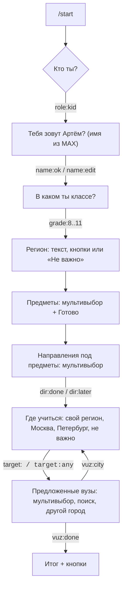
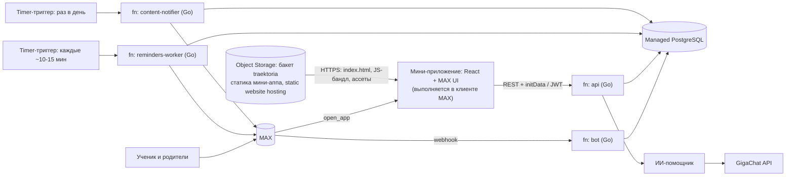
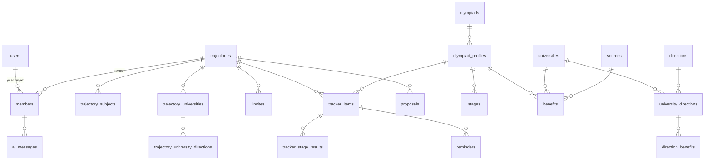

# Техническое задание: «Траектория» v2

Чат-бот и мини-приложение в мессенджере MAX: персональный навигатор олимпиад и поступления для школьника и его семьи.

- Версия: 2.1 от 22.09.2026. Обновляет v2.0: бэкенд переходит на Go и serverless (Yandex Cloud Functions + Object Storage вместо VM/Caddy/NestJS/Prisma/Redis+BullMQ) — см. разделы 8 и 13. Роли, права, функции и модель данных не менялись.
- Хакатон: студенческий хакатон MAX, трек «Образовательные решения». Финал — 29.10.2026, Казань.
- Прототип (эталон поведения, текстов и дизайна): `docs/prototype/index.html`.
- Скриншоты экранов с кодами A1–I7: `docs/screens/` (оглавление — `docs/screens/README.md`).

## 0. Как работать с этим документом (для разработчика и кодинг-ассистента)

1. Источники истины по приоритету: **этот ТЗ → поведение прототипа → скриншоты**. Если они расходятся, прав ТЗ.
2. Из прототипа берём тексты, дизайн-токены, состояния экранов и логику прав. Код прототипа не копируем: это один HTML без сервера, а продукт — React + MAX UI, API и база.
3. Всё про API MAX сверяем с официальной документацией https://dev.max.ru. Ничего не выдумываем. Детали в разделе 11 помечены как подтверждённые на 16.09.2026, но платформа меняется.
4. Работаем этапами из раздела 15. Одна задача — одна сессия. Задача готова, когда выполнены её критерии приёмки из раздела 4.
5. Демо-данные (олимпиады, вузы, льготы, даты) — только для разработки. Показывать их пользователю как факты нельзя, пока контент-администратор не заполнит реальные данные с источником и датой проверки.

Пометки в тексте: **[Факт]** — подтверждено первоисточником; **[Решение]** — решение команды; **[Проверить]** — нужно сверить перед реализацией.

---

## 1. Общие сведения

### 1.1. Проблема

Олимпиады — самый короткий путь на бюджет: без экзаменов (БВИ) или со 100 баллами ЕГЭ. Но льготы дают не только ВсОШ, а ещё около 80 олимпиад перечня с сотнями профилей. У каждого вуза свои условия: какие олимпиады он учитывает, за какие классы и какую льготу даёт. Сам перечень меняется каждый год. Информация разбросана по каталогам и сотням сайтов, о сроках никто не напоминает. Школьник не понимает, какие олимпиады нужны именно ему, а родители не могут помочь, потому что сами не разбираются в системе льгот.

### 1.2. Решение

Бот в MAX за пару минут узнаёт класс, регион, предметы, цель и вузы ученика. Мини-приложение подбирает олимпиады, показывает льготу в каждом вузе ученика с источником и датой проверки, ведёт трекер сроков. Бот напоминает о сроках всем участникам общей семейной траектории: ученику и родителям.

### 1.3. Пользователи

| Роль | Кто это | Что важно |
|---|---|---|
| Ученик | Школьник 8–11 класса. Приоритет — 8–10 класс из регионов, пилот — Татарстан | Понять, какие олимпиады нужны, не пропустить регистрацию |
| Родитель | Мама, папа или другой взрослый | Разобраться в льготах, помочь со сроками |
| Создатель траектории | Тот, кто первым прошёл онбординг: ученик или родитель | Управляет участниками, может удалить траекторию |
| Приглашённый | Подключился по ссылке | Видит общую траекторию, может выйти |
| Контент-администратор | Команда проекта | Заполняет олимпиады, вузы, льготы и источники |

### 1.4. Требования хакатона к сдаче [Факт, кейс трека]

- Работающий MVP, презентация в PDF, зафиксированный коммит (commit hash).
- README, запуск через `docker compose up` одной командой, сборка не дольше 5 минут.
- `.env.example` и файл зависимостей.
- После дедлайна онлайн-этапа код заморожен, дорабатывать могут только финалисты.

### 1.5. Глоссарий

| Термин | Значение |
|---|---|
| ВсОШ | Всероссийская олимпиада школьников. Этапы: школьный, муниципальный, региональный, заключительный. Проводится отдельно от перечня |
| Перечень, «РСОШ» | Перечень олимпиад школьников, утверждаемый Минобрнауки. На 2025/26 — приказ № 669, 83 олимпиады; в проекте на 2026/27 — 79 |
| Профиль | Предмет внутри олимпиады. У каждого профиля свой уровень: I, II или III |
| БВИ | Зачисление без вступительных испытаний |
| 100 баллов | Диплом засчитывается как 100 баллов ЕГЭ по профильному предмету |
| Подтверждение | По олимпиадам перечня льготу подтверждают ЕГЭ по предмету не ниже 75 баллов; вуз вправе поднять планку |
| Доп. баллы | Олимпиады вне перечня льгот не дают, только баллы за индивидуальные достижения, не больше 10 в сумме |
| Траектория | Общий профиль ученика: цель, вузы, трекер. К ней подключены участники |
| Трекер | Список выбранных олимпиад со сроками и статусами |
| open_app | Тип кнопки бота, открывающий мини-приложение |
| initData | Подписанные данные запуска мини-приложения, проверяются на сервере |

---

## 2. Границы версии

| Блок | Что входит |
|---|---|
| **V1** (онлайн-этап и финал) | Функции 1–51 из раздела 4 |
| Если останется время | 52. План подготовки до ближайшего этапа по шаблону из дат этапов, тем профиля и времени ученика |
| После пилота | 53. Подбор вузов и тест интересов. 54. Рассылка ссылки по классу для учителей. 55. Задачи прошлых лет. 57. Кружки и центры подготовки рядом. Функция 56, экспорт сроков в календарь телефона, сделана раньше — F56 |
| Не делаем | Гарантии поступления. Автоматическую регистрацию на чужих сайтах. Проведение олимпиад и прокторинг. Панель класса для учителя до пилота |

Если сроки поджимают, для живого демо жюри критичны функции 1–13, 17–22, 28–31. Их делаем первыми.

---

## 3. Роли и права

### 3.1. Матрица прав

| Действие | Ученик | Родитель | Только создатель |
|---|---|---|---|
| Смотреть траекторию, подбор, каталог, трекер | да | да | — |
| Добавить олимпиаду в трекер | да | только если в траектории нет ученика | — |
| Предложить олимпиаду ученику | — | да, если ученик в траектории | — |
| Принять или отклонить предложение | да | — | — |
| Убрать олимпиаду из трекера | да | только если в траектории нет ученика | — |
| Отметить «зарегистрирован» и снять отметку | да | да | — |
| Отметить регистрацию или итог этапа и снять отметку | да | да | — |
| Править профиль ученика (класс, регион, предметы, цель, вузы, направления в вузах) | да | да | — |
| Пригласить участника | да | да | — |
| Удалить приглашённого участника | — | — | да |
| Выйти из траектории | да, если не создатель | да, если не создатель | — |
| Удалить траекторию и все данные (/delete) | — | — | да |
| Чат с ИИ-помощником | свой, личный | свой, личный | — |

Любое изменение траектории видят все участники.

### 3.2. Правила семьи [Решение]

- У траектории ровно один создатель — тот, кто прошёл онбординг первым.
- Приглашать можно сколько угодно людей. Каждая ссылка одноразовая: по ней подключается один человек, после этого ссылка гаснет.
- Создатель может удалить любого приглашённого, в том числе ученика, если траекторию создал родитель.
- Создатель не может выйти из траектории, может только удалить её.
- Приглашённого бот встречает по имени, онбординг заново не нужен: достаточно подтвердить имя и цель.
- Если ученика в траектории нет, родитель добавляет олимпиады в трекер сам. Когда ученик подключится, он увидит их с пометкой «добавил(а) <имя>».

---

## 4. Функциональные требования

Формат: номер функции, требование, экраны (коды из `docs/screens`), критерии приёмки «Дано / Когда / Тогда».

### 4.1. Вход

**F1. Ссылка на бота из чата класса или родительского чата, либо поиск бота в MAX.** Экран A1.
- Дано: ссылка вида `https://max.ru/<bot>?start=<payload>` или бот найден поиском. Когда: пользователь открывает бота и нажимает «Начать». Тогда: бот присылает приветствие и вопрос о роли. Параметр ссылки сохраняется как источник (например, `src_class_9a`).
- Негатив: неизвестный или битый параметр → обычное приветствие без ошибки.

**F2. Выбор роли: школьник или родитель. Кто пришёл первым, тот и создаёт траекторию.** Экраны A2, B1.
- Дано: новый пользователь без траектории. Когда: нажата кнопка роли. Тогда: создаётся траектория, пользователь — её создатель с выбранной ролью.
- Дано: пользователь пришёл по ссылке-приглашению. Тогда: вопрос о роли не задаётся, роль берётся из траектории (см. F42).

**F3. Обращение зависит от роли.** Экраны A3, B2, C2, I2.
- Ученику бот и приложение пишут на «ты»: «Привет, Артём», «Твой профиль». Родителю — на «вы» и говорят о ребёнке по имени: «Здравствуйте, Ольга», «Цель Артёма», «У Артёма через 3 дня…».
- Правило действует во всех сообщениях, включая напоминания, уведомления и ответы помощника.
- Реализация: все тексты хранятся в одном словаре с двумя вариантами: `kid` и `parent`, с подстановкой имени ученика.

### 4.2. Онбординг в чате

**F4. Имя.** Экраны A3, B1.
- Ученику: «Тебя зовут Артём? Имя подставлено из твоего профиля MAX.» Кнопки «Да, это я», «Изменить имя». Имя берём из данных пользователя MAX.
- Родителю: «Как зовут вашего ребёнка?», ответ свободным текстом, от 1 до 40 символов.
- Негатив: пустое или слишком длинное имя → бот просит ввести заново.

**F5. Класс: 8, 9, 10 или 11.** Кнопки в один ряд. Ученику: «В каком ты классе?», родителю: «В каком классе Артём?».

**F6. Регион: текстом, кнопками или «Не важно».** Город или регион текстом, быстрые кнопки «Москва», «Санкт-Петербург», «Московская обл.», выбор по первой букве и «Не важно». Геопозицию из вложений бот понимает: по координатам определяем субъект РФ и город, координаты не храним. Кнопки `request_geo_location` нет: в MAX она работает только в мобильном приложении.
- Негатив: «Не важно» → регион не указан, напоминания по московскому времени; регион можно указать позже в профиле.

**F7. Любимые предметы, можно выбрать несколько.** Мультивыбор кнопками: отмеченные показываются с «✓», кнопка «Готово» активна при выборе хотя бы одного.

**F8. Цель: одно или несколько направлений или «Решу позже».** Бот не выбирает направление за ученика, а показывает те, что подходят под выбранные предметы: ключевые предметы направления пересекаются с любимыми. Остальные — по кнопке «Показать все направления».
- Мультивыбор с «✓», кнопка «Готово» — при выборе хотя бы одного.
- «Решу позже» (родителю — «Пока не знаем») — без направлений: подбор идёт по любимым предметам, в итоге «По твоим предметам подходят…».

**F9. Где учиться и вузы.** Сначала «Где хочешь учиться?»: свой регион, Москва, Санкт-Петербург (если это не свой регион), «Не важно» или «Другой регион» — список «округ → субъект», как на шаге региона. Москва включает область, Петербург — Ленинградскую область. Затем бот предлагает до 6 вузов с выбранными направлениями в этом городе — без отметок, ученик отмечает сам. Плюс «Другой вуз» (поиск по названию) и «Другой город».
- Вузы выбирать не обязательно: «Пропустить». Выбранные вузы определяют, какие льготы показываются в карточках.
- Негатив: подходящих вузов в городе в базе нет → бот честно говорит об этом и предлагает поиск или другой город.

### 4.3. Результат

**F10. Итоговое сообщение.** Экраны A7, B3.
- Тогда: бот пишет, сколько олимпиад подходит и когда ближайший срок: «Под твою цель подходят 4 олимпиады и ВсОШ. Ближайший срок — регистрация на «Высшую пробу», осталось 4 дня».
- Негатив: подходящих олимпиад нет → бот честно говорит об этом и предлагает добавить предмет или вуз.

**F11. Кнопки «Открыть мини-приложение», «Напоминать о сроках», «Пригласить в семью».** Кнопка открытия — тип `open_app`. «Напоминать о сроках» включает напоминания и присылает подтверждение с графиком. У родителя третья кнопка называется «Пригласить Артёма».

**F12. Мини-приложение открывается поверх чата, профиль уже заполнен.** Экран A8. Сплэш показывается, пока идёт проверка initData и загрузка данных, не дольше 2,5 с на 4G.

### 4.4. Подбор олимпиад

**F13. 3–5 олимпиад из перечня и ВсОШ под цель, с причиной рекомендации.** Экран C3. Логика в разделе 6.1.
- В каждой карточке: название, организатор, уровень профиля ученика, срок с цветной плашкой, льгота в вузах ученика одной строкой («Иннополис, ВШЭ: БВИ»), причина рекомендации одной строкой, кнопка трекера.
- Над списком метка «Рекомендация: сначала ближайшие сроки и точное совпадение профиля».

**F62. «Подбор» показывает только подходящие олимпиады, которых ещё нет в трекере.** Экраны C3, C7. Подходящая — в неё ещё можно вступить (срок первого этапа не прошёл), а перечневая — ещё и с льготой в вузах ученика на его направления (раздел 6.2). Олимпиады из трекера и ждущие ответа на предложение убираются до ранжирования: добавленная карточка уходит, её место занимает следующая по скору, внизу подтверждение «Добавлено в трекер».
- Над списком: «В трекере уже 3 — здесь только новые» (ссылка на трекер), у ученика — «Ждут твоего ответа в трекере: 1».
- Под списком — «Показать ещё N»: остальные подходящие по убыванию скора.
- Всё подходящее уже в трекере (C7): «Ты уже следишь за всеми подходящими олимпиадами. Ты большой молодец!» / родителю «Вы уже следите…», кнопки «Открыть трекер» и «Посмотреть каталог»; с фильтром — «по этому фильтру» и «Сбросить фильтры».
- Остальное ждёт ответа на предложение — «Остальные подходящие ждут твоего ответа» и переход в трекер.
- Подходящих нет (регистрации закрыты или в вузах нет льгот по предметам) — «Подходящих олимпиад пока нет» и «Найти вузы» (каталог вузов).
- Где олимпиада видна не через подбор (каталог, карточка), закрытая регистрация помечена «регистрация закрыта»; добавить в трекер всё равно можно.

**F14. ВсОШ отдельной веткой.** Экран C4. Карточка ВсОШ по предмету показывает 4 этапа с текущим, пояснение про проходной балл и льготу за диплом заключительного этапа (БВИ, подтверждать ЕГЭ не нужно).

**F15. Фильтры: уровень, скорый срок, онлайн-отбор.** Чипы «Все», «I уровень», «Срок скоро» (не больше 16 дней), «Онлайн-отбор». Пустой результат → состояние H3.

**F16. Олимпиады вне перечня с меткой «дополнительные баллы, до 10 в сумме».** Отдельный блок «Вне перечня» под основным списком с пояснением «Льгот не дают, только дополнительные баллы — до 10 в сумме за все достижения».

### 4.5. Карточка олимпиады

Открывается как нижний лист (bottom sheet). Экраны C5, C6.

**F17. Уровень конкретного профиля.** Блок «Уровень по профилям»: все профили олимпиады с уровнями, профиль ученика выделен. Метка «Факт», источник — перечень олимпиад (приказ Минобрнауки).

**F18. Льгота в вузах ученика — БВИ или 100 баллов — с источником и датой проверки.** Таблица: вузы ученика — строками, столбцы — «Победителю», «Призёру» и «Порог ЕГЭ», в ячейках «БВИ», «100 баллов», «+3 балла» или «нет». Вуз в строке кликабелен и открывает карточку вуза. Столбцы — закрытый набор, его выбирает сервер:
- «Порог ЕГЭ» — только если в вузах он разный или где-то зависит от направления: тогда в ячейке «от 75–90» (это нижний порог, разный по направлениям) и прямо под числом подпись «зависит от направления»; одинаковый порог уходит в общие условия;
- вне перечня — один столбец «Доп. баллы за диплом»;
- вузов сколько угодно: таблица растёт вниз, новых столбцов не появляется.

Льгота в строке — на направления ученика в этом вузе (раздел 6.2): под названием вуза подпись «Программная инженерия, ПМИ». Если на выбранных направлениях льгота разная, лучшая — в строке вуза, остальные — подстроками с названиями направлений. «Зависит от программы» (льгота не на всех программах направления) и «Льгота на … ещё уточняется — пока показана льгота вуза целиком» — жёлтой плашкой, как прочие особые условия. Под таблицей — «Льгота — на твои направления: отмеченные в карточке вуза или из цели».

Порядок строк: сначала самые выгодные (БВИ, потом 100 баллов, потом доп. баллы — больше баллов выше), при равенстве — по льготе призёру, затем по алфавиту. Вузы, которые олимпиаду не учитывают, — одной строкой под таблицей: «Не учитывают эту олимпиаду: ВШЭ, ИТМО». Внизу источник: «Правила приёма вузов на 2026 год. Проверено 15.09.2026».
- Негатив: у льготы нет источника → не показывать её с меткой «Факт», писать «данные уточняются».

**F19. Условия.** В одном блоке с F18, заголовок «Льгота и условия в твоих вузах». Что у вуза своё, видно по таблице: жёлтым отмечена ячейка, где вуз не как большинство вузов ученика (большинство — больше половины; нет его — не отмечаем ничего), под таблицей пояснение «не как в большинстве твоих вузов». Всё, для чего нет столбца, — жёлтой плашкой сразу под строкой вуза:
- класс диплома — только если вуз не засчитает диплом этого года: «Засчитывает только диплом 11 класса — диплом за 10 класс не подойдёт»;
- другой предмет ЕГЭ: «Льготу подтверждает ЕГЭ по предмету «Физика», а не «Информатика»»;
- прочие особенности из правил вуза.

После таблицы — подпись «Во всех вузах» и общие условия списком с галочками: нужен диплом, по какому предмету ЕГЭ подтверждает льготу (и порог, если он везде одинаковый), «БВИ можно использовать только в одном вузе».
- Негатив: вузы ученика льготы не дают → условия собираются по всем вузам базы, особенности вузов остаются в общем списке («МГУ, МФТИ: победителю — БВИ, призёру — 100 баллов»).

**F20. Блок «Почему подходит».** Метка «Рекомендация». Текст собирается из факторов подбора (раздел 6.1), с обращением по роли.

**F21. Этапы и даты.** Таймлайн: регистрация, отборочные этапы, заключительный. Ближайший этап выделен, пройденные — серым. Блок идёт сразу под уровнем по профилям (или под «Не входит в перечень»), до льгот: когда регистрация, важно не меньше, чем что даёт диплом. У ВсОШ этапы стоят на месте уровней.

**F22. Ссылка на официальный сайт олимпиады.** Открывается через `openLink` MAX Bridge.

**F23. Примеры вузов, где эта олимпиада даёт льготу, с переходом в карточку вуза.** Блок «Где ещё даёт льготу»: вузы базы, кроме вузов ученика, — те уже есть в блоке «Льгота и условия». У каждого — город и «на 18 из 24 направлений». Если других вузов нет, блока нет. Переход открывает карточку вуза поверх карточки олимпиады, в шапке появляется «Назад».

### 4.6. Каталог

Вкладка «Каталог» с переключателем «Олимпиады / Вузы». Экраны D1–D5.

**F24. Раздел «Олимпиады».** Все олимпиады базы, открыть можно в любой момент, без привязки к подбору. Строка: бейдж, название, организатор, уровень или «вне перечня».

**F25. Раздел «Вузы».** Список: название, город, число олимпиад с льготой, метка «мой» для вузов ученика. Карточка вуза (D3): город, направления (F65), олимпиады с льготой, порог ЕГЭ для подтверждения, ссылка на правила приёма, дата проверки, кнопка «Добавить в мои вузы» / «В моих вузах · 2 направления».

**F26. Из карточки вуза видно олимпиады, по которым в него можно поступить с льготой, с переходом в карточку олимпиады.**

**F27. Поиск по названию, фильтры по предмету и городу.** Поиск без учёта регистра, по мере ввода (debounce 250 мс). Олимпиады фильтруются по предмету (F66 — ещё и «ведут в мои вузы»), вузы — по городу и направлению (F67). Город финала ничего не говорит о том, куда олимпиада ведёт, — такого фильтра нет. Пустой результат → «Ничего не нашлось» и кнопка «Сбросить поиск и фильтры».

**F65. Направления у вуза: льгота — это «вуз + направление ↔ олимпиада».** Экраны D3, D4, C5, H1. Логика — раздел 6.2.
- Карточка вуза, блок «Направления»: у каждого — галочка «моё», название, код, число программ, «3 олимпиады» с льготой на нём или «льготы уточняются», у направления цели — «по твоей цели». Сначала выбранные, за ними из цели, дальше — где больше олимпиад; видно пять, остальные — «Все направления (19)». Порядок не меняется, пока карточка открыта: отмеченная строка не уезжает из-под пальца. Отметка сохраняется сразу; вуз становится «моим», а направление дописывается в цель. Снятие отметки цель не трогает. Выбор видят все участники.
- Подсказка под списком — на что сейчас считаются льготы: «Льготы считаем на направления из твоей цели» / «Отметь направления — покажем льготы именно на них».
- Блок «Олимпиады с льготой»: чипы «На мои направления N» (льгота на мои направления; если разная — «БВИ — ПИ; 100 баллов — ПМИ») и «Все M» (льгота вуза и «на 3 из 8 направлений»).
- Профиль (H1): 16 основных направлений чипами, выбранные не из основных — тоже чипами, «Ещё направления…» открывает выбор D4: поиск по названию или коду, «Твоя цель» сверху, дальше группы «ИТ», «Экономика и управление», «Физика и инженерия», «Медицина и биология», «Другие», у каждого направления код. Ниже списка вузов — «Направления в вузах»: «ВШЭ — Программная инженерия, ПМИ», «Иннополис — по цели: …», «не выбраны — льготы по вузу целиком»; тап открывает карточку вуза. Направление, выбранное в карточке вуза поверх профиля, не стирает несохранённые правки формы.
- Бот в онбординге по-прежнему предлагает 16 основных направлений; в базе их 72.

**F66. «Ведут в мои вузы и на мои направления» в каталоге олимпиад.** Экран D5. Над предметами — белая строка с переключателем, под заголовком — вузы ученика и число направлений: «Иннополис, КФУ, ВШЭ · 2 направления». Включённый оставляет олимпиады с БВИ, БВИ победителям или 100 баллами в вузах ученика на его направления; с предметом и поиском — «и». В строке олимпиады — метка сильнейшей льготы и вузы серым: «БВИ Иннополис · 100 баллов: КФУ, ВШЭ», «во всех твоих вузах».
- Вузов нет — переключатель неактивен, под ним «Сначала выбери вузы →» (вкладка «Вузы»).
- Пусто по предмету — «По этому предмету ни одна олимпиада не даёт БВИ или 100 баллов в твоих вузах на твои направления» и «Все предметы»; пусто без предмета — «Проверь направления в карточках вузов» и «Показать все олимпиады».

**F67. Фильтр вузов по направлению.** Экран D2. Ряд «Направление»: «Все», направления цели, выбранное из D4 и «Другое…» (тот же выбор с поиском, одно направление). Остаются вузы, где есть направление, покрывающее выбранное (укрупнённая группа 09.00.00 покрывает 09.03.04). В строке — «Казань, 24 олимпиады с льготой на это направление» или «льготы на это направление уточняются»; сначала где больше олимпиад, непроверенные — в конце. Тап открывает карточку вуза на этом направлении — оно первым в списке.

### 4.7. Сроки

**F28. Добавление олимпиады в трекер одной кнопкой.** Из подбора, карточки олимпиады и каталога. Повторное добавление не создаёт дубль. Права — раздел 3.1.

**F29. Напоминания в чате MAX за месяц, за неделю, за 3 дня и за 1 день.** Экран I1. Логика — раздел 6.3.

**F30. Кнопки в напоминании: «Открыть регистрацию», «Я зарегистрировался», «Напомнить завтра».** «Открыть регистрацию» — кнопка-ссылка. «Я зарегистрировался» ставит отметку (F46). «Напомнить завтра» создаёт разовое напоминание на следующий день, но не позже дедлайна. У родителя вторая кнопка называется «Артём зарегистрирован».

**F31. Трекер со статусами.** Экран E1. Группы «Нужно зарегистрироваться», «Участвую» и «Завершено» (F63), у отметок — кто их поставил: «Отметила Ольга». Счётчик на вкладке = число олимпиад в группе «Нужно зарегистрироваться» + число ожидающих предложений (у ученика).

**F63. Сроки и итог каждого этапа в трекере.** Экраны E1, E4, E5. В карточке — полоска этапов с датами: текущий выделен, пройденные с галочкой, этапы после закрывающего итога серые. Под ней одна строка действия для этапа, который ждёт отметки: [Регистрация пройдена] или «Как прошёл отборочный этап?» [Прохожу дальше] [Не прохожу]. Тап по полоске раскрывает все этапы с отметками и «Убрать из трекера» с подтверждением внутри карточки.
- Отметки зависят от этапа: регистрация — «Зарегистрирован»; отбор, школьный, муниципальный и региональный этапы, не последний финал — «Прохожу дальше / Не прохожу»; последний финал — «Диплом победителя / Диплом призёра / Без диплома».
- Первая регистрация — прежняя отметка F46; вторая регистрация (на финал) — отдельная отметка этапа.
- «Не прохожу» и итоги финала заканчивают участие: следующие этапы серые, напоминания по олимпиаде отменяются, карточка уходит в «Завершено» с итогом («Итог: диплом призёра» и переход к льготам диплома в вузах ученика). Отметку можно снять, и всё вернётся: у Innopolis Open туры альтернативные, «не прохожу» бывает ошибкой.
- Отметить можно этап, который идёт или прошёл. Противоречия (отметка после закрывающей, закрывающая при более поздних отметках, снятие регистрации при отметках этапов) — 409, интерфейс таких действий не предлагает.
- Отмечает любой участник, остальным бот пишет: «Ольга отмечает в трекере «Высшая проба»: отборочный этап — пройден». Убрать из трекера — у кого есть право (раздел 3.1).

**F64. Бот спрашивает итог этапа.** Экран I8. На следующий день после окончания этапа в 10:00 и ещё раз через неделю: «📝 Как прошёл отборочный этап? Отметь итог — трекер покажет, что дальше.» — кнопки итогов этого этапа и «Итогов ещё нет» («Хорошо, спрошу ещё раз через неделю»). Спрашивает ученика, без ученика — родителей; кто выключил напоминания в /settings, вопроса не получает. Только по олимпиадам с регистрацией и без закрывающего итога; вопросы о прошедших этапах после выкладки не рассылаются. Кнопка из старого сообщения, когда итог уже отмечен, ничего не меняет: «Уже отмечено в трекере — изменить можно там».

**F32. Календарь сроков на месяц.** Экран E2. Сетка месяца, сегодняшний день выделен, дни со сроками — цветом олимпиады, переключение месяцев. Открывается на месяце ближайшего срока, без будущих сроков — на текущем. Под сеткой — список сроков месяца.

**F56. Экспорт сроков в календарь телефона.** Экран E2: кнопка «Выгрузить в календарь» над сеткой. Открывает в браузере телефона файл календаря (.ics) со сроками всех этапов из трекера: iPhone предлагает добавить события в «Календарь», Android — в Google Календарь. Срок — событие на весь день с напоминанием накануне в 9:00; уже прошедшие сроки и регистрация, отмеченная как пройденная, не выгружаются. Ссылка — пропуск на 10 минут, подписанный отдельно от сессии: из истории браузера по нему не открыть ничего другого.

**F33. Уведомления, когда меняется перечень или правила вуза.** Экран I4. Логика — раздел 6.5.

**F34. Следующий шаг на главном экране: ближайшая регистрация из трекера.** Экран C1. Ближайшая незарегистрированная олимпиада трекера с обратным отсчётом и кнопкой «Открыть». Если всё отмечено — «Всё по плану».

### 4.8. ИИ-помощник

Открывается кнопкой «Спросить» на главной, в подборе и каталоге — в последнем чате участника. Экраны F1–F5. Логика — раздел 6.4.

**F35. Ответы по карточкам олимпиад и вузов из нашей базы, со ссылкой на карточку и первоисточник.** Под ответом — кнопки «Карточка «…»» (открывает карточку) и ссылка на первоисточник.

**F36. Если ответа в базе нет — прямое «данных нет» и ссылка на первоисточник.** Помощник не гадает и не пересказывает общие знания модели как факт.

**F37. У каждого участника свой личный чат с помощником, другой его не видит.** В шапке чата: «Этот чат видишь только ты» / «Этот чат видите только вы».

**F58. Несколько чатов с помощником.** Кнопка «＋» начинает новый чат, список «Чаты» — переход к прошлым, свежие сверху. Новый чат появляется в списке после первого вопроса. Экраны F3, F5.

**F59. Название чата.** По умолчанию — день первого вопроса в часовом поясе траектории: «Чат 21 сентября». Участник может заменить его своим, от 1 до 60 символов. Экраны F4, F5.

**F60. Помощник помнит разговор.** Отвечая, модель видит 10 предыдущих реплик чата, поэтому понимает уточнения вроде «А когда у неё регистрация?». Экран F3.

### 4.9. Семья

Вкладка «Семья». Экраны G1–G3, B3, B4, E3, I3.

**F38. Создатель траектории — тот, кто первым прошёл онбординг: ребёнок или родитель.** В списке участников у создателя метка «создатель».

**F39. Ссылка-приглашение одноразовая: по ней может подключиться только один человек.** Формат: `https://max.ru/<bot>?start=inv_<token>`, токен — 12+ случайных символов `[A-Za-z0-9_-]`.
- Негатив: ссылка уже использована или траектория удалена → бот пишет «Приглашение уже недействительно. Попросите прислать новую ссылку».

**F40. Приглашать можно сколько угодно людей, для каждого создаётся новая ссылка.** Кнопка «Пригласить участника» / «Пригласить ещё одного человека». Действия со ссылкой: «Отправить в чат MAX» (шеринг через MAX Bridge) и «Скопировать».

**F41. Создатель видит список участников и может удалить любого приглашённого.** Кнопка «Удалить» у каждого, кроме создателя. Удалённый получает сообщение от бота и теряет доступ.

**F42. Приглашённого бот встречает по имени, и онбординг заново проходить не нужно: достаточно подтвердить имя и цель.** Экран B4.
- Ученику: «Привет, Артём! Ольга пригласила тебя в «Траекторию» и уже собрала подборку олимпиад. Проверь, всё ли верно: имя, класс, цель». Кнопки «Да, всё верно», «Изменить цель».
- Если по ссылке пришёл родитель: «Здравствуйте! Артём пригласил вас в свою траекторию». Роль «Родитель» ставится автоматически. [Решение] Роль приглашённого выбирает тот, кто создаёт ссылку: «Пригласить ученика» или «Пригласить родителя». Если ученик уже есть, доступна только роль «Родитель».
- Имя пригласившего берём из его профиля MAX.

**F43. Общая траектория: все участники видят одни и те же олимпиады, сроки и статусы.**

**F44. Напоминания о сроках приходят всем участникам.** Каждому — в его формулировке (F3).

**F45. Родитель предлагает олимпиаду, а в трекер она попадает после подтверждения ученика.** Экраны E3, E1, I3.
- У родителя вместо «Добавить в трекер» — «Предложить Артёму», после нажатия — «Ждёт подтверждения Артёма».
- Ученик получает сообщение бота с кнопками «Добавить в трекер», «Открыть карточку», «Не сейчас» и видит блок «Ольга предлагает добавить» в трекере.
- «Добавить» → олимпиада в трекере, родитель получает уведомление. «Не сейчас» → предложение закрыто, родитель видит ответ.
- Если ученика в траектории нет, родитель добавляет сам (раздел 3.2).

**F46. Отметку «Я зарегистрировался» может поставить любой участник.** Остальные участники получают уведомление: «Артём отметил регистрацию на «Высшую пробу»». Снять отметку может любой участник.

**F47. Объяснение льгот простыми словами для родителя: БВИ, 100 баллов, подтверждение ЕГЭ.** Экран C2. Блок «Олимпиады простыми словами» на главной и во вкладке «Семья» у родителя. Источник — Порядок приёма в вузы.

**F48. Приглашённый участник может сам выйти из траектории.** Кнопка «Выйти из траектории» во вкладке «Семья» и в ответ на /delete (I7). Олимпиады и напоминания остаются у остальных.

### 4.10. Профиль и данные

**F49. Правка профиля ученика в мини-приложении, изменения видны всем участникам.** Экран H1. Поля: имя ученика, класс, регион, предметы (минимум один), направления (можно ни одного; основные чипами, остальные — выбор с поиском, F65), где учиться, вузы (можно ни одного) и на какие направления в них считаются льготы. Кнопка «Сохранить и обновить подбор». Под заголовком: «Изменения увидят все участники: Ольга, Игорь».

**F61. Тема оформления.** Экран H1, последнее поле перед «Сохранить»: «Как в системе», «Тёмная», «Светлая». Выбор хранится на устройстве, а не в общем профиле: другие участники его не видят. Применяется кнопкой «Сохранить» вместе с остальными полями, при следующем запуске открывается выбранная тема.

**F50. Удалить траекторию и все данные командой /delete может только создатель.** Экраны I6, I7.
- Создатель: подтверждение «Удалить траекторию Артёма и все данные? Артём и Игорь потеряют доступ. Отменить удаление будет нельзя» → «Удалить траекторию» / «Отмена». Удаление: сразу закрываем доступ, персональные данные удаляем физически не позже 24 часов.
- Не создатель: «Удалить траекторию может только её создатель — Ольга» и кнопка «Выйти из траектории».

**F51. Команды /start, /menu, /help, /settings.** Экран I5.
- /menu — кнопки «Мини-приложение» (open_app), «Трекер», «Семья», «Настройки».
- /help — список команд.
- /settings — какие напоминания присылать: за месяц, неделю, 3 дня, 1 день (у каждого участника свои настройки).
- Команды регистрируются в меню бота.

### 4.11. Общие состояния экранов

Экраны H2–H4. У каждого экрана с данными есть:
- **загрузка** — скелетон и понятный статус;
- **пусто** — что сделать дальше (кнопка к подбору, сброс фильтров);
- **ошибка** — что случилось по настоящей причине, что сохранено, кнопка «Повторить загрузку»:
  - нет сети — «Нет соединения с интернетом»; сбой сервера — «Сервер ответил ошибкой»; слишком много запросов — «Подождите минуту»; всё это с повтором;
  - не найдено, недоступно, ещё не готово — свой заголовок и без повтора: ответ будет тот же; для отказа сервера (4xx) показывается его объяснение;
  - вход без траектории (анкета в боте не пройдена) — «Анкета ещё не пройдена» и «Проверить снова», без красной иконки.
- **ошибка действия** (сохранить, добавить в трекер, создать ссылку) — всплывающее сообщение над вкладками с той же причиной; уходит само через 5 секунд.

---

## 5. Сценарии бота

### 5.1. Онбординг ученика



Онбординг родителя такой же, но после роли — «Как зовут вашего ребёнка?» (свободный текст), дальше вопросы про ребёнка по имени.

### 5.2. Схема callback payload [Решение]

Payload держим не длиннее 64 байт [Проверить лимит в документации MAX].

| Payload | Действие |
|---|---|
| `role:kid`, `role:parent` | выбор роли |
| `name:ok`, `name:edit` | подтверждение имени |
| `grade:8` … `grade:11` | класс |
| `region:list`, `region:<code>` | регион |
| `subj:t:<code>`, `subj:done` | предметы |
| `dir:t:<dir_id>`, `dir:all`, `dir:done`, `dir:later` | направления |
| `target:<code>`, `target:any`, `target:list`, `target:d:<n>` | где учиться |
| `vuz:t:<id>`, `vuz:other`, `vuz:city`, `vuz:done` | вузы |
| `rem:on` | включить напоминания |
| `inv:new` | создать приглашение |
| `rem:done:<item_id>`, `rem:snooze:<item_id>` | кнопки напоминания |
| `prop:acc:<id>`, `prop:dec:<id>` | ответ на предложение |
| `join:ok`, `join:goal` | подтверждение приглашённым |
| `del:yes`, `del:no`, `leave:yes` | удаление и выход |
| `set:rem:<30,7,3,1>` | настройки напоминаний |

### 5.3. Тексты ключевых сообщений

Полные тексты — в прототипе (`docs/prototype/index.html`, функции `chatProto`, `scr*`). Главные:

| Событие | Ученику | Родителю |
|---|---|---|
| Приветствие | «Привет! Задам несколько коротких вопросов и соберу подборку олимпиад. Кто ты?» | «Здравствуйте! Помогу подобрать олимпиады для поступления и не пропустить сроки. Кто вы?» |
| Итог | «Под твою цель подходят N олимпиад и ВсОШ. Ближайший срок — регистрация на «…», осталось X дней.» | «Под цель Артёма подходят N олимпиад и ВсОШ…» |
| Напоминание за месяц / неделю | «📅 Через месяц — регистрация на «…»» | «📅 У Артёма через месяц — регистрация на «…»» |
| Напоминание за 3 дня / 1 день | «⏰ Через 3 дня — регистрация на «…»» / «⏰ Завтра последний день регистрации на «…»» | «⏰ У Артёма через 3 дня закрывается регистрация на «…»» |
| Отметка другим участником | «✅ Ольга отметила регистрацию на «…»» | «✅ Артём отметил регистрацию на «…». Статус обновился в общей траектории.» |
| Предложение | «📩 Ольга предлагает добавить в трекер «…». Регистрация до …» | — |
| Приглашение создано | «Перешли эту ссылку в MAX. Она сработает для одного человека: …» | «Перешлите Артёму эту ссылку в MAX. Она сработает для одного человека: …» |

Длина сообщения — не больше 4000 символов [Факт, dev.max.ru].

---

## 6. Бизнес-логика

### 6.1. Подбор олимпиад (F13, F20, F62)

1. Кандидаты: профили олимпиад текущего учебного года, у которых предмет входит в предметы ученика и связан с направлением цели, а класс ученика допускается к участию. Вступить ещё можно: срок первого этапа (регистрации, школьного этапа ВсОШ или отбора, если регистрации нет) не прошёл. Перечневая олимпиада — ещё и с БВИ, БВИ победителям или 100 баллами в вузах ученика на его направления (раздел 6.2); без вузов — в вузах, предложенных по цели и месту учёбы. Правила одинаковы для бота и приложения: числа в чате и на экране не расходятся.
2. Отдельно: профиль ВсОШ по каждому предмету ученика — всегда в списке, если предмет связан с целью.
3. Олимпиады вне перечня не смешиваются с основным списком, а идут отдельным блоком (F16).
4. Скоринг [Решение], веса можно менять в конфиге:

| Фактор | Вес | Как считаем |
|---|---|---|
| Совпадение профиля с направлением | 0,30 | профиль входит в ключевые предметы направления |
| Льгота в вузах ученика | 0,30 | лучшая льгота среди вузов ученика: БВИ = 1, 100 баллов = 0,6, БВИ победителям = 0,8, нет = 0 |
| Уровень | 0,15 | I = 1, II = 0,6, III = 0,3 |
| Близость срока | 0,15 | ближайший дедлайн через 3–30 дней = 1, дальше — убывает; прошедший — исключаем |
| Онлайн-отбор | 0,05 | есть = 1 |
| Финал в регионе ученика | 0,05 | да = 1 |

5. Показываем топ-5 по скору, отсортированных по близости срока. В приложении олимпиады из трекера и ждущие ответа на предложение убираются до ранжирования — их места занимают следующие по скору; остальные подходящие — «Показать ещё N». Ответ говорит, что спрятано и почему: `tracked_count`, `proposed_count` и `state` (`ok`, `all_tracked`, `all_proposed`, `none_suitable`).
6. Причина рекомендации — 1–2 самых сильных фактора текстом: «Профиль совпадает с целью», «Финал проходит в Татарстане», «Онлайн-отбор».

### 6.2. Льготы и условия (F17–F19, F23, F25–F26, F65–F67)

- Льгота — это связка **профиль олимпиады + вуз + направление + год приёма**. Одна и та же олимпиада в разных вузах и на разных направлениях одного вуза даёт разное. Льгота «вуза целиком» — лучшая по его направлениям, как в правилах приёма.
- Правило «мои цели» (`core/targets`) — одно для подбора, карточек, каталога и помощника. Для каждого вуза ученика льгота считается:
  1. на направления, выбранные в карточке вуза;
  2. иначе — на направления цели, которые вуз покрывает: коды равны, или один из них — укрупнённая группа XX.00.00 той же группы (Иннополис даёт 09.00.00, цель — 09.03.04);
  3. иначе — по вузу целиком, как раньше.
  Если льготы на всех выбранных направлениях ещё проверяются, показывается льгота вуза целиком с пометкой «уточняется». Лучшая льгота на направлениях — в строке, остальные — отдельно. Если льгота на направлении есть не на всех программах, — «Зависит от программы» с тем, на каких есть.
- Выбор направления в вузе добавляет вуз в «мои» и направление в цель (цель становится осознанной). Снятие выбора цель не трогает. Выбор уходит вместе с вузом, сохранение профиля его не стирает.
- В карточке олимпиады показываем льготу для каждого вуза ученика отдельно победителю и призёру. Если записи нет — «не учитывает».
- Условия собираются из записи льготы: порог ЕГЭ, классы, за которые засчитывается диплом, плюс общее правило «БВИ только в один вуз».
- Для ВсОШ: льгота за диплом заключительного этапа, подтверждение ЕГЭ не требуется.
- У каждой записи обязателен источник и дата проверки. Без них запись не показывается как «Факт».

### 6.3. Напоминания (F29, F30, F44, F51)

- Для каждого дедлайна олимпиады в трекере планируются напоминания за 30, 7, 3 и 1 день в 10:00 по часовому поясу региона ученика.
- Получатели — все активные участники траектории с включённым порогом в /settings.
- Уже прошедшие пороги при добавлении олимпиады не отправляются, кроме ближайшего будущего.
- Дедупликация: одно напоминание на пару (дедлайн, порог, получатель).
- После отметки «зарегистрирован» напоминания о регистрации для этой олимпиады отменяются у всех.
- «Напомнить завтра» — разовое напоминание на следующий день в 10:00, если дедлайн ещё не прошёл.
- Вопрос об итоге этапа (F64) — напоминание со смещением −1 и −8: через день и через восемь дней после окончания этапа в 10:00. Планируется только по олимпиадам с регистрацией и без закрывающего итога и только на будущее время. Получает ученик, без ученика — родители; кто выключил напоминания, не получает. Отметка этапа отменяет его вопросы, закрывающий итог — все напоминания по олимпиаде; снятие отметки их возвращает.
- Этапы с отметкой и всё после закрывающего итога не напоминаются, не попадают в календарь и выгрузку .ics, по ним не приходит «изменились даты».
- Отправка через очередь с учётом лимитов MAX: 30 запросов в секунду всего и 2 в секунду на один чат; при ответе 429 — повтор с паузой.

### 6.4. ИИ-помощник (F35–F37, F58–F60)

- Режим RAG только по нашей базе: карточки олимпиад, вузов, каталога базы и ученика.
- Карточки собираются из тех же данных, что страницы приложения. Олимпиада — одна карточка на все профили: уровни и классы, этапы с датами и отметкой «прошёл / идёт сейчас / сейчас не идёт, начнётся …», льготы во всех вузах базы с порогом ЕГЭ и оговорками. Если в вопросе названы вузы, в карточке олимпиады условия только этих вузов, остальные вузы с льготами — списком; на «в моих вузах» — только по предметам ученика. Срок первого этапа прошёл — в карточке «Регистрация закрыта», как плашка в приложении; олимпиада в трекере — что там отмечено и статус («участие завершено: следующие этапы уже не для ученика»). Льгота в вузах ученика — на его направления по правилу «мои цели» (6.2). Вуз — все его направления с кодом, числом программ, бюджетными местами и олимпиадами с льготой или «льготы уточняются», на что ученику здесь считаются льготы (выбрано в вузе, по цели или вуз целиком) и олимпиады: сначала с льготой на направления ученика, остальные — отдельно, с тем, на скольких направлениях вуза они дают льготу; если в вопросе есть и олимпиада, от вуза берётся только шапка. Направление — в каких вузах базы оно есть (с укрупнённой группой — тоже), сколько олимпиад дают на нём льготу, где льготы уточняются, вузы ученика и вузы без направления. Каталог — какие вузы и олимпиады есть в базе; с предметом в вопросе — олимпиады этого предмета с уровнем и классами каждого профиля, с классом («для 7 класса») — только олимпиады для этого класса. Карточка ученика — класс, цель, предметы, вузы с направлениями и трекер: отметки этапов, статус и ближайшие этапы, без имени. «Подбор» — то же, что экран C3: подходящие олимпиады, которых ещё нет в трекере, в том же порядке, с льготой и ближайшим этапом, сколько уже в трекере, «всё добавлено» и «подходящих нет».
- Понимание вопроса: поиск названий и синонимов в тексте плюс классификатор TypeSafe Jev (typesafe/jev через polza.ai, тот же ключ). Jev получает вопрос и прошлый вопрос чата и возвращает вероятности: тип вопроса, олимпиада (каждая олимпиада базы — класс с официальным и народными названиями), вуз, предмет. Народные названия олимпиад — один список для поиска и Jev; названия вроде «олимпиада ВШЭ» поиск пропускает (их не отличить от «олимпиад, которые принимает ВШЭ»). Берутся все олимпиады с вероятностью от 0,15 и вузы от 0,25; ВсОШ от Jev не берётся, её вероятность делится между остальными; олимпиада с исходной вероятностью меньше 0,05 не берётся и после деления. Вуз-организатор олимпиады вопроса от Jev берётся, только если его назвали словами (Jev путает «Покори Воробьёвы горы» с вопросом про МГУ). Проверено на 62 размеченных вопросах и 20 отложенных, написанных до правок: вопрос разобран полностью верно (олимпиады, вузы, тип, предмет) в 37 из 42, 18 из 20 и 17 из 20. Jev недоступен дольше 4 секунд — работает только поиск названий.
- Направления в вопросе находит поиск: по коду («09.03.04»), сокращению («ПМИ», «ПИ», «ИБ», «ИВТ», «ФИИТ», «инфобез») и названию в любом падеже. Название из одного слова, совпадающее с предметом («математика»), остаётся предметом. «ПИ» — программная инженерия или прикладная информатика: берётся то, что в цели ученика, иначе оба. Названо направление — карточки олимпиады и вуза показывают льготы на него (в вузах из вопроса или во всех вузах с ним), а не на цель ученика; вуз без направления — «такого направления нет».
- По типу вопроса: «нет таких данных» (проходные баллы, общежитие, стоимость) и вопросы не по теме — сразу шаблон отказа без LLM; «что есть в базе» — каталог, а про названное направление — только его карточка; поиск олимпиад по условиям — каталог и «Подбор»; «моя цель, мой трекер, что мне подходит» — карточка ученика и «Подбор»; приветствие и «что я спрашивал» — ответ без карточек.
- Шаги: понять вопрос → собрать из БД карточки как контекст (сначала названное в вопросе, затем карточки прошлых ответов, затем догадки Jev) → отправить в LLM с системным промптом «отвечай только по контексту, ссылайся на id карточек, если в контексте нет ответа — ответь шаблоном отказа» → проверить, что в ответе есть ссылки на карточки из контекста.
- Оговорки, которые модель пропустила, дописывает код: если в ответе есть дата, а не сказано, фактические даты или примерные, — по карточкам, на которые ссылается ответ; если ответ называет вуз, у которого условие без источника, — «условия льготы ещё уточняются». Id карточек из текста ответа убираются.
- Первоисточники под ответом: к срокам — сайт олимпиады, к льготам — правила вузов из вопроса (иначе вузов ученика), к трекеру — сайты олимпиад трекера, ближайшие по срокам первыми.
- Если релевантных карточек нет или модель не сослалась на контекст — шаблон: «Данных нет. В нашей базе нет … Проверь правила приёма … [ссылка на первоисточник]».
- Защита от prompt injection: пользовательский текст не смешивается с системными инструкциями, ответ модели не выполняется как команда, длина вопроса ограничена 500 символами.
- Контекст разговора: в LLM уходят 10 предыдущих реплик чата. Поиск карточек по тексту — только по последнему вопросу; к найденному добавляются карточки, на которые ссылались ответы из этих 10 реплик (заново из БД, не больше 6). Факты — только из карточек: прошлые ответы нужны, чтобы понять вопрос, а не как источник.
- Чатов у участника сколько угодно; каждый чат и его история видны только ему. Чужой чат для API не существует (404).
- Провайдер: GigaChat API, резерв — YandexGPT. Данные остаются в России.

### 6.5. Уведомления об изменениях (F33)

- Контент-администратор меняет перечень, профиль или льготу → создаётся событие изменения.
- Раз в день бот рассылает участникам траекторий, которых это касается (олимпиада в трекере или вуз в профиле), короткое сообщение с кнопками «Открыть карточку» и ссылкой на первоисточник.
- Одна рассылка в день на траекторию, изменения группируются.

### 6.6. Следующий шаг (F34)

Ближайший по дедлайну пункт трекера из группы «Нужно зарегистрироваться» (F63). Для ВсОШ — ближайший этап: «Школьный этап ВсОШ, 1 октября».

---

## 7. Мини-приложение

### 7.1. Навигация

- Нижнее меню: «Главная», «Трекер», «Каталог», «Подбор», «Семья».
- Профиль — по аватару на главной. Помощник — плавающая кнопка «Спросить» на главной, в подборе и каталоге.
- Карточки олимпиады, вуза и чат помощника — нижние листы. Карточки открываются стопкой с кнопкой «Назад».
- В шапке мини-приложения: «Траектория», подзаголовок — кто смотрит («Артём, ученик» / «Ольга, родитель»).

### 7.2. Экраны

| Код | Экран | Функции |
|---|---|---|
| C1 / C2 | Главная ученика / родителя | 3, 34, 47 |
| C3 / C7 | Подбор / всё подходящее уже в трекере | 13, 15, 16, 62 |
| C4 | Карточка ВсОШ | 14, 21 |
| C5 / C6 | Карточка олимпиады | 17–23, 28, 65 |
| D1 / D2 / D3 | Каталог олимпиад / вузов / карточка вуза | 24–27, 65, 67 |
| D4 | Выбор направлений с поиском | 65, 67 |
| D5 | Каталог: «Ведут в мои вузы и на мои направления» | 66 |
| E1 / E2 | Трекер / календарь | 28, 31, 32, 44–46, 63 |
| E4 / E5 | Карточка трекера раскрыта / завершено | 63 |
| E3 | Карточка глазами родителя | 45 |
| F1 / F2 | Помощник | 35–37 |
| G1 / G2 / G3 | Семья: создатель / ссылка / приглашённый | 38–44, 48 |
| H1 | Профиль ученика | 49, 61, 65 |
| H2–H4 | Загрузка, пусто, ошибка | — |

### 7.3. Дизайн

- Компоненты MAX UI, если они покрывают элемент; остальное — свои компоненты в том же стиле.
- Токены из прототипа: основной `#6B2BFF`, синий `#1A6DFF`, бирюзовый `#7FEAF7`, розовый `#FF3D8B`, текст `#17142A`, фон приложения `#F4F4F9`.
- Шрифт интерфейса — Onest или системный шрифт MAX UI.
- Плашки сроков: не больше 7 дней — розовая, не больше 16 — жёлтая, дальше — серая, «готово» — зелёная.
- Метки источника данных: «Факт» (зелёная), «Рекомендация» (фиолетовая), «Демо-даты» (серая).
- Тач-цели не меньше 44×44 px, контраст текста не меньше 4.5:1, подписи у иконок-кнопок, поддержка тёмной темы.

---

## 8. Архитектура

### 8.1. Компоненты



**Object Storage (S3-совместимый бакет)** в архитектуре выполняет две роли:

1. **Хостинг мини-приложения.** Бакет с включённым static website hosting отдаёт собранный фронт по адресу вида `https://<bucket>.website.yandexcloud.net/`. Это тот самый `WEBAPP_URL`, который передаётся организаторам через форму привязки мини-приложения. Сертификат — wildcard самого Yandex Cloud, домен и Let's Encrypt не нужны.
2. **Хранилище артефактов деплоя (по необходимости).** Загрузка версии функции через консоль ограничена ZIP-архивом в 3,5 МБ; архивы до 128 МБ заливаются только через Object Storage. Если архив `fn: api` перерастёт этот лимит (например, при вендоринге зависимостей), отдельный служебный бакет под артефакты решает вопрос без изменения архитектуры.

Бакет и каждая функция получают собственный HTTPS-адрес сразу при создании: отдельный прокси и сертификат (Caddy) не нужны — подробности в разделе 13.

### 8.2. Стек [Решение, обновлено 22.09.2026 — переход на serverless]

| Слой | Технология | Почему |
|---|---|---|
| Язык бэкенда | Go | быстрый холодный старт в Cloud Functions, официальный SDK MAX есть под Go |
| Бот | Go SDK MAX, функция `fn: bot` | вебхук напрямую в Cloud Function, без прокси |
| API мини-приложения | Go (`net/http` + chi/gin), одна функция `fn: api` с `integration=raw` | внутренний роутер на все REST-ручки вместо функции на каждый эндпоинт — меньше холодных стартов, проще деплой |
| Мини-приложение | React, Vite, MAX UI (без изменений, зона фронтенда) | нативный вид внутри MAX |
| Хостинг фронта | Yandex Object Storage, статический хостинг бакета | HTTPS сразу, без домена и сервера |
| Хостинг бэкенда | Yandex Cloud Functions (serverless) | HTTPS сразу на каждую функцию, не падает в простое, не тикает 24/7 |
| БД | Managed PostgreSQL 16 | реляционная модель льгот, managed вместо своего инстанса |
| Доступ к БД | `pgx` + `sqlc` (типизированный SQL) | без ORM-рантайма, под Go |
| Миграции | `goose` | схема и сиды |
| Напоминания | Timer-триггер (cron) → `fn: reminders-worker`, дедуп через уникальный индекс `(reminder_id, member_id)` в Postgres | Redis/BullMQ не нужны: serverless-функция не держит долгоживущего consumer'а очереди, periodic poll по БД закрывает ту же задачу проще |
| Сессии | JWT (HS256, 1 час), без серверного хранилища | естественно ложится на stateless-функции |
| Секреты | Yandex Lockbox → переменные окружения функций | не в коде, не в git |
| Админка контента | Сиды из `datasets/*.json` в v1, защищённые ручки в `fn: api` — если хватит времени | полноценная Node-админка (AdminJS) ушла вместе с Node-стеком |

**Убрано из версии 1 (было в ТЗ v2.0, отменено 22.09.2026):** NestJS/Fastify, Prisma, Redis 7 + BullMQ, Caddy, отдельный `worker` как долгоживущий процесс. Причина — риск для требования хакатона о непрерывной доступности 30.09-14.10 без права трогать код: своя VM нуждается в домене, сертификате и присмотре, чего сериес-функции и Object Storage не требуют.

## 9. Модель данных



| Таблица | Ключевые поля |
|---|---|
| `users` | id, max_user_id (unique), first_name, created_at |
| `trajectories` | id, student_name, grade, region_code, tz, target_region_code (где учиться, NULL — не важно), goal_status (known/exploring; suggested — у старых траекторий), source_payload, created_at, deleted_at |
| `trajectory_directions` | trajectory_id, direction_id, position (порядок выбора) |
| `members` | id, trajectory_id, user_id, role (kid/parent), is_creator, joined_at, left_at, removed_at, reminder_offsets int[] default {30,7,3,1}. Уникальность: активный участник один раз на траекторию |
| `trajectory_subjects` | trajectory_id, subject_code |
| `trajectory_universities` | trajectory_id, university_id |
| `invites` | id, trajectory_id, token (unique), role, created_by_member_id, created_at, used_at, used_by_user_id, revoked_at |
| `subjects` | code, name |
| `directions` | id, code (из id), name, subject_codes text[], groups text[], onboarding (16 основных — в онбординге бота) |
| `university_directions` | university_id, direction_id, status (offered/to_check — льготы уточняются), programs, budget_places, program_names |
| `direction_benefits` | olympiad_profile_id, university_id, direction_id, admission_year, benefit, ege_min, diploma_grades, note, varies (не на всех программах), source_id |
| `trajectory_university_directions` | trajectory_id, university_id, direction_id — выбор в карточке вуза; уходит вместе с вузом |
| `universities` | id, short_name, name, city, region_code, directions (или таблица программ), ege_note, rules_url, rules_verified_at |
| `olympiads` | id, name, organizer, kind (perechen/vsosh/other), official_url, format, final_city, final_region_code |
| `olympiad_profiles` | id, olympiad_id, subject_code, level (I/II/III/null), school_year, grades_from, grades_to, source_id |
| `stages` | id, olympiad_profile_id, kind (registration/qualifying/final/school/municipal/regional), starts_at, ends_at, deadline_at, is_online |
| `benefits` | id, olympiad_profile_id, university_id, admission_year, benefit (bvi/score100/bvi_winners/extra_points), extra_points, ege_min, diploma_grades int[], note, source_id |
| `sources` | id, kind (order/rules/site), title, url, verified_at |
| `tracker_items` | id, trajectory_id, olympiad_profile_id, added_by_member_id, created_at, registered_at, registered_by_member_id. Уникальность: (trajectory_id, olympiad_profile_id) |
| `proposals` | id, trajectory_id, olympiad_profile_id, proposed_by_member_id, status (pending/accepted/declined), created_at, resolved_at |
| `tracker_stage_results` | tracker_item_id, stage_id, registered, result (passed/failed/winner/prizer/participant), set_by_member_id, set_at — отметки этапов, кроме первой регистрации (она — `tracker_items.registered_at`) |
| `reminders` | id, tracker_item_id, stage_id, offset_days (30/7/3/1; 0 — «завтра»; −1 и −8 — вопрос об итоге), fire_at, status (planned/sent/cancelled) |
| `reminder_deliveries` | reminder_id, member_id, max_message_id, sent_at. Уникальность: (reminder_id, member_id) |
| `content_changes` | id, entity, entity_id, summary, created_at, notified_at |
| `ai_messages` | id, member_id, role (user/assistant), text, card_refs jsonb, refused bool, created_at |
| `audit_log` | id, member_id, action, entity, entity_id, created_at |

Хранение: при удалении траектории — мягкое удаление сразу, физическое удаление персональных данных не позже 24 часов. Координаты геолокации не храним.

---

## 10. API мини-приложения

- Авторизация: `POST /api/v1/session` принимает `initData`, сервер проверяет подпись (раздел 11.3) и выдаёт JWT на 1 час. Дальше — `Authorization: Bearer <jwt>`.
- Все ответы в JSON, ошибки: `{ "error": { "code": "FORBIDDEN", "message": "Удалить участника может только создатель" } }`.
- Проверка прав — на сервере, по матрице из раздела 3.1.

| Метод и путь | Назначение | Функции |
|---|---|---|
| `POST /session` | initData → JWT, текущая траектория, роль, права | 12 |
| `GET /home` | цель, счётчики, следующий шаг, ближайшие сроки | 34, 47 |
| `GET /recommendations?filter=` | подбор без добавленного, «ещё», сколько спрятано, состояние + блок вне перечня | 13–16, 62 |
| `GET /directions` | все направления: код, группы, основное ли | 8, 65 |
| `GET /olympiads?q=&subject=&mine=` | каталог олимпиад; `mine=true` — ведут в мои вузы на мои направления | 24, 27, 66 |
| `GET /olympiads/:id` | карточка: профили, льготы в вузах ученика, условия, этапы, примеры вузов | 17–23 |
| `GET /universities?q=&city=&direction=` | каталог вузов; с направлением — олимпиады на нём | 25, 27, 67 |
| `GET /universities/:id` | карточка вуза: направления, олимпиады с льготой на мои направления | 25, 26, 65 |
| `GET /tracker` | пункты трекера и предложения | 31, 45 |
| `POST /tracker` `{profileId}` | добавить | 28 |
| `DELETE /tracker/:id` | убрать | 28 |
| `PUT /tracker/:id/registered` / `DELETE …/registered` | отметить или снять отметку | 46 |
| `PUT /tracker/:id/stages/:stage_id` `{registered, result}` | отметка этапа: регистрация или итог; 409 — противоречие | 63 |
| `GET /calendar?month=2026-10` | сроки месяца | 32 |
| `POST /proposals` `{profileId}` | предложить (родитель) | 45 |
| `POST /proposals/:id/accept` / `…/decline` | ответ ученика | 45 |
| `GET /family` | участники, создатель, активные ссылки | 38, 43 |
| `POST /family/invites` `{role}` | новая одноразовая ссылка | 39, 40 |
| `DELETE /family/members/:id` | удалить участника (создатель) | 41 |
| `POST /family/leave` | выйти | 48 |
| `GET /profile` / `PATCH /profile` | профиль ученика | 49 |
| `PUT /profile/universities` | вузы ученика | 9, 25, 49 |
| `PUT /profile/universities/:id/directions` `{direction_ids}` | направления в вузе; вуз — в мои, направления — в цель | 65 |
| `GET /ai/chats` / `POST /ai/chats` `{text}` | свои чаты помощника; новый чат с первым вопросом | 37, 58, 59 |
| `PATCH /ai/chats/:id` `{title}` | переименовать чат | 59 |
| `GET /ai/chats/:id/messages` / `POST …/messages` `{text}` | реплики чата; вопрос с контекстом 10 реплик | 35–37, 60 |

Бот работает с теми же сервисами напрямую, без HTTP.

---

## 11. Интеграция с MAX

Данные по dev.max.ru на 16.09.2026. **[Проверить]** перед реализацией, платформа активно меняется.

### 11.1. Bot API [Факт]

- Базовый адрес: `https://platform-api2.max.ru` (с 19.07.2026 заменил `platform-api.max.ru`). Может понадобиться сертификат Минцифры в доверенных.
- Токен передаётся в заголовке `Authorization: <token>`. Передача в query не поддерживается.
- Обновления в продакшене — через webhook: `POST /subscriptions`, HTTPS, порт 443, секрет приходит в заголовке `X-Max-Bot-Api-Secret`, сервер отвечает 200 OK. Long polling — только для разработки.
- Типы обновлений: `message_created`, `message_callback`, `bot_started` (в том числе с параметром ссылки), `bot_added`, `bot_removed`, `bot_stopped` и другие. Тип — в поле `update_type`.
- Отправка: `POST /messages`, редактирование: `PUT /messages`, ответ на нажатие кнопки: `POST /answers?callback_id=…`.
- Кнопки: `callback`, `link`, `open_app`, `request_contact`, `request_geo_location`, `message` и другие. До 210 кнопок, 30 рядов, до 7 в ряду; для `link`, `open_app`, `request_geo_location`, `request_contact` — до 3 в ряду. URL кнопки — до 2048 символов.
- Длина текста сообщения — до 4000 символов. Лимиты: 30 запросов в секунду всего и 2 в секунду на один чат, при превышении — HTTP 429.

### 11.2. Мини-приложение и MAX Bridge [Факт]

- Скрипт: `https://st.max.ru/js/max-web-app.js`, объект `window.WebApp`.
- URL мини-приложения (HTTPS) задаётся в настройках бота на business.max.ru.
- Используем: `initData`, `initDataUnsafe`, `platform`, `openLink`, `shareMaxContent`, `BackButton`, `HapticFeedback`, `getViewportSize`, `enableClosingConfirmation`.
- Deep link в бота: `https://max.ru/<bot>?start=<payload>`. Deep link в мини-приложение: `https://max.ru/<bot>?startapp=<payload>`, payload до 512 символов из `[A-Za-z0-9_-]`, приходит в `start_param`.

### 11.3. Проверка initData [Факт]

Только на сервере:

1. Разобрать строку `initData`, убрать поле `hash`, URL-декодировать значения.
2. Отсортировать пары по ключам по алфавиту и склеить в строку `key=value` через `\n`.
3. `secret_key = HMAC_SHA256(key="WebAppData", data=BOT_TOKEN)`.
4. `signature = hex(HMAC_SHA256(key=secret_key, data=строка_из_шага_2))`.
5. Сравнить с `hash` безопасным сравнением. Проверить, что `auth_date` не старше часа.

### 11.4. Локальная разработка

- Сделать заглушку `window.WebApp` для браузера: тестовый пользователь, `platform: "web"`, генерация `initData`, подписанной тестовым токеном. Включается только при `NODE_ENV=development`.
- Для проверки бота в живом MAX нужен HTTPS-адрес вебхука: сервер с Caddy или туннель.
- Публикация бота и мини-приложения доступна юрлицу, ИП или самозанятому-резиденту РФ [Факт, dev.max.ru/docs/maxbusiness/connection]. Для хакатона — тестовый доступ команды, вопрос задать организаторам.

---

## 12. Нефункциональные требования

| Область | Требование |
|---|---|
| Скорость | Ответ на нажатие кнопки бота — до 1 с (сначала `POST /answers`, потом работа). Мини-приложение готово к работе за 2,5 с на 4G |
| Надёжность | Healthcheck `/healthz` у каждого сервиса. Повторы запросов к MAX с паузой. Идемпотентная отправка напоминаний |
| Безопасность | Проверка подписи initData и секрета вебхука. Секреты только в переменных окружения. Ограничение частоты запросов к API. Валидация всех входных данных. Права проверяются на сервере |
| Данные | Храним минимум: имя ученика, класс, регион, предметы, цель, вузы, max_user_id участников. Серверы — в России |
| 152-ФЗ | Политика конфиденциальности и пользовательское соглашение по ссылке из /help. Удаление по /delete. **[Проверить]** Согласие законного представителя для детей младше 14 лет исключено из V1 — юридический риск, вернуть до публичного запуска |
| Логи | Структурированные, без токенов и персональных данных |
| Доступность | Тач-цели от 44 px, контраст от 4.5:1, подписи иконок, тёмная тема |

---

## 13. Инфраструктура и поставка

### 13.1. Структура репозитория

```
apps/
  bot/          # Go: вебхук MAX, диалоги, команды. cmd/function — вход для Cloud Functions, cmd/local — обычный http.Server для docker-compose
  api/          # Go: REST для мини-аппа, бизнес-логика, права. Та же двойная точка входа (function/local)
  reminders/    # Go: обработчик Timer-триггера + локальный аналог (ручной запуск/cron) для dev
  web/          # мини-приложение (React + MAX UI) — без изменений
packages/
  shared/       # общие Go-пакеты: модели, клиент MAX Bot API, проверка initData, тексты kid/parent
  db/           # SQL-миграции (goose) + сгенерированный sqlc-код
docs/
  TZ.md
  prototype/index.html
  screens/*.png
infra/
  docker-compose.yml   # локальный запуск: postgres + bot(http) + api(http) + web
  README.md             # команды yc CLI: бакет, функции, Managed PostgreSQL, Timer-триггеры
.env.example
README.md
```

### 13.2. Локальный запуск и деплой

**Docker Compose (требование хакатона — воспроизводимый локальный запуск):** сервисы `postgres`, `bot`, `api` (оба как обычные HTTP-серверы через `cmd/local`), `web` (dev-сервер или статика). У всех healthcheck. `docker compose up` поднимает всё, применяет миграции и сиды. Сборка — не дольше 5 минут. Это только для локальной проверки кода: живой продакшен на 30.09-14.10 работает не в докере, а в облаке (см. ниже).

**Прод-деплой (serverless):** тот же Go-код из `cmd/function` разворачивается как Cloud Functions через `yc serverless function version create`; фронт собирается и заливается в бакет с включённым static website hosting. Домен не покупается, TLS не настраивается: у бакета и у каждой функции уже есть подписанный HTTPS-адрес с момента создания.

### 13.3. Переменные окружения (`.env.example`)

| Переменная | Назначение |
|---|---|
| `MAX_BOT_TOKEN` | токен бота |
| `MAX_API_BASE` | `https://platform-api2.max.ru` |
| `MAX_BOT_NAME` | ник бота для ссылок |
| `WEBHOOK_URL`, `WEBHOOK_SECRET` | адрес Cloud Function `fn: bot` и секрет вебхука |
| `WEBAPP_URL` | адрес бакета с мини-приложением |
| `API_BASE_URL` | адрес Cloud Function `fn: api` (зашивается во фронт при сборке) |
| `DATABASE_URL` | строка подключения к Managed PostgreSQL, `sslmode=require` |
| `JWT_SECRET` | подпись сессий |
| `LLM_PROVIDER`, `GIGACHAT_AUTH_KEY` | ИИ-помощник |
| `REMINDER_HOUR` | час отправки напоминаний по местному времени ученика, по умолчанию 10 |
| `DEV_FAKE_WEBAPP` | включить заглушку MAX Bridge (для фронта, локально) |

`REDIS_URL` убран — Redis в архитектуре больше не используется.

## 14. Тестирование и приёмка

- **Unit:** проверка initData, скоринг подбора, планирование напоминаний (пороги, дедупликация, «завтра», отмена после регистрации), матрица прав, выбор формулировки по роли.
- **Интеграционные:** вебхук → бот → БД; одноразовая ссылка (второе использование отклоняется); предложение → принятие → уведомление родителю; /delete создателем и не создателем.
- **E2E мини-приложения:** онбординг → подбор → карточка → вуз → трекер → отметка.
- **Сверка с макетами:** каждый экран сравнивается со скриншотом того же кода из `docs/screens`.
- **Ручная проверка в MAX** на телефоне и в веб-версии — по чек-листу: вход по ссылке, обе роли, open_app, напоминание, приглашение, предложение, удаление.

**Демо для жюри (3 минуты):** Ольга из родительского чата проходит онбординг → получает подбор → приглашает Артёма → Артём подтверждает цель → открывает карточку «Высшей пробы» с льготами в своих вузах → Ольга предлагает «Технокубок», Артём принимает → напоминание приходит обоим → Артём отмечает регистрацию, Ольга видит статус → вопрос помощнику и честное «данных нет».

---

## 15. Этапы работ

| Этап | Что делаем | Функции | Готово, когда |
|---|---|---|---|
| M0. Каркас | Монорепозиторий, Docker Compose, БД, миграции, сиды, CI, README, заглушка MAX Bridge | — | `docker compose up` поднимает всё, `/healthz` отвечает |
| M1. Бот и онбординг | Вебхук, /start, роли, онбординг обеих ролей, итог, команды | 1–11, 51 | Оба онбординга проходят в MAX |
| M2. Каркас мини-приложения | Сессия по initData, вкладки, главная, профиль, состояния | 12, 34, 47, 49 | Главная совпадает с C1 и C2 |
| M3. Подбор и карточки | Скоринг, фильтры, карточки олимпиады и вуза, ВсОШ | 13–23 | Экраны C3–C6 совпадают со скриншотами |
| M4. Каталог | Поиск и фильтры | 24–27 | D1–D3 |
| M5. Трекер и напоминания | Трекер, календарь, планировщик, кнопки напоминаний | 28–32 | Напоминание приходит и отметка работает |
| M6. Семья | Приглашения, участники, предложения, выход, удаление | 38–46, 48, 50 | Демо-сценарий с двумя аккаунтами проходит |
| M7. ИИ-помощник | RAG по базе, отказ без данных, несколько чатов, контекст 10 реплик | 35–37, 58–60 | F1–F5 воспроизводятся |
| M8. Изменения и полировка | Уведомления об изменениях, тёмная тема и её выбор в профиле, доступность, тесты | 33, 61 | Чек-лист раздела 14 пройден |

Для онлайн-этапа критичны M0–M5. M6–M8 — если хватит времени, иначе в окно доработки до финала.

---

## 16. Риски и открытые вопросы

| Вопрос | Решение по умолчанию |
|---|---|
| Можно ли на хакатоне получить доступ к Bot API без юрлица? | Спросить организаторов. Запасной вариант — демо в режиме разработки с заглушкой MAX Bridge |
| Родитель с двумя детьми | V1: одна траектория на пользователя. При переходе по второму приглашению бот предлагает выбрать траекторию. Переключатель — после пилота |
| Срок жизни ссылки-приглашения | V1: без срока, гаснет после первого использования. Создатель может отозвать неиспользованные ссылки |
| Может ли создатель-родитель удалить ученика? | По текущему решению — да. Проверить на кастдеве, не стоит ли запретить |
| Согласие законного представителя (младше 14 лет) | Исключено из V1, вернуть до публичного запуска |
| Лимит длины callback payload | Держим до 64 байт, сверить с документацией |
| Качество и актуальность данных | Ручное заполнение с источником и датой проверки, уведомления об изменениях |
| Ошибки LLM | Только RAG по базе, отказ без контекста, метки «Факт» и «Рекомендация» |
